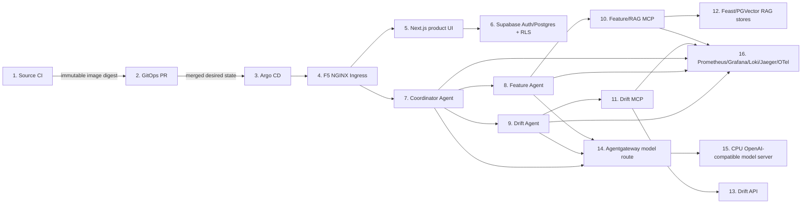

# Financial Distress Data Engineering System

# Table of Contents

1. [Introduction](#introduction)
2. [Project Status](#project-status)
3. [Business Domain](#business-domain)
4. [Overall System Architecture](#overall-system-architecture)
5. [System Deployment Diagram](#system-deployment-diagram)
6. [Phase 2 Deployment and Evidence](#phase-2-deployment-and-evidence)
7. [Runtime Evidence Snapshot](#runtime-evidence-snapshot)
8. [Schema Evidence](#schema-evidence)
9. [API Surface](#api-surface)
10. [Project Structure](#project-structure)
11. [Documentation](#documentation)
12. [Naming Convention](#naming-convention)
13. [Local Setup](#local-setup)
14. [Running in Docker](#running-in-docker)
15. [Product and Phase 2 Checks](#product-and-phase-2-checks)
16. [Service URLs](#service-urls)
17. [Run Stage 1 Evidence](#run-stage-1-evidence)
18. [Validation Commands](#validation-commands)
19. [Useful Inspection Queries](#useful-inspection-queries)
20. [Stop Services](#stop-services)

## Introduction

This repository contains the complete Financial Distress Data + AI Engineering
coursework system: a verified local-first lakehouse foundation, an additive
Phase 2 LLM/agent product, and the evidence/runtime contracts that connect
them. Phase 1 remains the data foundation; Phase 2 consumes its Gold outputs
without changing Phase 1 semantics.

The project has two deployment boundaries:

- **Source monorepo:** Python lakehouse, Phase 2 contracts/services, Next.js
  product app, Supabase migrations, tests, evidence contracts, and runbooks.
- **Private GitOps control repo:** Helm-rendered GKE desired state, Argo CD
  applications, immutable image references, ingress, agents, model serving,
  and observability manifests. It is maintained separately as
  `financial-distress-gitops`.

The accepted coursework scope is the **LLM track: 60 rows / 100 points**. The
57 ML rows remain explicitly deferred/design-only. The LLM evidence has been
captured and the live runtime has passed; the final submission freeze still
requires convergent evidence SHA stamping and the remaining Phase 6 packaging
steps. See [Project Status](#project-status),
[docs/coursework.md](docs/coursework.md), and the
[submission reviewer index](docs/submission/README.md).

Apache Flink is an **opt-in** streaming runtime for the local Phase 1 path. It
is not started by `docker compose up` and requires `--profile flink` plus
`ENABLE_FLINK=1`.

## Project Status

| Area | State | Meaning |
|---|---|---|
| Phase 1 lakehouse | Verified | Collectors, Kafka, Bronze/Silver/Gold, DQ, metadata, DuckDB, MinIO and local evidence are implemented and gated. |
| Phase 2 LLM track | Logical coverage captured; freeze pending | 60/60 LLM rows and 100/100 logical rubric points are represented by canonical evidence files; SHA restamping and the strict freeze audit remain. ML rows remain deferred. |
| Product plane | Implemented and tested | Next.js web app, Supabase auth/RLS, analyst surfaces, agent registry/chat and evidence-plane state handling are covered by product tests and browser checks. |
| GKE evidence plane | Live-verified | Argo applications, agents, MCP services, model gateway, KServe, telemetry and coordinator round-trip were live-tested. |
| Submission freeze | Pending | Evidence SHAs must be restamped after the final docs/runtime commits; strict gate must pass before submission. |
| Known operational residual | GHCR cold-node pull | The current web image is private; cached nodes run it, but a cold node needs an out-of-band sealed `read:packages` credential. |

## Business Domain

The platform is a **local-first financial-distress data lakehouse** for Vietnamese listed companies. It collects quarterly financial statements, daily market prices, and supporting reference data, then produces curated Bronze/Silver/Gold tables, distress labels (Altman Z-Score inspired), and audit-ready evidence that downstream analysts and ML engineers can trust.

Primary users:

- **Data engineer** — owns the Airflow DAGs, Kafka topics, PySpark transforms, MinIO layout, and PostgreSQL metadata.
- **ML engineer** — consumes Gold features and `obt_company_quarter_risk` to train, score, and monitor financial-distress models (Phase 2).
- **Analyst / reviewer** — opens DBeaver or DuckDB against the local lakehouse to validate row counts, SCD2 history, lineage, and data contracts.

Why it matters: a missed early warning on a stressed issuer costs downstream capital and credit decisions. The platform compresses that feedback loop by putting curated, quality-checked, lineage-tracked data one query away from the consumer.

## Overall System Architecture

The complete system is layered rather than a single runtime. The local lakehouse
provides durable Bronze/Silver/Gold data and evidence; the Phase 2 product plane
provides persistent user-facing state; and the disposable GKE evidence plane
executes the LLM/agent path for live proof. Each layer has an explicit owner and
contract. Phase 2 is additive and never silently rewrites the Phase 1 DAG or
storage semantics.

For the local lakehouse diagram, each node is a **deployable unit**: Airflow,
Kafka, Flink (opt-in), PySpark (local mode), MinIO, PostgreSQL, DuckDB, and
DBeaver run as separate processes or containers. Arrows follow data flow;
solid arrows are the default Phase 1 path and dashed arrows are profile-gated.

DuckDB is used only as a local, single-node SQL inspection engine for DBeaver and reviewer evidence over MinIO Parquet. It is not a horizontally scalable serving layer, and pipeline correctness does not depend on DuckDB; governance records are stored in PostgreSQL `project_metadata` with MinIO Parquet evidence mirrors.


## System Deployment Diagram

The diagram below is the local Phase 1 deployment view: every cluster is a
deployable unit (process or container) and every edge is a real data flow in the
local pipeline. The complete Phase 2 deployment flow is documented separately
below and in [docs/phase2/architecture.md](docs/phase2/architecture.md).


The DOT source for the diagram lives at
[`images/architecture/system_deployment_diagram.dot`](images/architecture/system_deployment_diagram.dot)
so the diagram stays editable. Re-render after edits with:

```bash
dot -Tpng images/architecture/system_deployment_diagram.dot \
    -o images/architecture/system_deployment_diagram.png
```

## Phase 2 Deployment and Evidence

Phase 2 keeps the source monorepo and the private GitOps control repository
separate. The numbered flow below names the principal deployables in the
submitted LLM path; the evidence auditor and reviewer index are the source of
truth for what has actually been executed.



Flow legend: source CI builds/tests/scans/signs; GitOps owns deployment
configuration; Argo CD reconciles only the merged revision; NGINX is the only
external entry point; agents call MCP tools; MCP wrappers call the feature/RAG
and drift services; telemetry is redaction-safe and trace-correlated. The
product plane persists user/session/report state in Supabase while the evidence
plane remains disposable. The live coordinator path has been verified with
model warm-up, specialist calls, citations, Prometheus targets and Jaeger
services. The canonical evidence files, rather than this diagram, determine
rubric execution status.

## Runtime Evidence Snapshot

The checked-in Stage 1 evidence proves the local pipeline has run end to end.
The latest committed evidence package reports `status: pass` in
`docs/evidence/stage1_runtime_audit_summary.json`.

| Evidence area | Current proof |
|---|---|
| Airflow pipeline | `stage1_real_e2e_pipeline` finished successfully in `docs/evidence/stage1_real_airflow_dag_test.txt` |
| Kafka streaming | Offsets exist for `financial.price_events`, `financial.news_events`, and `financial.alert_events` |
| MinIO lakehouse | 436 objects across Bronze, Silver, Gold, and `evidence/stage1/` prefixes |
| PostgreSQL metadata | `pipeline_run_log`, `data_quality_result`, `dataset_freshness`, `backfill_request`, `source_request_log`, and `collector_checkpoint` exported in `docs/evidence/stage1_real_postgres_summary.json` |
| DuckDB validation | Gold row counts, duplicate checks, distress-label distribution, and PIT leakage checks exported in `docs/evidence/stage1_real_duckdb_validation.json` |
| DQ failure handling | Critical DQ failure probe confirms failure is persisted before halt |

Key DuckDB metrics from the checked-in evidence:

| Metric | Value |
|---|---:|
| `total_financial_statement_rows` | 16 |
| `total_dim_company_rows` | 2 |
| `total_dim_date_rows` | 732 |
| `total_market_feature_rows` | 12 |
| `total_news_sentiment_rows` | 2 |
| `future_feature_leakage_rows` | 0 |

## Schema Evidence

The local schema follows a Medallion design: raw Bronze-style tables, Silver
staging tables, Gold dimensions/facts, distress labels, OBT, and feature tables.

<div style="text-align: center;">
  
</div>

DBeaver evidence can be reproduced by connecting to a local DuckDB file named
`warehouse.db` and opening the `schema_evidence` schema. `warehouse.db` is a
local generated artifact and is intentionally ignored by Git; regenerate it from
the local pipeline when needed.

## API Surface

There is no REST/FastAPI service in Phase 1. The Phase 2 LLM track adds
FastAPI-backed MCP services and agents under `apps/`, `src/agents/`, and
`src/llm/`. The Next.js product exposes authenticated analyst, agent registry,
chat, report, and evidence-session surfaces; the GKE evidence plane exposes
only the routed ingress/MCP/model endpoints needed by the product and live
evidence checks. These are additive and do not change the Phase 1 pipeline
contracts.

## Project Structure

```txt
├── dags/                  - Airflow DAGs for Stage 1 workflows
├── src/                   - Python source code
│   ├── collectors/        - Fixture-backed source adapters and collectors
│   ├── streaming/         - Kafka event contracts, micro-batch logic, and Flink opt-in client
│   ├── transforms/        - Bronze/Silver/Gold transform logic
│   ├── quality/           - Data quality checks and DQ runner
│   ├── metadata/          - PostgreSQL metadata writers and schema registry
│   ├── catalog/           - DuckDB catalog and validation helpers
│   ├── io/                - MinIO and local IO helpers
│   ├── jobs/              - Runtime evidence job wrappers
│   ├── ml/                - Phase 2 ML class contracts and adapters (isolated)
│   ├── drift/             - Phase 2 drift/quality adapters
│   ├── llm/               - Phase 2 LLM contracts, RAG, and safety adapters
│   └── agents/            - Phase 2 MCP-backed agent orchestration
├── configs/               - Collector, Spark, source, and DQ config files
├── sql/                   - PostgreSQL metadata DDL and DuckDB SQL views
├── tests/                 - PyTest unit, contract, and runtime smoke tests
├── docs/                  - Specs and evidence notes
├── images/                - Architecture diagrams
├── infra/                 - Container build/bootstrap assets
│   ├── airflow/            - Airflow image build context
│   ├── flink/              - Flink jobmanager/taskmanager image build context
│   └── kafka/              - Kafka topic init script
├── scripts/               - Local E2E, DQ failure, and evidence audit runners
├── apps/                  - Phase 2 Next.js product app
├── packages/              - Shared TypeScript contracts and UI helpers
├── supabase/              - Phase 2 migrations, RLS, and outbox schema
├── feature_repo/          - Feast structured/RAG feature definitions
├── docker-compose.yml     - Local platform services
├── pyproject.toml         - Python package and tooling config
└── README.md              - This README file
```

Phase 2 code under `src/ml/`, `src/drift/`, `src/llm/`, and `src/agents/` is
isolated and never mutates Phase 1 pipeline behavior.

The GKE deployment manifests are intentionally **not** in this repository. The
separate private control repository
[`financial-distress-gitops`](docs/architecture/repository-map.md#separate-deployment-repository)
owns Terraform, Helm values, Argo CD applications, image digests, policies,
ingress, model serving, agents, and observability desired state.

The Python package boundary (`pip install -e .`, the `src`-as-package-name
decision, and which dependency manifest is authoritative for which consumer)
is documented in the [repository map](docs/architecture/repository-map.md).

## Documentation

The README only summarizes the project. Detailed design notes, contracts, and runtime evidence live under `docs/`:

- [Business problem and dataset scope](docs/idea.md) — Phase 0 problem discovery.
- [Data generator contract (W17 knobs, evidence)](docs/01_data_generator.md) — how the fixture-backed adapter shapes the offline and streaming inputs.
- [Schema design (Medallion, SCD2, feature tables)](docs/02_schema_design.md) — Bronze / Silver / Gold layout, naming convention, and the `obt_company_quarter_risk` contract.
- [Schema design evidence and ERD](docs/schema-design.md) — DBeaver/DuckDB visualization of all zones.
- [Storage optimization (compaction, Z-order, DuckDB indexes)](docs/05_storage_optimization.md) — Gold-zone small-file compaction, Z-order clustering, and DuckDB index benchmarks.
- [Spark and storage optimization evidence](docs/spark-and-storage-optimization.md) — baseline vs optimized Spark results.
- [Flink stream processing evidence](docs/flink-stream-processing.md) — burst, late arrival, duplicate, and window processing.
- [Data pipeline orchestration evidence](docs/data-pipeline-orchestration.md) — DP1 / DP2 / DP3 Airflow graphs.
- [Data governance evidence](docs/data-governance.md) — DataHub lineage, assertions, and data contracts.
- [Docker optimization evidence](docs/docker-optimization.md) — baseline vs optimized Airflow image sizes.
- [System architecture (numbered deployment flows)](docs/system-architecture.md) — deployable units and data flow.
- [Repository map](docs/architecture/repository-map.md) — owner, plane, and generated-status for every tracked top-level directory.
- [Phase 2 coursework (accepted source of truth)](docs/coursework.md) — explicit Phase 2 scope, two-plane design, and evidence contract.
- [Phase 2 requirements](docs/phase2/requirements.md) — per-deliverable acceptance criteria in WHO -> ACTION -> RESULT form.
- [Phase 2 architecture](docs/phase2/architecture.md) — two-plane design, 8 numbered data flows, cost envelope.
- [Phase 2 low-level design](docs/phase2/low-level-design.md) — ML and LLM class contracts.
- [Phase 2 rubric matrix](docs/phase2/rubric-matrix.csv) — machine-readable 200-point evidence contract (ML 100 + LLM 100).
- [Phase 2 evidence contract](docs/phase2/evidence-contract.md) — evidence format and linter rules.
- [Phase 2 ADRs](docs/phase2/adr/) — architecture decision records 001..010; ADR-010 is the current LLM-only platform decision.
- [Phase 2 novel ideas](docs/phase2/novel-ideas.md) — two per track with executable proof paths.
- [Novel idea 1: dbt-style SQL contracts](docs/09_novel_idea_1.md) — DuckDB macro + Python mirror for naming contracts.
- [Novel idea 2: Airbyte-style ingestion manifest](docs/10_novel_idea_2.md) — declarative source manifest + dispatcher.
- [Novel idea evidence manifests](docs/novel-idea-evidence-manifest.md) and [PIT leakage guard](docs/novel-idea-pit-leakage-guard.md) — evidence integrity and point-in-time correctness proofs.
- [Runtime evidence](docs/evidence/) — Airflow run logs, MinIO inventory, PostgreSQL metadata exports, and DuckDB validation snapshots used to prove the pipeline ran end to end.
- [Rubric completion spec](docs/11_rubric_completion_spec.md) — row-by-row mapping from the mini-coursework rubric to work and proof.
- [UI screenshot capture runbook](docs/ui-screenshot-runbook.md) — how to capture genuine Airflow / DataHub / Spark / Flink UI screenshots from the running stack.

## Naming Convention

The Gold layer uses a single naming rule, enforced by
`tests/test_naming_convention.py`. The rule covers both the
DuckDB-side view names and the MinIO-side storage paths so the
two never drift apart.

### DuckDB Views

Every view defined in `sql/duckdb_create_views.sql` matches
`gold_{dim_|fact_|obt_|feat_}*`:

| Layer prefix | Meaning | Examples |
| --- | --- | --- |
| `gold_dim_` | Conformed dimension tables | `gold_dim_company`, `gold_dim_date` |
| `gold_fact_` | Event or measurement facts | `gold_fact_financial_statement`, `gold_fact_market_price`, `gold_fact_market_alert`, `gold_fact_news_sentiment` |
| `gold_obt_` | One-big-table denormalized joins | `gold_obt_company_quarter_risk` |
| `gold_feat_` | Model-ready feature tables | `gold_feat_company_financial_4q`, `gold_feat_company_market_30d`, `gold_feat_company_news_30d`, `gold_feat_company_unified` |

### MinIO Storage Paths

Gold writes in `src/jobs/stage1_spark_lakehouse_job.py` go to one of
the allowed layer folders under the `gold/` prefix:

```
s3a://financial-distress-lake/gold/dim_*/
s3a://financial-distress-lake/gold/fact_*/
s3a://financial-distress-lake/gold/obt_*/
s3a://financial-distress-lake/gold/feat_*/
s3a://financial-distress-lake/gold/distress_labels/
```

`distress_labels` is the only Gold folder that does not use the
`dim_/fact_/obt_/feat_` family because it carries the label targets
that the Phase 2 ML training reads; it is intentionally a single
top-level folder so the labels are easy to discover and audit.

### Bronze and Silver

Bronze and Silver storage paths do not enforce a per-table prefix
inside the layer folder — the dataset name is the only segment:

```
s3a://financial-distress-lake/bronze/{dataset}/data.parquet
s3a://financial-distress-lake/silver/{dataset}/
```

This keeps the raw ingest and dedup layers flexible enough to absorb
new source adapters without forcing a schema rename on every
addition.

# LOCAL

## Local Setup

Create or activate a Python environment, then install development and runtime dependencies.

```bash
python -m pip install -r requirements.txt
python -m pip install -e ".[dev,runtime]"
```

Create local environment config.

```bash
cp .env.example .env
```

## Running in Docker

Start the complete local data platform (Flink stays disabled).

```bash
docker compose up -d
```

Check service status.

```bash
docker compose ps
.venv/bin/python scripts/check_stage1_services.py
```

Opt in to Apache Flink (jobmanager + taskmanager, profile `flink`):

```bash
ENABLE_FLINK=1 docker compose --profile flink up -d
```

DAG 04 (`dags/dag_04_stream_market_events_to_kafka.py`) automatically dispatches to the Flink REST endpoint when `ENABLE_FLINK=1`; otherwise it keeps the original `MicroBatchConsumer` smoke path so the default stack stays light.

Create Kafka topics manually if needed.

```bash
docker compose exec kafka bash /opt/financial-distress-init/kafka_init_topics.sh
```

## Product and Phase 2 Checks

The local Docker commands above validate the Phase 1 lakehouse. The product
and evidence-plane checks are separate because the product is a pnpm/Next.js
workspace and the live LLM runtime is owned by the private GitOps repository.

Run the product checks from the repository root:

```bash
pnpm --dir apps/web test
pnpm --dir apps/web typecheck
pnpm --dir apps/web lint
pnpm --dir apps/web e2e:live
pnpm --dir apps/web e2e:assistant
```

The browser checks require the configured product URL and test session
environment. They exercise authentication, analyst/report surfaces, agent
registry, chat, and evidence-session state; they do not replace the canonical
rubric evidence audit.

Run the live GKE coordinator and telemetry smoke test when the evidence plane
is up:

```bash
.venv/bin/python scripts/run_phase2_e2e.py --json --timeout 120
```

The current live contract covers 28 checks: Argo/workload and service
readiness, model warm-up, coordinator round-trip with feature/drift citations,
Prometheus targets, and Jaeger service discovery. The equivalent operator
entrypoint is `make phase2-e2e` in the separate
`financial-distress-gitops` repository.

Run Phase 2 source and contract tests locally:

```bash
.venv/bin/python -m pytest tests/phase2 -q
```

The final submission gate is a two-repository audit. Use the project-local
Phase 2 environment and the checked-out GitOps repository:

```bash
PATH="$PWD/.venv-phase2/bin:$PATH" \
.venv-phase2/bin/python scripts/audit_phase2_evidence.py \
  --strict --require-executed --run-validations --track LLM --ml 100 --llm 100 \
  --phase1-base ddbcbe7bd41ae4883954b8a247efdc67c7329078 \
  --gitops-root "${GITOPS_ROOT:-../financial-distress-gitops}"
```

Set `GITOPS_ROOT` to the local checkout path when the control repository is
not beside this source repository.

As of this documentation refresh, the 60 LLM rows are logically covered but
the final freeze is still pending: evidence source/GitOps SHA stamps must be
restamped after the latest repository commits and this strict command must
pass before the submission is called frozen.

## Runtime Evidence Snapshot — Phase 2

The following is a live verification snapshot from **2026-08-13**, not a claim
that the final evidence freeze has passed:

| Check | Result |
|---|---|
| Argo CD applications | 13/13 Synced and Healthy |
| kagent control plane | CRDs Established; 10 Agents Ready |
| MCP registration | Grafana MCP accepted/reconciled; controller registered tools |
| Model path | Agentgateway -> KServe/Knative CPU OpenAI-compatible model server |
| Coordinator E2E | HTTP 200 with feature and drift citations |
| Telemetry | Prometheus targets healthy; Jaeger services discoverable |
| Submission freeze | Pending SHA restamp and strict two-repository audit |

The live plane is disposable and cost-bounded. The current operational
residual is GHCR cold-node image pull: cached nodes run the private web image,
while a cold node needs the sealed package-read credential supplied out of
band. No credential belongs in this repository.

## Service URLs

| Service | URL / Connection | Notes |
|---|---|---|
| Airflow | `http://localhost:8080` | Credentials come from local environment configuration |
| MinIO Console | `http://localhost:9001` | Credentials come from local environment configuration |
| MinIO API | `http://localhost:9000` | Bucket: `financial-distress-lake` |
| PostgreSQL | `localhost:55432` | DB/user credentials come from local environment configuration |
| Kafka host listener | `localhost:9094` | Host-side access |
| Kafka Docker listener | `kafka:9092` | Container-side access |
| Flink jobmanager (opt-in) | `http://localhost:8081` | Start with `docker compose --profile flink up -d`; gated by `ENABLE_FLINK=1` |

## Run Stage 1 Evidence

Run the fixture-backed Stage 1 evidence pipeline from the host.

```bash
.venv/bin/python scripts/run_stage1_evidence.py
```

Run the connected local E2E path through Airflow, Kafka, Spark, MinIO,
PostgreSQL, and DuckDB.

```bash
.venv/bin/python scripts/run_stage1_real_e2e.py \
  --execution-date 2026-06-06T10:04:00+00:00 \
  --export-evidence /tmp/stage1-e2e
```

Generate a machine-readable audit summary for the E2E artifacts.

```bash
.venv/bin/python scripts/audit_stage1_evidence.py /tmp/stage1-e2e
```

Validate the checked-in submission evidence without regenerating files.

```bash
.venv/bin/python scripts/audit_stage1_evidence.py docs/evidence --check
```

Build a reviewer-facing readiness report from the checked-in evidence.

```bash
.venv/bin/python scripts/stage1_readiness_report.py
.venv/bin/python scripts/stage1_readiness_report.py --json --output /tmp/stage1_readiness_report.json
```

Prove critical DQ failures are persisted before the pipeline halts.

```bash
.venv/bin/python scripts/run_stage1_dq_failure_probe.py \
  --run-id stage1-dq-failure-probe \
  --export-evidence /tmp/stage1-dq-failure-probe
```

For a no-service payload check:

```bash
.venv/bin/python scripts/run_stage1_evidence.py --dry-run --evidence-dir /tmp/stage1-evidence
```

Run the primary Airflow evidence DAG once from the CLI.

```bash
docker compose exec airflow-scheduler airflow dags test stage1_local_evidence_pipeline 2026-06-06T02:00:00+00:00
```

Runtime evidence artifacts are written to MinIO:

```txt
financial-distress-lake/evidence/stage1/run_id=.../
```

Expected files:

```txt
stage1_row_counts.json
stage1_minio_objects.txt
stage1_stream_batches.json
stage1_duckdb_validation.json
```

The real E2E runner also exports:

```txt
stage1_real_airflow_dag_test.txt
stage1_real_kafka_offsets.json
stage1_real_minio_objects.json
stage1_real_postgres_summary.json
stage1_real_duckdb_validation.json
stage1_runtime_audit_summary.json
```

## Validation Commands

Run local quality gates.

```bash
.venv/bin/python scripts/run_stage1_quality_gates.py
```

Run quality gates plus Docker service readiness after the stack is up.

```bash
.venv/bin/python scripts/run_stage1_quality_gates.py --include-services
```

Build a readiness report plus live service checks after the stack is up.

```bash
.venv/bin/python scripts/stage1_readiness_report.py --include-services
.venv/bin/python scripts/stage1_readiness_report.py --include-services --include-quality-gates
```

The one-shot gate runs the same checks individually listed below.

```bash
.venv/bin/python -m pytest tests
.venv/bin/ruff check src dags tests scripts
.venv/bin/black --check src dags tests scripts
docker compose config
.venv/bin/python scripts/audit_stage1_evidence.py docs/evidence --check
```

While iterating, `.venv/bin/python -m pytest tests -m "not slow"` runs the fast
loop — no Docker stack, no Postgres binaries. Markers select tests; they never
skip, so `pytest tests` with no `-m` stays the definition of done.

List Kafka topics.

```bash
docker compose exec kafka /opt/kafka/bin/kafka-topics.sh --bootstrap-server kafka:9092 --list
```

List Airflow DAGs.

```bash
docker compose exec airflow-scheduler airflow dags list
```

Inspect MinIO objects from inside the container.

```bash
docker compose exec minio sh -c 'ls -R /data/financial-distress-lake | head -120'
```

## Useful Inspection Queries

PostgreSQL metadata checks:

```bash
docker compose exec postgres psql -U airflow -d financial_distress -c \
"select dataset_name, status, count(*) from project_metadata.pipeline_run_log group by dataset_name, status order by dataset_name, status;"
```

```bash
docker compose exec postgres psql -U airflow -d financial_distress -c \
"select dataset_name, check_name, status, severity, count(*) from project_metadata.data_quality_result group by dataset_name, check_name, status, severity order by dataset_name, check_name;"
```

```bash
docker compose exec postgres psql -U airflow -d financial_distress -c \
"select dataset_name, status, freshness_lag_minutes, sla_minutes from project_metadata.dataset_freshness;"
```

```bash
docker compose exec postgres psql -U airflow -d financial_distress -c \
"select dataset_name, start_date, end_date, status, requested_by from project_metadata.backfill_request order by created_at desc limit 20;"
```

DuckDB validation output is generated at:

```txt
docs/evidence/stage1_duckdb_validation.json
```

Airflow DAG test output writes the same validation artifact to MinIO under the Stage 1 evidence prefix.

## Stop Services

Stop containers but keep volumes/data.

```bash
docker compose stop
```

Stop and remove containers/network.

```bash
docker compose down
```
