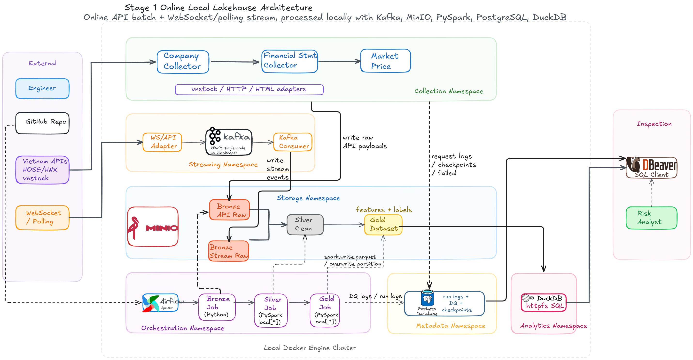

# Financial Distress Data Engineering System

## Introduction

This project is a local-first data engineering foundation for Financial Distress analytics. It runs a small lakehouse stack with Airflow, Kafka, MinIO, PostgreSQL, DuckDB, and PyTest-based validation.

The current Stage 1 pipeline uses deterministic fixture-backed collectors, then materializes Bronze, Silver, Gold, Data Quality, Metadata, and Evidence outputs locally.

## Overall System Architecture

<div style="text-align: center;">
  
</div>

# Table of Contents

1. [Project Structure](#project-structure)
2. [Local Setup](#local-setup)
3. [Running in Docker](#running-in-docker)
4. [Service URLs](#service-urls)
5. [Run Stage 1 Evidence](#run-stage-1-evidence)
6. [Validation Commands](#validation-commands)
7. [Useful Inspection Queries](#useful-inspection-queries)
8. [Stop Services](#stop-services)

## Project Structure

```txt
├── dags/                  - Airflow DAGs for Stage 1 workflows
├── src/                   - Python source code
│   ├── collectors/        - Fixture-backed source adapters and collectors
│   ├── streaming/         - Kafka event contracts and micro-batch logic
│   ├── transforms/        - Bronze/Silver/Gold transform logic
│   ├── quality/           - Data quality checks and DQ runner
│   ├── metadata/          - PostgreSQL metadata writers and schema registry
│   ├── catalog/           - DuckDB catalog and validation helpers
│   ├── io/                - MinIO and local IO helpers
│   └── jobs/              - Runtime evidence job wrappers
├── configs/               - Collector, Spark, source, and DQ config files
├── sql/                   - PostgreSQL metadata DDL and DuckDB SQL views
├── tests/                 - PyTest unit, contract, and runtime smoke tests
├── docs/                  - Specs and evidence notes
├── images/                - Architecture diagrams
├── init/                  - Kafka topic init script
├── scripts/               - Local evidence runner
├── docker-compose.yml     - Local platform services
├── pyproject.toml         - Python package and tooling config
└── README.md              - This README file
```

# LOCAL

## Local Setup

Create or activate a Python environment, then install development and runtime dependencies.

```bash
python -m pip install -r requirements.txt
python -m pip install -e ".[dev,runtime]"
```

Create local environment config.

```bash
cp .env.example .env
```

## Running in Docker

Start the complete local data platform.

```bash
docker compose up -d
```

Check service status.

```bash
docker compose ps
```

Create Kafka topics manually if needed.

```bash
docker compose exec kafka bash /opt/financial-distress-init/kafka_init_topics.sh
```

## Service URLs

| Service | URL / Connection | Notes |
|---|---|---|
| Airflow | `http://localhost:8080` | Username/password: `airflow` / `airflow` |
| MinIO Console | `http://localhost:9001` | Username/password: `minioadmin` / `minioadmin` |
| MinIO API | `http://localhost:9000` | Bucket: `financial-distress-lake` |
| PostgreSQL | `localhost:55432` | DB: `financial_distress`, user/password: `airflow` / `airflow` |
| Kafka host listener | `localhost:9094` | Host-side access |
| Kafka Docker listener | `kafka:9092` | Container-side access |

## Run Stage 1 Evidence

Run the fixture-backed Stage 1 evidence pipeline from the host.

```bash
.venv/bin/python scripts/run_stage1_evidence.py
```

For a no-service payload check:

```bash
.venv/bin/python scripts/run_stage1_evidence.py --dry-run --evidence-dir /tmp/stage1-evidence
```

Run the primary Airflow evidence DAG once from the CLI.

```bash
docker compose exec airflow-scheduler airflow dags test stage1_local_evidence_pipeline 2026-06-06T02:00:00+00:00
```

Runtime evidence artifacts are written to MinIO:

```txt
financial-distress-lake/evidence/stage1/run_id=.../
```

Expected files:

```txt
stage1_row_counts.json
stage1_minio_objects.txt
stage1_stream_batches.json
stage1_duckdb_validation.json
```

## Validation Commands

Run local quality gates.

```bash
.venv/bin/python -m pytest tests
.venv/bin/ruff check src dags tests scripts
.venv/bin/black --check src dags tests scripts
docker compose config
```

List Kafka topics.

```bash
docker compose exec kafka /opt/kafka/bin/kafka-topics.sh --bootstrap-server kafka:9092 --list
```

List Airflow DAGs.

```bash
docker compose exec airflow-scheduler airflow dags list
```

Inspect MinIO objects from inside the container.

```bash
docker compose exec minio sh -c 'ls -R /data/financial-distress-lake | head -120'
```

## Useful Inspection Queries

PostgreSQL metadata checks:

```bash
docker compose exec postgres psql -U airflow -d financial_distress -c \
"select dataset_name, status, count(*) from project_metadata.pipeline_run_log group by dataset_name, status order by dataset_name, status;"
```

```bash
docker compose exec postgres psql -U airflow -d financial_distress -c \
"select dataset_name, check_name, status, severity, count(*) from project_metadata.data_quality_result group by dataset_name, check_name, status, severity order by dataset_name, check_name;"
```

```bash
docker compose exec postgres psql -U airflow -d financial_distress -c \
"select dataset_name, status, freshness_lag_minutes, sla_minutes from project_metadata.dataset_freshness;"
```

DuckDB validation output is generated at:

```txt
docs/evidence/stage1_duckdb_validation.json
```

Airflow DAG test output writes the same validation artifact to MinIO under the Stage 1 evidence prefix.

## Stop Services

Stop containers but keep volumes/data.

```bash
docker compose stop
```

Stop and remove containers/network.

```bash
docker compose down
```
