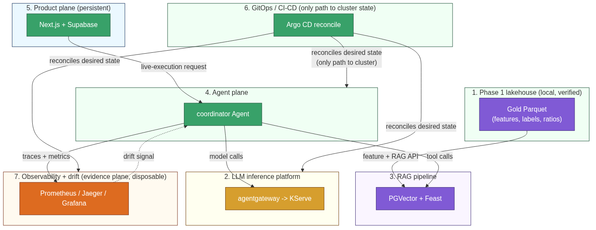

# Financial Distress Data + AI Engineering Platform

A local-first financial-distress data lakehouse for Vietnamese listed companies, extended with an additive Phase 2 LLM/agent product and a disposable GKE evidence plane — verified end to end, not just designed.

## 📚 Table of Contents

1. [🏦 Business Domain](#-business-domain)
2. [📝 System Overview](#-system-overview)
3. [🏗️ Architecture](#️-architecture)
4. [📁 Repository Structure](#-repository-structure)
5. [🗂️ Coursework Documentation](#️-coursework-documentation)
6. [🚀 Quickstart](#-quickstart)
7. [📌 Project Status](#-project-status)

## 🏦 Business Domain

The platform is a **local-first financial-distress data lakehouse** for Vietnamese listed companies. It collects quarterly financial statements, daily market prices, and supporting reference data, then produces curated Bronze/Silver/Gold tables, distress labels (Altman Z''-Score inspired), and audit-ready evidence that downstream analysts and ML engineers can trust.

Primary users:

- **Data engineer** — owns the Airflow DAGs, Kafka topics, PySpark transforms, MinIO layout, and PostgreSQL metadata.
- **ML engineer** — consumes Gold features and `obt_company_quarter_risk` to train, score, and monitor financial-distress models (Phase 2).
- **Analyst / reviewer** — opens DBeaver or DuckDB against the local lakehouse to validate row counts, SCD2 history, lineage, and data contracts, or the product web app for a live authenticated view.

Why it matters: a missed early warning on a stressed issuer costs downstream capital and credit decisions. The platform compresses that feedback loop by putting curated, quality-checked, lineage-tracked data one query away from the consumer.

## 📝 System Overview

- **Lakehouse (Phase 1, verified):** a local-first medallion pipeline — `src/collectors`/`src/generator` produce deterministic batch and streaming data, Airflow (`dags/`) orchestrates three DAGs (DP1 source→Bronze, DP2 Bronze→Silver/Gold, DP3 offline features), Kafka (KRaft) carries streaming events, PySpark local mode performs the Bronze→Silver→Gold transform with a measured 1.56x optimization, Flink is an opt-in event-time streaming path, MinIO is the durable S3A lakehouse boundary, PostgreSQL holds operational metadata and DQ results, and DuckDB/DBeaver is the reviewer inspection surface — nothing here talks to AWS.
- **LLM + RAG (Phase 2, live-verified):** a real OpenAI-compatible model server (llama.cpp on KServe/Knative, Qwen2.5-0.5B, quantization-benchmarked) reached only through `agentgateway`, backing a RAG pipeline (`src/llm/rag_pipeline.py`) that fetches, chunks, governs (licensing/PII/quarantine), embeds, and writes to PGVector with proven idempotency and a real quarantine round-trip.
- **Agents + MCP (Phase 2, live-verified):** a coordinator agent fans out in parallel to a feature specialist and a drift specialist under a hard hop bound, each calling its own governed MCP tool (`feature-mcp`, `drift-mcp`) inside a sandboxed, tokenless, read-only `agents-sandbox` namespace with default-deny NetworkPolicies — proven live with a 5-span, 170ms Jaeger trace across all three services.
- **Product plane (persistent):** Next.js renders authenticated analyst, report, agent-registry, and chat surfaces; Supabase owns Auth/Postgres/RLS and the evidence-session outbox that bridges the persistent product plane to the disposable evidence plane — the UI never claims a successful live answer before the evidence plane actually returns one.
- **Platform + observability (GitOps-delivered):** GitHub Actions builds/tests/signs an immutable image digest, opens a GitOps PR, and Argo CD reconciles only the merged desired state (13/13 applications Synced/Healthy); NGINX is the sole external entry point behind basic-auth; OpenTelemetry ships traces/metrics/logs to Jaeger/Prometheus/Grafana/Loki, correlated by `trace_id` across all three systems for a single request.

## 🏗️ Architecture

Composed system diagram — seven subsystems and their cross-boundary contracts (source: [`docs/architecture/system-overview.mmd`](docs/architecture/system-overview.mmd), regeneration command in [`docs/system-architecture.md`](docs/system-architecture.md)):



Every diagram node is a **deployable unit** — Airflow, Kafka, Flink (opt-in), Spark (PySpark local mode), MinIO, and PostgreSQL each run as their own process or container, never a library or SDK. Each subsystem also has its own small Mermaid diagram, embedded in the narrative doc that proves it — see [`docs/system-architecture.md`](docs/system-architecture.md) for the full diagram index (5-class color legend: edge/service/store/model/result) and links into every owning doc. The Phase 1-mandated deployment diagram required by `docs/mini_coursework.md` stays at its spec-pinned path:


## 📁 Repository Structure

```txt
├── dags/                  - Airflow DAGs (Stage 1) + dags/phase2/ additive wrappers
├── src/                   - Python source code
│   ├── collectors/        - Fixture-backed source adapters and collectors
│   ├── streaming/         - Kafka event contracts, micro-batch logic, Flink opt-in client
│   ├── transforms/        - Bronze/Silver/Gold transform logic
│   ├── quality/           - Data quality checks and DQ runner
│   ├── metadata/          - PostgreSQL metadata writers and schema registry
│   ├── catalog/           - DuckDB catalog and validation helpers
│   ├── io/                - MinIO and local IO helpers
│   ├── jobs/               - Runtime evidence job wrappers
│   ├── ml/                - Phase 2 ML class contracts and adapters (isolated)
│   ├── drift/              - Phase 2 drift detection + generator-config simulation
│   ├── llm/                - Phase 2 LLM contracts, RAG pipeline, embedding registry, citation/PII guard
│   └── agents/             - Phase 2 coordinator/feature/drift agent orchestration
├── apps/                  - Phase 2 Next.js product app + feature-api/feature-mcp/drift-api/drift-mcp services
├── packages/              - Shared TypeScript contracts and UI helpers
├── supabase/              - Phase 2 migrations, RLS, and outbox schema
├── feature_repo/          - Feast structured/RAG feature definitions
├── notebooks/             - Agent/MCP demonstration notebooks (LLM evidence track)
├── configs/               - Collector, Spark, source, drift, and DQ config files
├── sql/                   - PostgreSQL metadata DDL and DuckDB SQL views
├── tests/                 - PyTest unit, contract, and runtime tests; tests/phase2/ covers Phase 2
├── docs/                  - Specs, narrative submission docs, architecture, evidence notes
│   ├── submission/         - Reviewer-facing narrative docs (LLM track, mini-coursework, ML deferred)
│   ├── architecture/       - Subsystem + composed Mermaid diagram sources
│   ├── pngs/                - Reviewer screenshot/diagram pool (manifest-tracked)
│   └── phase2/evidence/    - Canonical, audit-pinned LLM evidence rows (immutable location)
├── images/                - Phase 1 spec-mandated architecture diagrams
├── infra/                 - Container build/bootstrap assets (airflow/, flink/, kafka/)
├── scripts/               - Local E2E, DQ-failure, evidence-audit, and doc-gate runners
├── plans/                 - Implementation plans, phase files, and reports
├── docker-compose.yml     - Local platform services (Postgres, Kafka, MinIO, Airflow, Flink opt-in)
├── pyproject.toml         - Python package and tooling config
└── README.md              - This file
```

Phase 2 code under `src/ml/`, `src/drift/`, `src/llm/`, and `src/agents/` is additive and never mutates Phase 1 pipeline behavior. The GKE deployment manifests are intentionally **not** in this repository — the separate private control repository [`financial-distress-gitops`](docs/architecture/repository-map.md#separate-deployment-repository) owns Terraform, Helm values, Argo CD applications, image digests, policies, ingress, model serving, agents, and observability desired state. Full ownership map: [`docs/architecture/repository-map.md`](docs/architecture/repository-map.md); Python package boundary details: same doc.

## 🗂️ Coursework Documentation

Three reviewer index tables, each row linking to a full narrative doc with real code quotes, image proofs, and honest limitations (skeleton fixed in [`docs/docs-style-contract.md`](docs/docs-style-contract.md)):

**LLM track — 60/60 rows, 100/100 points, full index at `docs/submission/rubric-final-coursework-(final-llm)/README.md`:**

| Area | Doc |
|---|---|
| LLM inference platform | `llm_inference_platform.md` |
| Global model config | `global_model_config.md` |
| Agent registry | `agent_registry.md` |
| RAG | `rag.md` |
| Web API — feature pull | `web_api_user_data.md` |
| Web API — drift detection | `web_api_drift_detection.md` |
| Agent understanding | `agent_understanding.md` |
| Coordinator agent | `coordinator_agent.md` |
| Agent warm-up | `agent_warm_up.md` |
| CI/CD | `ci_cd.md` |
| Routing & gateway | `routing_gateway.md` |
| IaC | `iac.md` |
| Observability | `observability.md` |
| A/B testing | `ab_testing.md` |
| Security | `security.md` |
| Validation & verification | `validation_verification.md` |
| Improve the data generator | `improve_data_generator.md` |
| Repository design | `repository_design.md` |
| Low-level design | `low_level_design.md` |
| Novel ideas | `novel_ideas.md` |
| Cost | `cost.md` |

**Mini-coursework (Phase 1) — full index at `docs/submission/rubric-(mini-coursework)/README.md`:**

| Area | Doc |
|---|---|
| README business domain | `readme_business_domain.md` |
| Engineering fundamentals | `engineering_fundamentals.md` |
| Data generator | `data_generator.md` |
| Processing jobs | `processing_jobs.md` |
| Data storage | `data_storage.md` |
| Data pipeline orchestration | `data_pipeline_orchestration.md` |
| Data governance | `data_governance.md` |
| Schema design | `schema_design.md` |
| Novel ideas | `novel_ideas.md` |

**ML track — deferred by accepted decision, full reasoning at `docs/submission/ml-track-deferred.md`:** 18 sections, 57 rows, 100 points, every row `design_only` with a concrete reason and a pointer to the nearest LLM-track equivalent where one exists.

Directory names above contain parentheses and are intentionally not hyperlinked from this table — `check_documentation.py`'s link-gate regex breaks on `(...)` inside a path; open them directly from the tree.

## 🚀 Quickstart

```bash
python -m pip install -r requirements.txt
python -m pip install -e ".[dev,runtime]"
cp .env.example .env
docker compose up -d
.venv/bin/python scripts/check_stage1_services.py
```

Full local setup, Docker Compose profiles (incl. opt-in Flink), product/Phase 2 checks, service URLs, Stage 1 evidence regeneration, validation commands, inspection queries, and the naming convention live in [`docs/operator-runbook.md`](docs/operator-runbook.md) — moved out of this README so it stays reviewer-facing.

## 📌 Project Status

| Area | State | Meaning |
|---|---|---|
| Phase 1 lakehouse | Verified | Collectors, Kafka, Bronze/Silver/Gold, DQ, metadata, DuckDB, MinIO and local evidence are implemented and gated. |
| Phase 2 LLM track | Logical coverage captured; freeze pending | 60/60 LLM rows and 100/100 logical rubric points are represented by canonical evidence files; SHA restamping and the strict freeze audit remain. ML rows remain deferred. |
| Product plane | Implemented and tested | Next.js web app, Supabase auth/RLS, analyst surfaces, agent registry/chat and evidence-plane state handling are covered by product tests and browser checks. |
| GKE evidence plane | Live-verified | Argo applications, agents, MCP services, model gateway, KServe, telemetry and coordinator round-trip were live-tested; Argo CD's own UI was unreachable via port-forward this session (node-level fault, not fixed by retry) — CLI-verified 13/13 Synced/Healthy stands in for the UI capture. |
| Submission freeze | Pending | Evidence SHAs must be restamped after the final docs/runtime commits; strict gate must pass before submission. |
| Known operational residual | GHCR cold-node pull | The current web image is private; cached nodes run it, but a cold node needs an out-of-band sealed `read:packages` credential. |

This status table is the honesty anchor for the whole documentation set — nothing above claims more than the linked evidence proves.
