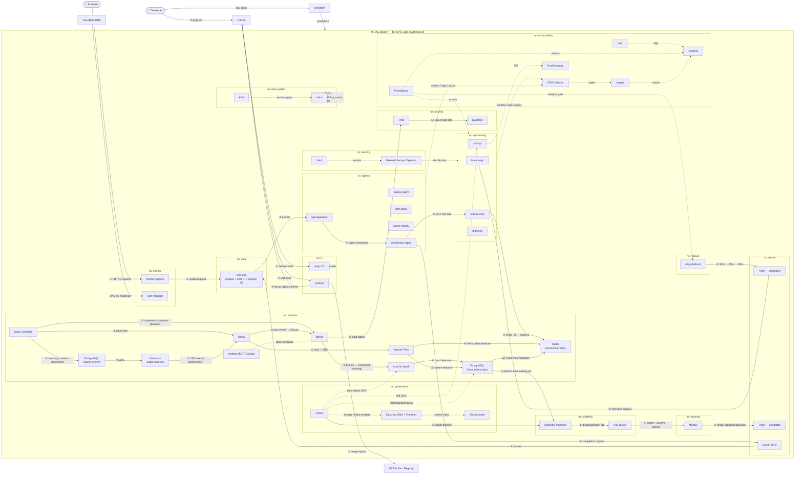

# Deployment Diagram — Draft

Working draft for the README's high-level deployment diagram, laid out in the same
orientation as `images/architecture/reference-recsys-mlops-overview.png`: actors on
the left, one cluster boundary, namespace boxes inside, data flowing left to right.

Every box is a **deployable unit**. Libraries (Feast SDK, OpenTelemetry SDK) and
formats (Iceberg, Parquet) never get a box — they appear as edge labels.

---

## 1. Full system

---

## 2. `ns: dataflow` in detail — the hybrid ingestion design

Two lanes converge on the Feast stores, exactly as the reference arranges them:
batch along the top, event stream along the bottom, offline store above online store.

**This diverges from the reference deliberately.** The reference routes *all*
streaming through Postgres and Debezium because it simulates an e-commerce app whose
source code the data team cannot modify. This project has two genuinely different
kinds of data and routes each the way its nature demands.

```mermaid
flowchart LR
  subgraph LANE_BATCH["LÀN TRÊN — batch + state"]
    direction LR
    GEN1["Data Generator"]
    PGSRC["PostgreSQL<br/>company master + financial statements"]
    DBZ["Debezium CDC<br/>Kafka Connect"]
    MINIO["MinIO<br/>object storage"]
    BRONZE[("Bronze tables")]
    SILVER[("Silver / Gold tables")]
    OBT[("Analytic OBT")]
    SPARK["Apache Spark<br/>batch feature engineering"]
  end

  subgraph LANE_STREAM["LÀN DƯỚI — event stream"]
    direction LR
    GEN2["Data Generator"]
    KAFKA["Kafka"]
    K2B["kafka-to-bronze<br/>consumer"]
    FLINK["Apache Flink<br/>realtime feature engineering"]
  end

  subgraph FEAST["Feast stores"]
    direction TB
    PGOFF["PostgreSQL<br/>Feast OFFLINE store"]
    REDIS["Redis<br/>Feast ONLINE store"]
  end

  GEN1 -- "① company master + statements" --> PGSRC
  GEN1 -- "② statement snapshots (parquet)" --> MINIO
  PGSRC -- "③ WAL" --> DBZ
  DBZ -- "④ CDC events — before/after, catches restatements" --> KAFKA

  GEN2 -- "⑤ price ticks — topic financial.price_events" --> KAFKA

  KAFKA -- "⑥ raw events" --> K2B
  K2B -- "⑦ partitioned by event_date / event_hour" --> BRONZE
  MINIO -- "⑧ raw files" --> BRONZE
  BRONZE -- "⑨ cleaned, deduped" --> SILVER
  SILVER -- "⑩ run SQL (Trino)" --> OBT
  SILVER -- "⑪ partitioned reads" --> SPARK
  SPARK -- "⑫ batch features" --> PGOFF

  KAFKA -- "⑬ ticks ⋈ latest statement state" --> FLINK
  FLINK -- "⑭ fresh online features" --> REDIS
  FLINK -- "⑮ stream features" --> PGOFF
  PGOFF -- "⑯ Feast materialization (incremental)" --> REDIS
```

### Why price ticks skip Postgres

| | Price ticks | Financial statements |
|---|---|---|
| Nature | **Event** — happened, immutable | **State** — a row that gets corrected |
| Can it change? | No. Nobody revises yesterday's 10:31 quote | Yes. Restatements, late filings, corrections |
| Consistency need | None — no OLTP state to agree with | Must match committed DB state exactly |
| Route | Producer → Kafka directly | Postgres → CDC → Kafka |
| Verified in code | `src/generator/streaming.py:59` → topic `financial.price_events` | — |

Sending ticks through Postgres purely to have Debezium read them back out adds a
deployable unit and latency while solving nothing. Conversely, publishing statement
changes straight to Kafka would reintroduce the **dual-write problem**: a commit that
succeeds while the publish fails leaves the stream missing an event, and no
transaction spans both systems to prevent it. CDC derives the event *from* the
commit, so the two cannot diverge.

### Why the restatement path matters beyond the diagram

When a revised Q3 filing arrives, Debezium emits an `UPDATE` carrying both `before`
and `after`. Any feature already computed from the superseded figures is now wrong
for training — but it was *correct* at the time it was known. That is exactly the
condition the point-in-time leakage guard (novel idea #2) exists to detect, and it
arises naturally here rather than being contrived.

---

## 3. What is deliberately **not** drawn

| Omitted | Reason |
|---|---|
| Feast SDK | A library, not a deployable unit — the rubric names this exact trap. Feast appears as the edge label on materialization |
| Iceberg | A table format. The **Iceberg REST Catalog** is the deployable unit |
| OpenTelemetry SDK | Embedded in each service; only the **Collector** is deployed |
| MCP | A protocol — an edge label between agent and MCP server |
| Helm / kubectl | Tools that run and exit |
| `write views, carts, purchases` (reference has it) | The reference's serving app writes user events back into the source DB, closing a behavioural loop. This project has no such loop — an analyst UI does not generate financial statements. Copying that arrow would leave a flow with no data to name |

---

## 4. Checklist against the grading criteria

- [ ] Every main component is a deployable unit
- [ ] Arrow direction follows data movement; label states **what data**, not a verb
- [ ] Call-only edges (Airflow → Kubeflow API) still drawn as arrows
- [ ] Every arrow numbered and described
- [ ] Four user flows in four colours, each numbered independently from ①
- [ ] Dashed arrows reserved for non-primary flows (observability, secrets, mesh)
- [ ] Cluster boundary drawn, so in-cluster vs out-of-cluster is unambiguous
- [ ] Diagram matches the running system at capture time, not the plan

## Open questions

- `dags/03_collect_market_price_api.py` exposes only `_collect()`; the write target
  is not visible in that file. Confirm whether it publishes to Kafka or writes to
  Postgres before finalising arrow ⑤ — the diagram must match the code.
- Whether the analyst UI should log predictions back to Postgres. If yes, that adds
  a genuine return edge; if no, the diagram stays one-directional as drawn.
