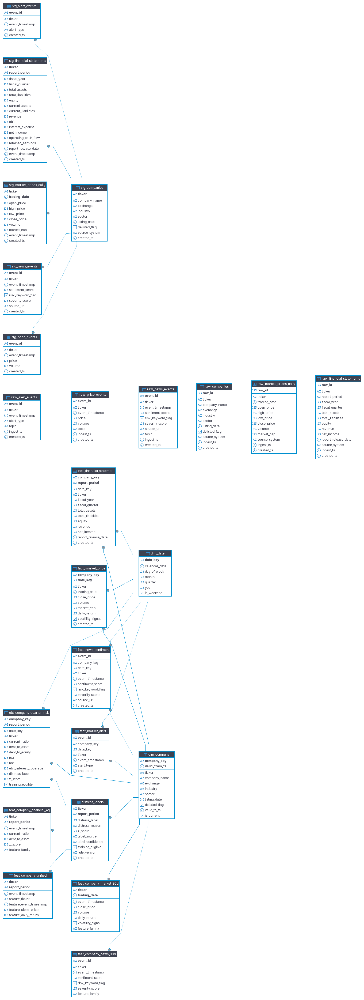

# Operator Runbook

Local setup, Docker Compose, product/Phase 2 checks, service URLs, Stage 1
evidence regeneration, validation commands, inspection queries, naming
convention, and stop/teardown — moved out of `README.md` so the README stays
reviewer-facing. Every command below was verified to reference a real,
existing script or file as of this move (2026-08-14).

## Table of Contents

1. [Naming Convention](#naming-convention)
2. [Runtime Evidence Snapshot — Phase 1](#runtime-evidence-snapshot--phase-1)
3. [Schema Evidence](#schema-evidence)
4. [API Surface](#api-surface)
5. [Local Setup](#local-setup)
6. [Running in Docker](#running-in-docker)
7. [Product and Phase 2 Checks](#product-and-phase-2-checks)
8. [Runtime Evidence Snapshot — Phase 2](#runtime-evidence-snapshot--phase-2)
9. [Service URLs](#service-urls)
10. [Run Stage 1 Evidence](#run-stage-1-evidence)
11. [Validation Commands](#validation-commands)
12. [Useful Inspection Queries](#useful-inspection-queries)
13. [Stop Services](#stop-services)

## Naming Convention

The Gold layer uses a single naming rule, enforced by
`tests/test_naming_convention.py`. The rule covers both the
DuckDB-side view names and the MinIO-side storage paths so the
two never drift apart.

### DuckDB Views

Every view defined in `sql/duckdb_create_views.sql` matches
`gold_{dim_|fact_|obt_|feat_}*`:

| Layer prefix | Meaning | Examples |
| --- | --- | --- |
| `gold_dim_` | Conformed dimension tables | `gold_dim_company`, `gold_dim_date` |
| `gold_fact_` | Event or measurement facts | `gold_fact_financial_statement`, `gold_fact_market_price`, `gold_fact_market_alert`, `gold_fact_news_sentiment` |
| `gold_obt_` | One-big-table denormalized joins | `gold_obt_company_quarter_risk` |
| `gold_feat_` | Model-ready feature tables | `gold_feat_company_financial_4q`, `gold_feat_company_market_30d`, `gold_feat_company_news_30d`, `gold_feat_company_unified` |

### MinIO Storage Paths

Gold writes in `src/jobs/stage1_spark_lakehouse_job.py` go to one of
the allowed layer folders under the `gold/` prefix:

```
s3a://financial-distress-lake/gold/dim_*/
s3a://financial-distress-lake/gold/fact_*/
s3a://financial-distress-lake/gold/obt_*/
s3a://financial-distress-lake/gold/feat_*/
s3a://financial-distress-lake/gold/distress_labels/
```

`distress_labels` is the only Gold folder that does not use the
`dim_/fact_/obt_/feat_` family because it carries the label targets
that the Phase 2 ML training reads; it is intentionally a single
top-level folder so the labels are easy to discover and audit.

### Bronze and Silver

Bronze and Silver storage paths do not enforce a per-table prefix
inside the layer folder — the dataset name is the only segment:

```
s3a://financial-distress-lake/bronze/{dataset}/data.parquet
s3a://financial-distress-lake/silver/{dataset}/
```

This keeps the raw ingest and dedup layers flexible enough to absorb
new source adapters without forcing a schema rename on every
addition.

## Runtime Evidence Snapshot — Phase 1

The checked-in Stage 1 evidence proves the local pipeline has run end to end.
The latest committed evidence package reports `status: pass` in
`docs/evidence/stage1_runtime_audit_summary.json`.

| Evidence area | Current proof |
|---|---|
| Airflow pipeline | `stage1_real_e2e_pipeline` finished successfully in `docs/evidence/stage1_real_airflow_dag_test.txt` |
| Kafka streaming | Offsets exist for `financial.price_events`, `financial.news_events`, and `financial.alert_events` |
| MinIO lakehouse | 436 objects across Bronze, Silver, Gold, and `evidence/stage1/` prefixes |
| PostgreSQL metadata | `pipeline_run_log`, `data_quality_result`, `dataset_freshness`, `backfill_request`, `source_request_log`, and `collector_checkpoint` exported in `docs/evidence/stage1_real_postgres_summary.json` |
| DuckDB validation | Gold row counts, duplicate checks, distress-label distribution, and PIT leakage checks exported in `docs/evidence/stage1_real_duckdb_validation.json` |
| DQ failure handling | Critical DQ failure probe confirms failure is persisted before halt |

Key DuckDB metrics from the checked-in evidence:

| Metric | Value |
|---|---:|
| `total_financial_statement_rows` | 16 |
| `total_dim_company_rows` | 2 |
| `total_dim_date_rows` | 732 |
| `total_market_feature_rows` | 12 |
| `total_news_sentiment_rows` | 2 |
| `future_feature_leakage_rows` | 0 |

## Schema Evidence

The local schema follows a Medallion design: raw Bronze-style tables, Silver
staging tables, Gold dimensions/facts, distress labels, OBT, and feature tables.



DBeaver evidence can be reproduced by connecting to a local DuckDB file named
`warehouse.db` and opening the `schema_evidence` schema. `warehouse.db` is a
local generated artifact and is intentionally ignored by Git; regenerate it from
the local pipeline when needed. See `docs/submission/rubric-(mini-coursework)/schema_design.md`
for the narrative naming/SCD2/feature-contract proof.

## API Surface

There is no REST/FastAPI service in Phase 1. The Phase 2 LLM track adds
FastAPI-backed MCP services and agents under `apps/`, `src/agents/`, and
`src/llm/`. The Next.js product exposes authenticated analyst, agent registry,
chat, report, and evidence-session surfaces; the GKE evidence plane exposes
only the routed ingress/MCP/model endpoints needed by the product and live
evidence checks. These are additive and do not change the Phase 1 pipeline
contracts.

## Local Setup

Create or activate a Python environment, then install development and runtime dependencies.

```bash
python -m pip install -r requirements.txt
python -m pip install -e ".[dev,runtime]"
```

Create local environment config.

```bash
cp .env.example .env
```

## Running in Docker

Start the complete local data platform (Flink stays disabled).

```bash
docker compose up -d
```

Check service status.

```bash
docker compose ps
.venv/bin/python scripts/check_stage1_services.py
```

Opt in to Apache Flink (jobmanager + taskmanager, profile `flink`):

```bash
ENABLE_FLINK=1 docker compose --profile flink up -d
```

DAG 04 (`dags/dag_04_stream_market_events_to_kafka.py`) automatically dispatches to the Flink REST endpoint when `ENABLE_FLINK=1`; otherwise it keeps the original `MicroBatchConsumer` smoke path so the default stack stays light.

Create Kafka topics manually if needed.

```bash
docker compose exec kafka bash /opt/financial-distress-init/kafka_init_topics.sh
```

## Product and Phase 2 Checks

The local Docker commands above validate the Phase 1 lakehouse. The product
and evidence-plane checks are separate because the product is a pnpm/Next.js
workspace and the live LLM runtime is owned by the private GitOps repository.

Run the product checks from the repository root:

```bash
pnpm --dir apps/web test
pnpm --dir apps/web typecheck
pnpm --dir apps/web lint
pnpm --dir apps/web e2e:live
pnpm --dir apps/web e2e:assistant
```

The browser checks require the configured product URL and test session
environment. They exercise authentication, analyst/report surfaces, agent
registry, chat, and evidence-session state; they do not replace the canonical
rubric evidence audit.

Run the live GKE coordinator and telemetry smoke test when the evidence plane
is up:

```bash
.venv/bin/python scripts/run_phase2_e2e.py --json --timeout 120
```

The current live contract covers 28 checks: Argo/workload and service
readiness, model warm-up, coordinator round-trip with feature/drift citations,
Prometheus targets, and Jaeger service discovery. The equivalent operator
entrypoint is `make phase2-e2e` in the separate
`financial-distress-gitops` repository.

Run Phase 2 source and contract tests locally:

```bash
.venv/bin/python -m pytest tests/phase2 -q
```

The final submission gate is a two-repository audit. Use the project-local
Phase 2 environment and the checked-out GitOps repository:

```bash
PATH="$PWD/.venv-phase2/bin:$PATH" \
.venv-phase2/bin/python scripts/audit_phase2_evidence.py \
  --strict --require-executed --run-validations --track LLM --ml 100 --llm 100 \
  --phase1-base ddbcbe7bd41ae4883954b8a247efdc67c7329078 \
  --gitops-root "${GITOPS_ROOT:-../financial-distress-gitops}"
```

Set `GITOPS_ROOT` to the local checkout path when the control repository is
not beside this source repository.

As of this documentation refresh, the 60 LLM rows are logically covered but
the final freeze is still pending: evidence source/GitOps SHA stamps must be
restamped after the latest repository commits and this strict command must
pass before the submission is called frozen.

## Runtime Evidence Snapshot — Phase 2

The following is a live verification snapshot from **2026-08-13**, not a claim
that the final evidence freeze has passed:

| Check | Result |
|---|---|
| Argo CD applications | 13/13 Synced and Healthy |
| kagent control plane | CRDs Established; 10 Agents Ready |
| MCP registration | Grafana MCP accepted/reconciled; controller registered tools |
| Model path | Agentgateway -> KServe/Knative CPU OpenAI-compatible model server |
| Coordinator E2E | HTTP 200 with feature and drift citations |
| Telemetry | Prometheus targets healthy; Jaeger services discoverable |
| Submission freeze | Pending SHA restamp and strict two-repository audit |

The live plane is disposable and cost-bounded. The current operational
residual is GHCR cold-node image pull: cached nodes run the private web image,
while a cold node needs the sealed package-read credential supplied out of
band. No credential belongs in this repository.

## Service URLs

| Service | URL / Connection | Notes |
|---|---|---|
| Airflow | `http://localhost:8080` | Credentials come from local environment configuration |
| MinIO Console | `http://localhost:9001` | Credentials come from local environment configuration |
| MinIO API | `http://localhost:9000` | Bucket: `financial-distress-lake` |
| PostgreSQL | `localhost:55432` | DB/user credentials come from local environment configuration |
| Kafka host listener | `localhost:9094` | Host-side access |
| Kafka Docker listener | `kafka:9092` | Container-side access |
| Flink jobmanager (opt-in) | `http://localhost:8081` | Start with `docker compose --profile flink up -d`; gated by `ENABLE_FLINK=1` |

## Run Stage 1 Evidence

Run the fixture-backed Stage 1 evidence pipeline from the host.

```bash
.venv/bin/python scripts/run_stage1_evidence.py
```

Run the connected local E2E path through Airflow, Kafka, Spark, MinIO,
PostgreSQL, and DuckDB.

```bash
.venv/bin/python scripts/run_stage1_real_e2e.py \
  --execution-date 2026-06-06T10:04:00+00:00 \
  --export-evidence /tmp/stage1-e2e
```

Generate a machine-readable audit summary for the E2E artifacts.

```bash
.venv/bin/python scripts/audit_stage1_evidence.py /tmp/stage1-e2e
```

Validate the checked-in submission evidence without regenerating files.

```bash
.venv/bin/python scripts/audit_stage1_evidence.py docs/evidence --check
```

Build a reviewer-facing readiness report from the checked-in evidence.

```bash
.venv/bin/python scripts/stage1_readiness_report.py
.venv/bin/python scripts/stage1_readiness_report.py --json --output /tmp/stage1_readiness_report.json
```

Prove critical DQ failures are persisted before the pipeline halts.

```bash
.venv/bin/python scripts/run_stage1_dq_failure_probe.py \
  --run-id stage1-dq-failure-probe \
  --export-evidence /tmp/stage1-dq-failure-probe
```

For a no-service payload check:

```bash
.venv/bin/python scripts/run_stage1_evidence.py --dry-run --evidence-dir /tmp/stage1-evidence
```

Run the primary Airflow evidence DAG once from the CLI.

```bash
docker compose exec airflow-scheduler airflow dags test stage1_local_evidence_pipeline 2026-06-06T02:00:00+00:00
```

Runtime evidence artifacts are written to MinIO:

```txt
financial-distress-lake/evidence/stage1/run_id=.../
```

Expected files:

```txt
stage1_row_counts.json
stage1_minio_objects.txt
stage1_stream_batches.json
stage1_duckdb_validation.json
```

The real E2E runner also exports:

```txt
stage1_real_airflow_dag_test.txt
stage1_real_kafka_offsets.json
stage1_real_minio_objects.json
stage1_real_postgres_summary.json
stage1_real_duckdb_validation.json
stage1_runtime_audit_summary.json
```

## Validation Commands

Run local quality gates.

```bash
.venv/bin/python scripts/run_stage1_quality_gates.py
```

Run quality gates plus Docker service readiness after the stack is up.

```bash
.venv/bin/python scripts/run_stage1_quality_gates.py --include-services
```

Build a readiness report plus live service checks after the stack is up.

```bash
.venv/bin/python scripts/stage1_readiness_report.py --include-services
.venv/bin/python scripts/stage1_readiness_report.py --include-services --include-quality-gates
```

The one-shot gate runs the same checks individually listed below.

```bash
.venv/bin/python -m pytest tests
.venv/bin/ruff check src dags tests scripts
.venv/bin/black --check src dags tests scripts
docker compose config
.venv/bin/python scripts/audit_stage1_evidence.py docs/evidence --check
```

While iterating, `.venv/bin/python -m pytest tests -m "not slow"` runs the fast
loop — no Docker stack, no Postgres binaries. Markers select tests; they never
skip, so `pytest tests` with no `-m` stays the definition of done.

List Kafka topics.

```bash
docker compose exec kafka /opt/kafka/bin/kafka-topics.sh --bootstrap-server kafka:9092 --list
```

List Airflow DAGs.

```bash
docker compose exec airflow-scheduler airflow dags list
```

Inspect MinIO objects from inside the container.

```bash
docker compose exec minio sh -c 'ls -R /data/financial-distress-lake | head -120'
```

## Useful Inspection Queries

PostgreSQL metadata checks:

```bash
docker compose exec postgres psql -U airflow -d financial_distress -c \
"select dataset_name, status, count(*) from project_metadata.pipeline_run_log group by dataset_name, status order by dataset_name, status;"
```

```bash
docker compose exec postgres psql -U airflow -d financial_distress -c \
"select dataset_name, check_name, status, severity, count(*) from project_metadata.data_quality_result group by dataset_name, check_name, status, severity order by dataset_name, check_name;"
```

```bash
docker compose exec postgres psql -U airflow -d financial_distress -c \
"select dataset_name, status, freshness_lag_minutes, sla_minutes from project_metadata.dataset_freshness;"
```

```bash
docker compose exec postgres psql -U airflow -d financial_distress -c \
"select dataset_name, start_date, end_date, status, requested_by from project_metadata.backfill_request order by created_at desc limit 20;"
```

DuckDB validation output is generated at:

```txt
docs/evidence/stage1_duckdb_validation.json
```

Airflow DAG test output writes the same validation artifact to MinIO under the Stage 1 evidence prefix.

## Stop Services

Stop containers but keep volumes/data.

```bash
docker compose stop
```

Stop and remove containers/network.

```bash
docker compose down
```
