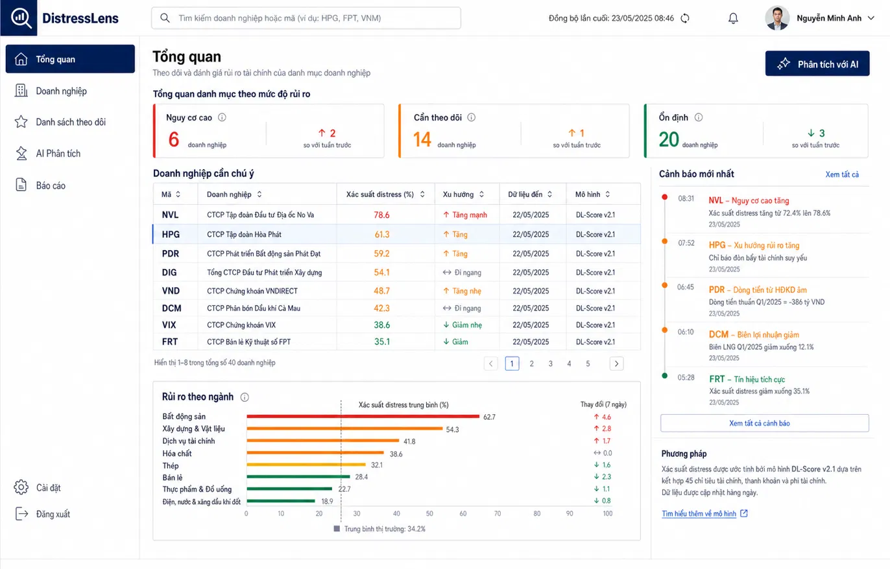

# UI-APPROVED-01 — Analyst overview

- Route baseline: `/` and `/companies`
- Preserve: analyst navigation, global search, risk summary cards, attention
  table, alert rail, sector-risk chart and model-method summary.
- States to implement: loading, empty search, stale data, API error,
  EKS-off cached result and signed-out/auth error.
- Evolution allowed: improve responsive layout, contrast, chart semantics and
  spacing without removing provenance, disclaimer or risk-status meaning.
- Image SHA-256:
  `c18987145fac9abc43fdc632446d0b8779d00d6f8dc0fba6d40df89fed269318`
