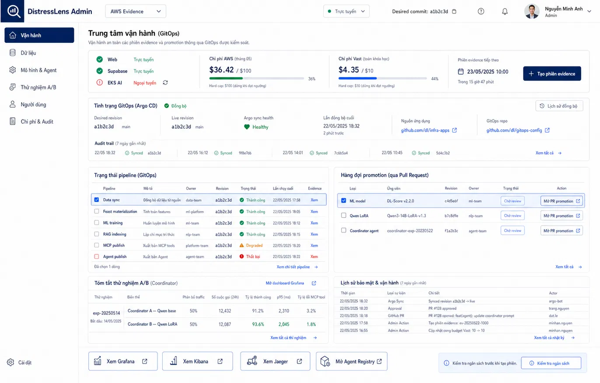

# UI-APPROVED-03 — Admin GitOps operations

- Route baseline: `/ops/evidence`; linked registry at `/agents/registry`.
- Preserve: admin shell, environment/plane status, AWS/Vast cost gauges,
  evidence-session action, Argo desired/live revision, pipeline and promotion
  tables, A/B summary, audit history and observability/registry links.
- States to implement: OFF, REQUESTED, PROVISIONING, SYNCING, READY,
  CAPTURING, DESTROYING, FAILED, EXPIRED, cost-cap denial and stale fencing.
- Evolution allowed: improve density, responsive tables and action feedback;
  preserve viewer/operator/admin boundaries and server-side enforcement.
- Image SHA-256:
  `066f456d8762912bb07a096da5d909bb5a625347bc4d7e9bb77d2ac7d2f3c8a4`
