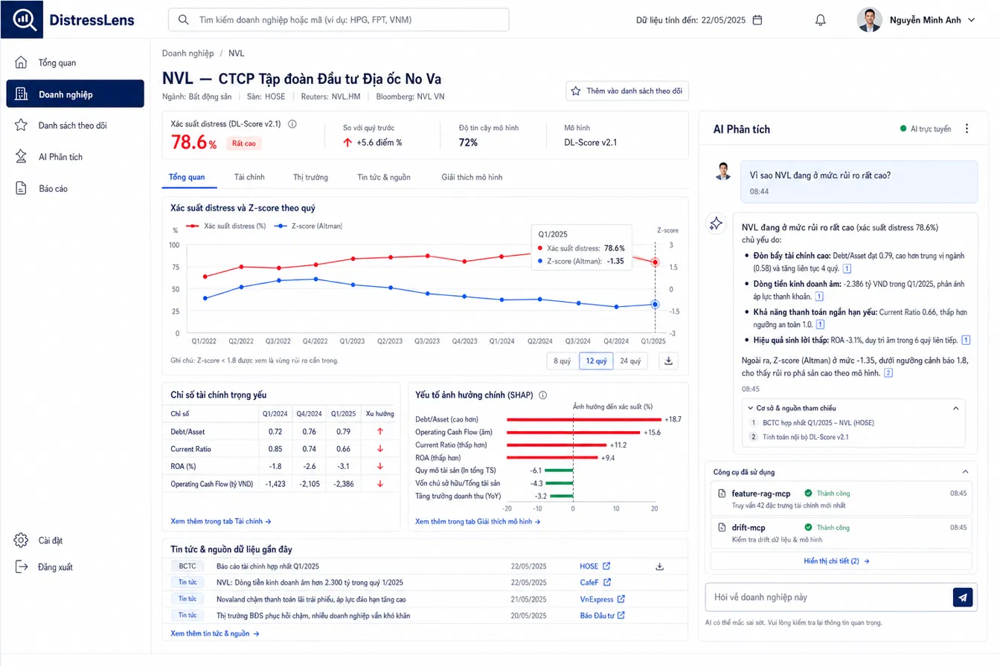

# DistressLens Frontend Product and UI Specification

**Status:** final reference baseline for the platform implementation

**Scope:** product-plane frontend only; runtime proof remains in Phase 8
**Source of truth:** this document and the three image-backed manifests in
`docs/platform/evidence/product/design/`

This is the product-plane contract for the platform. It turns the three approved
visual references into testable routes and states; it does not replace the
runtime evidence captured in Phase 8.

## Implementation audit snapshot

At source `0e9aac4` (2026-08-03), the product foundation (contracts, Supabase
schema/RLS tests and state-machine types) exists, but the web app still has the
default create-next-app `apps/web/src/app/page.tsx` and none of the approved
routes is implemented. The three approved reference images are now stored in
this repository; they describe the initial visual direction, not shipped
runtime behavior. the platform remains `todo` until the routes and evidence
fixtures below are implemented.

## Approved visual references

The approved images are identified as `UI-APPROVED-01` through
`UI-APPROVED-03`. The binaries below are the user-supplied originals copied
without modification to `docs/platform/evidence/product/design/`. They are the
initial frontend reference; implementation may improve spacing, typography,
responsive behavior and visual polish as long as the information hierarchy,
semantics and product boundaries remain intact. The sample names, numbers and
timestamps in the images are reference fixtures, not production data.

| ID | Route(s) | Required content | Evidence |
|---|---|---|---|
| `UI-APPROVED-01` | `/`, `/companies` | analyst overview: portfolio risk cards, attention table, alert rail, sector-risk chart, model-method summary, global search and persistent navigation | `UI-APPROVED-01.png` + Playwright states at 1440/1024/390 px |
| `UI-APPROVED-02` | `/companies/[ticker]`, `/agents/chat` | company risk detail: KPI strip, trend chart, financial indicators, SHAP explanation, news/source citations, AI analysis panel, MCP/tool trace, model version and disclaimer | `UI-APPROVED-02.png` + redacted trace/output and route/state manifest |
| `UI-APPROVED-03` | `/ops/evidence`, `/agents/registry` | admin GitOps operations: plane health, AWS/Vast cost, session creation, Argo desired/live revision, pipeline status, promotion queue, A/B summary, audit history and links to observability/registry | `UI-APPROVED-03.png` + RBAC/action matrix and lifecycle evidence |

### Reference 01 — Analyst overview


The frontend should preserve the left navigation (Overview, Companies,
Watchlist, AI Analysis, Reports, Settings), a global ticker/company search,
plane/user status in the header, three risk-summary cards, an attention table,
an alert timeline, sector comparison and a short model-method explanation.
On smaller screens these become stacked cards and collapsible rails rather than
disappearing content.

### Reference 02 — Company detail and AI analysis



The company page is the main analyst decision-support surface: breadcrumb and
identity header, watchlist action, risk/confidence/model KPI strip, tabbed
financial views, probability/Z-score trend, key indicators, SHAP drivers,
recent sources, and a right-side AI analysis panel. The panel must expose
citation IDs and a safe tool trace, but must not expose prompts, credentials or
raw secrets. A separate `/agents/chat` route may reuse the panel components but
retains its own route and authorization boundary.

### Reference 03 — Admin GitOps operations


The admin shell is intentionally separate from the analyst shell. It needs an
environment selector, online/offline plane status, AWS and Vast cost gauges,
evidence-session action, Argo desired/live revision and sync health, pipeline
and promotion tables, A/B summary, audit timeline, and deep links to Grafana,
Kibana, Jaeger and Agent Registry. Viewer roles can inspect this surface;
operator/admin actions remain server-authorized and fencing-protected.

### Visual evolution rule

These references establish the initial composition and interaction intent. The
implementation may use a stronger design system, improved contrast, better
responsive layouts, accessible charts, clearer empty/error states and refined
micro-interactions. It must not remove provenance, disclaimer, RBAC state,
cached/live labeling, cost controls or the analyst/agent/admin separation just
to match pixels.

| Reference | SHA-256 |
|---|---|
| `UI-APPROVED-01.png` | `c18987145fac9abc43fdc632446d0b8779d00d6f8dc0fba6d40df89fed269318` |
| `UI-APPROVED-02.png` | `5d21bf24f74499f7487f762ff5194f1055fbbad274ad2ad03b2613897186f4f7` |
| `UI-APPROVED-03.png` | `066f456d8762912bb07a096da5d909bb5a625347bc4d7e9bb77d2ac7d2f3c8a4` |

## Information architecture

- **Analyst:** search → company detail → explanation/RAG → compare → save/export.
- **Agent:** chat and registry are separate navigation targets. Chat is for
  bounded analysis; registry is for governed releases and health.
- **Operations:** evidence lifecycle and cost controls are separate from
  analyst content. A viewer can inspect but cannot mutate.
- **Persistent shell:** header carries product identity, plane status,
  authenticated role and disclaimer; navigation remains usable when EKS is
  offline.

## Shared shell and component contract

### Analyst shell

- Left navigation: Overview, Companies, Watchlist, AI Analysis, Reports,
  Settings and Sign out; the active item is visibly selected and keyboard
  reachable. A guest sees only Overview -- every other destination denies an
  unauthenticated caller, so the rail does not offer a dead click.
- Header: DistressLens identity, global company/ticker search, last-data or
  freshness timestamp, plane status, notifications and the authenticated user
  menu -- or, for a guest, a sign-in/sign-up control pair in its place.
- Content: one clear page title, one primary action, cards/tables/charts with
  explicit units, source/freshness labels and a persistent educational
  non-investment disclaimer.
- Analyst surfaces use neutral white/gray canvas, dark navy primary controls,
  red/amber/green risk semantics and non-color labels/icons so color is never
  the only signal.

### Authentication boundary

- Sign-up is open (`/sign-up`); a new account always gets the `analyst` role
  through `handle_new_user()`
  (`supabase/migrations/20260814200000_phase2_profile_identity.sql`), never
  a client-supplied value. Password reset and OAuth providers remain out of
  scope. The configured Supabase project requires email confirmation before
  a new account can sign in (`GET /auth/v1/settings` ->
  `mailer_autoconfirm: false`); `/sign-up` shows a "check your email" state
  in that case instead of redirecting in.
- A signed-in session survives access-token expiry: `middleware.ts` rotates
  the access/refresh cookie pair ahead of page render and fails open to the
  guest state on any rotation error, so a rotation bug degrades to
  "signed out," never a site-wide 500.
- A guest (`role === null`) is rendered as a guest everywhere -- no analyst
  chrome, no fabricated role -- and every denial a guest hits offers a
  sign-in call to action instead of a bare "not permitted" message
  (`ROUTE_FORBIDDEN_GUEST_COPY` in `apps/web/src/lib/states/route-states.ts`).
- Profile switching is a real sign-out followed by a real sign-in to a
  different account, listed from `DISTRESSLENS_DEMO_ACCOUNTS`
  (`apps/web/src/lib/server/demo-accounts.ts`) -- there is no impersonation
  path and no client ever holds another account's credential.
- Sign out (`GET /sign-out`) clears both session cookies and calls
  `auth.signOut()` with the caller's token, revoking the refresh token
  upstream rather than only forgetting it in the browser. It accepts a
  same-origin-validated `?next=` so the profile switcher can land back on
  `/sign-in` with the next account's email prefilled.
- The rail's sign-out link is rendered with `prefetch={false}`
  (`components/shell/nav-rail.tsx`). `GET /sign-out` has a side effect, and
  `next/link` prefetches every link it renders by default; prefetching it
  would have signed a visitor out the moment the link scrolled into view,
  never on an actual click.
- A signed-in user can rename themselves (`display_name` only); `role` is not
  reachable through that write path (owner-only column grant, see
  `docs/platform/security/rbac.md`).

### Company and AI analysis components

- Company header: breadcrumb, ticker/name/market metadata and watchlist action.
- Risk summary: distress probability, change versus prior run, model
  confidence and model/data version.
- Analysis body: probability/Z-score trend, financial-indicator table, SHAP
  drivers, recent news/source list and tabs for Overview, Finance, Market,
  News & Sources and Model Explanation.
- AI panel: user question, streaming/complete/error states, citation IDs,
  expandable MCP/tool trace, agent/model version and safe next action. The
  panel is reusable in `/agents/chat`, but chat authorization and navigation
  remain independent from company data access.

### Admin shell

- Separate `DistressLens Admin` identity and navigation: Operations, Data,
  Models & Agents, A/B Testing, Users, Cost & Audit and Settings.
- Environment selector (for example, AWS Evidence), online/offline selector,
  desired Git commit, help/notifications and admin identity are always visible.
- Operations dashboard: Web/Supabase/EKS health, AWS/Vast cost gauges,
  evidence-session creation, Argo desired/live revision, sync health,
  pipeline status, promotion queue, A/B summary, audit history and links to
  Grafana/Kibana/Jaeger/Agent Registry.
- Viewer mode is read-only. Operator/admin controls show disabled reasons and
  are rechecked server-side with AAL2, idempotency and fencing.

### Product flow

```text
Overview -> Companies -> Company detail -> AI analysis/RAG -> Compare -> Save/export report
                                   \-> Agents chat (bounded, separately authorized)
Admin shell -> Evidence session -> GitOps sync -> Pipelines -> Promotion/A-B -> Audit/export
```

The arrows describe navigation and evidence relationships, not synchronous
dependencies. The analyst product remains usable when the evidence plane is
OFF or expired.

## State and data contract

Every route implements loading, empty, stale, degraded, forbidden, timeout and
server-error states. A cached result includes `cached_at`, `source_sha`, data or
model version and a visible `LIVE_UNAVAILABLE`/`CACHED_RESULT` label. No UI may
claim that cached output came from a live KServe or agent run.

The evidence operations state machine is:

```text
OFF -> REQUESTED -> PROVISIONING -> SYNCING -> READY -> CAPTURING -> DESTROYING -> OFF
                         |-> FAILED -------------------------------> retry
READY/any active state --expiry-------------------------------> EXPIRED -> OFF
```

The UI reads typed contracts from `packages/contracts/`; it never infers
authorization or lifecycle state from client-only flags.

### Required state copy

Every non-success state answers three questions: what is unavailable, what is
cached or last known, and what the user can safely do next. Examples:

| State | Required truthfulness |
|---|---|
| `EKS_OFF_CACHED` | show `CACHED_RESULT`, `cached_at`, source/model/data version and `LIVE_UNAVAILABLE` |
| `PROVISIONING`/`SYNCING` | show lifecycle progress and polling/subscription status; do not show “live” inference |
| `FAILED` | show failure category, correlation/run ID and retry/teardown action allowed by role |
| `FORBIDDEN` | explain missing permission without revealing protected row/content |
| `POLICY_BLOCKED` | state that the request was blocked and provide a safe alternative; do not echo hidden prompt text |
| `STALE_FENCING` | reject the mutation, preserve the current owner/session and provide refresh/retry guidance |

Sample values visible in the approved images may be used as deterministic
fixture data only when marked `REFERENCE_FIXTURE`; they must never be mistaken
for live financial data or executed evidence.

### Assistant request contract

The AI assistant is a single bounded request path: `POST /api/assistant/stream`.
The analyst's question, history and context travel in the request body (never
the query string), and the response is an SSE stream whose frames map one-to-one
onto the message states the panel already renders.

Route order is the same policy `guardRequest` documents:

1. `resolveSession()` — role, AAL, user id, `planeReady`.
2. `guardRequest({ action: "analyst.run_ai_request", mutating: true })` — denial
   audits `FORBIDDEN` and returns 403 with a `policy_blocked` frame.
3. `consumeAiBudget()` — denial audits `RATE_LIMITED`/`QUOTA_EXHAUSTED` and
   returns 429 carrying the reset time; no stream opens.
4. Plane gate — when the plane is off or `DISTRESSLENS_INFERENCE_URL` is unset,
   return a 200 stream with exactly `state:eks_off` + `done`. Absence of the
   plane is product state, not a client error, and never a generated answer.
5. Proxy — open the upstream OpenAI-compatible stream, translate chunks into
   frames, forward abort both ways, and enforce `ASSISTANT_TIMEOUT_MS` on the
   whole interaction (including the initial response headers).
6. Terminate — audit `ALLOWED` or `FAILED` (a closed error class, never an
   upstream message) and close the stream.

Frames: `state` (`streaming`, `tool_running`, `complete`, `timeout`,
`policy_blocked`, `error`, plus assistant-only `eks_off`), `token`, `tool`,
`citation`, `quota` (remaining + reset time), `done` (agent/model version),
`error` (closed `AssistantErrorCode`).

State copy: `timeout` -> "Quá thời gian chờ" with a safe retry hint;
`eks_off` -> cached indicators remain available, direct live AI analysis is
temporarily off; `error` -> the request could not be completed; quota-exhausted
-> remaining quota is spent and the reset time is shown. The remaining quota
line is visible in the panel before the analyst spends it.

Redaction rule: no prompt text, no upstream token, no inference URL and no raw
upstream chunk ever appears in an audit row, a log line, an error message or a
rendered surface — upstream failures map to the closed error-code set above.

## Visual and accessibility rules

- Use the approved information hierarchy and labels; cosmetic motion is not a
  the platform requirement.
- Responsive breakpoints: 1440 px desktop, 1024 px tablet, 390 px mobile.
- Keyboard operation and visible focus are mandatory; semantic headings,
  labels, landmarks and contrast must pass axe checks.
- Honor `prefers-reduced-motion` and provide non-color status indicators.
- Long model/tool output is scrollable, copyable and capped; errors explain a
  safe next action without revealing prompts, tokens, credentials or PII.
- Keep the educational/non-investment disclaimer visible on company,
  explanation, chat, comparison and exported-report surfaces.

## Security and product boundaries

- Supabase RLS and Next.js server boundaries enforce role/action checks;
  client hiding is only a presentation aid.
- Lifecycle mutations require a fresh fencing token and idempotency key.
- Agent chat uses bounded SSE only when the evidence plane is `READY`; lifecycle
  operations use the durable outbox and polling/subscription path.
- Rate limits and per-user AI quotas are enforced at the product boundary.
- Audit events contain actor/action/result/version, never raw prompts, tokens or
  secrets.

## Testing contract

Three layers, each owning a different claim:

- **Unit (`pnpm test`, Vitest, node environment):** `apps/web/src/lib` and
  `packages/contracts/src`. Server boundaries, data adapters, the SQL-call
  contracts and pure logic — gated at 90% lines/branches, enforced on every
  `pnpm test` run (`coverage.enabled: true`), not only in CI.
- **Component (`pnpm test`, Vitest, jsdom environment, `src/components/**/*.test.tsx`):**
  the interactive surfaces whose state/role-gating logic is otherwise only
  provable end-to-end — the assistant panel, the ops action button, the
  disclaimer banner, the nav rail. Queries go through roles and accessible
  names, so a component test doubles as an accessibility check and stays
  stable across visual refinement. The other presentational components under
  `src/components` are proved by Playwright instead; a render test for
  already-covered markup would assert nothing a screenshot doesn't already
  prove.
- **Playwright (`pnpm --filter @distresslens/web e2e` / `e2e:roles` /
  `e2e:assistant*`):** the real app in a real browser at 1440/1024/390 px —
  route composition, focus order, no-horizontal-scroll, and the full
  request/response path server unit tests mock out.

## Outbox worker

A Vercel request writes a lifecycle intent and returns; it cannot babysit a
multi-minute AWS operation. `pnpm --filter @distresslens/web outbox:worker`
runs the separate process that claims and resolves those intents:

- Runs against the service-role Supabase client only — never inside a request
  handler, since the service-role key bypasses RLS.
- Claims events with a lease (`claim_outbox_events`); a crashed worker's lease
  expires and another worker reclaims the event.
- `complete_outbox_event` refuses a stale fencing token by marking the event
  `FAILED` and returning that row — it does not raise, because raising would
  roll back the very mark it needs to leave behind.
- Today's registered handler (`createDefaultOutboxHandlerRegistry` in
  `src/lib/server/outbox-handlers.ts`) advances no real infrastructure; its
  result string says so explicitly (`no infrastructure contacted`). The GitOps
  dispatcher that actually drives EKS provisioning/destruction lands in
  phase-03 of the unified plan (a separate control repo) and replaces only
  that handler body — the loop, registry and worker contract stay the same.
- Structured single-line JSON logs record event id, target state, attempt and
  outcome; never the fencing token or the service-role key.

## Cross-track dashboard boundary

ML observability and ML/LLM A/B dashboards remain canonical Grafana/evidence-
plane artifacts because they depend on Prometheus and executed workloads. The
product shell exposes their freshness, run ID, model/agent version and a
deep-link/status card from `/ops/evidence` and `/reports/[id]`; a product
screenshot never replaces the Grafana export required by the rubric.

## Acceptance criteria

- Product reviewer -> opens `UI-APPROVED-01` -> sees analyst search, risk,
  explanation, RAG, comparison, saved-report and freshness paths with honest
  cached/degraded states.
- LLM reviewer -> opens `UI-APPROVED-02` -> sees citations, tool trace,
  model/agent version and policy/error states without secret leakage.
- Platform reviewer -> opens `UI-APPROVED-03` -> sees registry governance and
  evidence lifecycle/cost/GitOps actions with unauthorized actions rejected on
  the server.
- Accessibility reviewer -> runs the desktop/mobile Playwright suite -> sees
  deterministic screenshots, keyboard focus and reduced-motion compliance.

## Evidence manifest

Each UI evidence file under `docs/platform/evidence/product/` records:

```yaml
reference_id: UI-APPROVED-01
route: /companies/ACME
state: EKS_OFF_CACHED
viewport: 1440x900
source_sha: "<40-hex>"
gitops_sha: "<40-hex>"
data_version: "<version>"
artifact: "<screenshot-or-playwright-report>"
expected_result: "<what the reference proves>"
actual_result: "<observed result>"
redaction_status: "<redactions>"
```

The Phase 8 evidence auditor must reject a UI artifact with a missing route,
state, viewport, provenance, or redaction field.
