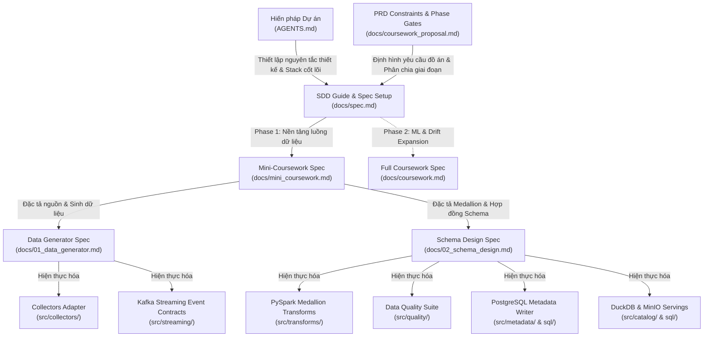
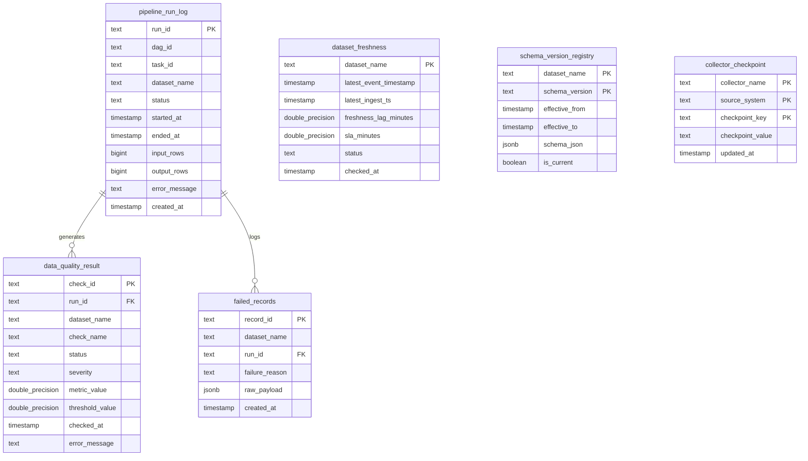
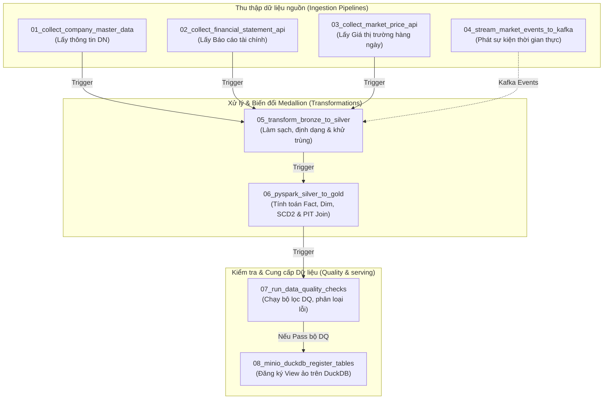

# 📊 Giai đoạn 1: Kiến trúc Dự án & Hướng dẫn Kỹ thuật Chi tiết
**Online Local Lakehouse for Vietnamese Financial Distress Analytics**

Tài liệu này cung cấp một bản phân tích kiến trúc chuyên sâu, chi tiết ở mức thành phần (component-by-component), tích hợp các yếu tố kỹ thuật dữ liệu lớn (big-data engineering) và nền tảng lý thuyết tài chính doanh nghiệp (corporate finance) của **Giai đoạn 1 (Phase 1 mini-coursework)**. Mục tiêu cốt lõi của tài liệu là giúp bất cứ kỹ sư dữ liệu hay Coding Agent nào khi bắt đầu phiên làm việc mới đều có thể hiểu toàn bộ "ngọn ngành" hệ thống: từ luồng đi của dữ liệu, quy trình biến đổi Medallion, cơ chế chống trùng lặp dữ liệu (deduplication) trên Kafka/Spark, thiết kế kiểm định chất lượng (DQ), hệ thống metadata vận hành trong PostgreSQL, cho đến công thức tính toán chỉ số Altman Z'' cùng 5 cảnh báo sớm và cách thức mở rộng lên Giai đoạn 2 (ML/AI).

---

## 🗺️ 1. Bản đồ Liên kết Tài liệu Hệ thống (Spec/Design Traceability Matrix)

Hệ thống được phát triển theo mô hình **Spec-Driven Development (SDD)** nghiêm ngặt của Nexlab. Mọi thành phần mã nguồn (Python, SQL, DAGs) đều có nguồn gốc trực tiếp từ các tài liệu đặc tả (specification). Dưới đây là sơ đồ ánh xạ mối quan hệ giữa các tài liệu đặc tả và các module mã nguồn tương ứng:



### Bảng Ánh xạ và Tương tác Giữa Các File (Traceability Matrix)

| Tài liệu Đặc tả | Module Hiện thực hóa | Mục tiêu Thiết kế & Vai trò trong Hệ thống |
| :--- | :--- | :--- |
| **docs/01_data_generator.md** | `src/collectors/`, `src/streaming/` | Định nghĩa cấu trúc hạt (grain), định dạng thuộc tính, các thách thức dữ liệu thực tế (outliers, missing values) và các hợp đồng sự kiện truyền phát (price, news, alert). |
| **docs/02_schema_design.md** | `src/transforms/`, `src/quality/`, `sql/init_project_metadata.sql` | Đặc tả cấu trúc các lớp Medallion (Bronze, Silver, Gold), thiết kế khóa surrogate xác định duy nhất, mô hình SCD Type 2 cho chiều thông tin công ty, cơ chế Point-in-Time (PIT) join và bộ quy tắc kiểm định chất lượng (DQ Rules). |
| **docs/mini_coursework.md** | Toàn bộ dự án (`src/`, `dags/`, `tests/`) | Đóng vai trò là "As-Built Specification" phản ánh trạng thái hoàn thành thực tế của Giai đoạn 1. Đây là nguồn dữ liệu chuẩn duy nhất (single source of truth) về mặt kỹ thuật cho hệ thống hiện tại. |
| **docs/spec.md** | Thư mục gốc (`AGENTS.md`) | Định nghĩa quy trình 7 Phase của Nexlab và chiến lược mở rộng mở (extensibility strategy) giúp tích hợp mô hình học máy mà không ảnh hưởng đến pipeline lõi. |

---

## 🏗️ 2. Kiến trúc Chế độ Kép (Dual-Mode Architectural Pattern)

Để giải quyết mâu thuẫn giữa tốc độ phát triển (TDD tốc độ cao trong môi trường CI/CD không có kết nối ngoài) và tính thực tế khi triển khai lên hệ thống dữ liệu phân tán quy mô lớn, kiến trúc được thiết kế theo **Mô hình Chế độ Kép (Dual-Mode Design)**:

### 1. In-Memory Validation Mode (Chế độ Kiểm định Trong Bộ nhớ)
* **Môi trường hoạt động**: Chạy cục bộ thông qua lệnh `pytest tests` trong vài mili-giây.
* **Đặc tính**: Hoàn toàn độc lập với Docker, PostgreSQL, MinIO hay Apache Kafka.
* **Cơ chế**:
  * Các adapter sử dụng dữ liệu giả định xác định (`VnstockFixtureAdapter`) để cung cấp tập dữ liệu đầu vào.
  * Toàn bộ nhật ký chạy (run logs), bản ghi lỗi (failed records) và kết quả kiểm tra chất lượng (DQ results) được ghi vào các cấu trúc danh sách (`list[dict]`) nằm trong bộ nhớ RAM của `MetadataWriter`.
  * Các phép toán PySpark được kiểm thử song song thông qua bản hiện thực thuần Python (Pure Python side-by-side implementation) tương đương, đảm bảo tính đúng đắn của logic tính toán mà không cần khởi động Java Virtual Machine (JVM).

### 2. Production-Ready Local Lakehouse Mode (Chế độ Lakehouse Thực tế)
* **Môi trường hoạt động**: Cụm Docker Compose nội bộ (`docker-compose.yml`) gồm PostgreSQL, MinIO, Kafka, Airflow Webserver và Airflow Scheduler.
* **Đặc tính**: Phục vụ tính toán lớn, lưu trữ phân tán bền vững, hỗ trợ truy vấn đồng thời và cung cấp bằng chứng chạy thực tế (Evidence).
* **Cơ chế**:
  * **Trạm thu thập & Đẩy streaming**: Các sự kiện thị trường thời gian thực được đóng gói thành các cấu trúc `StreamEvent` chuẩn hóa, chuyển qua giao thức TCP đến các broker Kafka cục bộ.
  * **Hấp thụ & Lưu trữ Bronze**: Thành phần `MicroBatchConsumer` tiêu thụ dữ liệu từ các phân vùng Kafka, gom cụm theo thời gian thực và ghi xuống MinIO dưới dạng các tệp Parquet phân vùng Hive theo cấu trúc: `s3a://financial-distress-lake/bronze/kafka/{topic}/event_date={YYYY-MM-DD}/event_hour={HH}/batch_id={UUID}/`.
  * **Xử lý Batch lớn với PySpark**: Các tiến trình xử lý chuyển đổi dữ liệu từ Bronze sang Silver và từ Silver sang Gold sử dụng sức mạnh tính toán phân tán của Spark, khai thác giao thức S3A để đọc ghi trực tiếp trên các phân vùng của MinIO.
  * **Ghi nhật ký Vận hành**: Sử dụng `PostgresMetadataWriter` để ghi nhận mọi hoạt động kiểm định chất lượng, nhật ký xử lý dữ liệu của các tác vụ và cấu trúc dữ liệu bị lỗi trực tiếp vào PostgreSQL schema `project_metadata`.
  * **Trục phục vụ dữ liệu**: DuckDB đóng vai trò là công cụ truy vấn hiệu năng cao, ánh xạ trực tiếp các thư mục Parquet từ MinIO thành các bảng ảo (Views) thông qua thư viện kết nối `httpfs`, cho phép phân tích dữ liệu trực tiếp bằng DBeaver.

---

## 📈 3. Công cụ Phân tích Tài chính & Cảnh báo Sớm (Corporate Finance Engine)

Giá trị kinh tế lớn nhất của dự án là sự kết hợp giữa mô hình phân tích định lượng cổ điển **Altman Z''-Score (hiệu chỉnh năm 1993)** và **5 Quy tắc Cảnh báo Kế toán Sớm** được tối ưu riêng cho thị trường mới nổi như Việt Nam.

```
                                  [ Dữ liệu Báo cáo Tài chính lớp Silver ]
                                                     |
                          +--------------------------+--------------------------+
                          |                                                     |
              [ Chỉ số Altman Z''-Score ]                               [ 5 Cảnh báo Kế toán ]
              - X1: Vốn lưu động / Tổng tài sản                         1. Nợ quá lớn (Debt/Asset > 0.8)
              - X2: Lợi nhuận giữ lại / Tổng tài sản                    2. Khả năng thanh toán kém (Current Ratio < 1.0)
              - X3: EBIT / Tổng tài sản                                 3. Lỗ ròng 2 quý liên tiếp (Net Loss x2)
              - X4: Vốn chủ sở hữu / Tổng nợ                            4. Vốn chủ sở hữu âm (Negative Equity)
                          |                                             5. EBIT không đủ bù lãi vay (EBIT/Interest < 1.0)
                          |                                                     |
                          +--------------------------+--------------------------+
                                                     |
                                            [ Bộ lọc Quy tắc ]
                                                     |
                          +--------------------------+--------------------------+
                          |                                                     |
                [ THỎA MÃN ĐIỀU KIỆN? ]                                [ THỎA MÃN ĐIỀU KIỆN? ]
                 Z'' < 1.1 OR Warning >= 2                              Z'' >= 2.6 AND Warning < 2
                          |                                                     |
                         (Có)                                                  (Có)
                          |                                                     |
              [ DISTRESS LABEL = 1 ]                                [ DISTRESS LABEL = 0 ]
           (Nguy cơ Khủng hoảng Tài chính)                                  (An toàn)
                          |                                                     |
                          +-----------------------------------------------------+
                                                     |
                                   (Nếu 1.1 <= Z'' <= 2.6 và Warning < 2)
                                                     |
                                            [ GRAY ZONE MONITOR ]
                                      (Nhãn = 0, Cần giám sát chặt chẽ)
```

### 3.1. Phép toán Altman Z''-Score (Hiệu chỉnh năm 1993)
Mô hình Z-Score ban đầu năm 1968 được xây dựng dựa trên các doanh nghiệp sản xuất đã niêm yết tại Mỹ. Đối với thị trường Việt Nam, việc áp dụng nguyên bản sẽ dẫn đến sai lệch nghiêm trọng. Do đó, hệ thống sử dụng phiên bản hiệu chỉnh Z'' dành cho các doanh nghiệp phi sản xuất và doanh nghiệp hoạt động ở thị trường mới nổi:

$$\text{Z''} = 6.56(X_1) + 3.26(X_2) + 6.72(X_3) + 1.05(X_4)$$

#### Giải nghĩa chi tiết 4 biến số tài chính:
* **$X_1 = \text{Vốn lưu động (Working Capital)} / \text{Tổng tài sản (Total Assets)}$ (Khả năng thanh khoản ngắn hạn)**:
  $$\text{Working Capital} = \text{Tài sản ngắn hạn (Current Assets)} - \text{Nợ ngắn hạn (Current Liabilities)}$$
  * *Ý nghĩa*: Đo lường mức độ dự trữ tài sản lỏng của doanh nghiệp để đáp ứng các nghĩa vụ nợ đến hạn trong vòng 1 năm. Tỷ số này âm biểu thị **Thâm hụt vốn lưu động**, phản ánh rủi ro mất khả năng thanh toán ngay lập tức do doanh nghiệp phải dùng tài sản dài hạn hoặc đi vay mới để trả nợ ngắn hạn.
* **$X_2 = \text{Lợi nhuận giữ lại (Retained Earnings)} / \text{Tổng tài sản (Total Assets)}$ (Khả năng sinh lời tích lũy)**:
  * *Ý nghĩa*: Đo lường tỷ lệ tích lũy lợi nhuận từ khi thành lập được doanh nghiệp tái đầu tư thay vì chi trả cổ đông. Tỷ lệ này cao chứng tỏ doanh nghiệp có lịch sử vận hành bền vững, có khả năng hấp thụ các cú sốc tài chính ngắn hạn. Tỷ lệ này âm phản ánh tình trạng thua lỗ lũy kế kéo dài, ăn mòn cấu trúc vốn chủ sở hữu.
* **$X_3 = \text{EBIT} / \text{Tổng tài sản (Total Assets)}$ (Hiệu suất sinh lời của tài sản)**:
  * *Ý nghĩa*: Đo lường khả năng tạo ra lợi nhuận từ hoạt động cốt lõi trước lãi vay và thuế (EBIT) trên mỗi đồng tài sản được đầu tư, không phụ thuộc vào cấu trúc đòn bẩy tài chính hay chính sách thuế của quốc gia. Đây là biến số có trọng số thống kê **lớn nhất và quan trọng nhất** trong việc dự báo nguy cơ vỡ nợ doanh nghiệp.
* **$X_4 = \text{Vốn chủ sở hữu (Equity)} / \text{Tổng nợ (Total Liabilities)}$ (Khả năng bảo vệ chủ nợ - Solvency)**:
  * *Ý nghĩa*: Hệ thống sử dụng **Giá trị sổ sách của vốn chủ sở hữu (Book Value of Equity)** thay vì Giá trị thị trường (Market Value). Lựa chọn này giúp triệt tiêu hoàn toàn hiện tượng đầu cơ giá cổ phiếu hoặc biến động thị trường chứng khoán bất thường làm biến dạng sức khỏe tài chính thực của doanh nghiệp. Tỷ số này nhỏ hơn $1.0$ cho thấy chủ nợ đang tài trợ nhiều tài sản hơn cổ đông, đẩy doanh nghiệp vào thế rủi ro mất cân đối cấu trúc vốn dài hạn.

### 3.2. 5 Quy tắc Cảnh báo Kế toán Sớm (Early Warning Rules)
Trong thực tế đầu tư và quản trị rủi ro tín dụng tại Việt Nam, các báo cáo tài chính có thể bị thiếu trường thông tin (ví dụ: không công bố lợi nhuận giữ lại hoặc chi phí lãi vay) dẫn đến việc Z''-Score không thể tính toán được. Hệ thống giải quyết bài toán này bằng việc chạy song song **secondary warning system** để bù đắp thông tin:

1. **Nợ trên tài sản quá cao (`high_debt_to_asset` > 80%)**:
   $$\text{Total Liabilities} / \text{Total Assets} > 0.8$$
   Đòn bẩy tài chính cực đoan, doanh nghiệp cực kỳ nhạy cảm với các biến động tăng lãi suất ngân hàng hoặc siết tín dụng.
2. **Khả năng thanh toán hiện thời kém (`low_current_ratio` < 1.0)**:
   $$\text{Current Assets} / \text{Current Liabilities} < 1.0$$
   Doanh nghiệp không có đủ tài sản ngắn hạn có thể chuyển đổi thành tiền trong vòng 1 năm để thanh toán các khoản nợ phải trả trong cùng kỳ.
3. **Thua lỗ liên tiếp hai quý (`two_quarter_net_loss`)**:
   $$\text{Net Income}_t < 0 \quad \text{AND} \quad \text{Net Income}_{t-1} < 0$$
   *Lưu ý xử lý mốc thời gian*: Điều kiện này yêu cầu kỳ báo cáo $t$ và $t-1$ phải là hai quý lịch sử liên tục liền kề (ví dụ: Q2/2025 và Q1/2025). Nếu xảy ra hiện tượng lệch kỳ (chỉ thu thập được Q3/2025 và Q1/2025 mà thiếu Q2), hệ thống sẽ từ chối kích hoạt cảnh báo này nhằm ngăn chặn các tín hiệu cảnh báo sai do đứt gãy chuỗi thời gian.
4. **Vốn chủ sở hữu âm (`negative_equity` < 0)**:
   $$\text{Equity} < 0$$
   Doanh nghiệp đã hoàn toàn mất vốn, rơi vào tình trạng **phá sản kỹ thuật trên bảng cân đối kế toán**.
5. **Khả năng bù đắp lãi vay suy kiệt (`weak_interest_coverage` < 1.0)**:
   $$\text{EBIT} / \text{Interest Expense} < 1.0$$
   Lợi nhuận từ hoạt động kinh doanh tạo ra không đủ để chi trả chi phí lãi vay của doanh nghiệp. Để tồn tại, doanh nghiệp buộc phải thanh lý tài sản hoặc vay đảo nợ liên tục.
   Nếu `interest_expense = 0` hoặc null, hệ thống bỏ qua cảnh báo này thay vì phạt doanh nghiệp không có nợ vay tài chính.

**Ngoại lệ ngành tài chính**: Banks, insurance, securities, diversified financials và GICS sector 40 bị loại khỏi phép tính Altman Z'' vì cấu trúc bảng cân đối kế toán của các ngành này có đòn bẩy cao một cách bình thường. Các dòng này nhận `distress_label = NULL`, `distress_reason = "financial_sector_excluded"`, `label_confidence = NULL`, và `training_eligible = false`.

**Ngoại lệ mẫu số bằng 0**: Nếu `total_liabilities = 0`, thành phần $X_4$ được cap ở `99.0` và ghi lý do `"zero_liabilities_x4_capped"` để tránh biến một doanh nghiệp không nợ thành điểm Z'' null.

### 3.3. Chính sách Phân loại Nhãn Rủi ro (Labeling Policy)
Nhãn rủi ro tài chính (`distress_label`) được tính toán động tại lớp Gold trước khi xây dựng bảng OBT theo chính sách sau:

* **Nhãn = 1 (Khủng hoảng - Distress Zone)**:
  * Nếu điểm số $Z'' < 1.1$ (Rơi vào vùng nguy hiểm).
  * **HOẶC** nếu doanh nghiệp kích hoạt từ **2 cảnh báo sớm trở lên** (ngay cả khi điểm số $Z''$ bị thiếu do khuyết số liệu balance sheet).
* **Nhãn = 0 (An toàn - Safe Zone)**:
  * Nếu điểm số $Z'' > 2.6$ **VÀ** số cảnh báo sớm được kích hoạt nhỏ hơn 2.
* **Vùng Giám sát Cần thiết (Gray Zone Monitor)**:
  * Nếu điểm số nằm trong khoảng $1.1 \le Z'' \le 2.6$ và số cảnh báo ít hơn 2, hệ thống gán nhãn rủi ro bằng `0` nhưng đính kèm chuỗi lý do `"gray_zone_monitor"`, đặt `label_confidence = "low"` và `training_eligible = false`. Gray-zone rows không nên được đưa thẳng vào supervised training của Phase 2.
* **Trường hợp thiếu thông tin dữ liệu (Insufficient Data)**:
  * Nếu điểm số $Z''$ bị rỗng (null) và số cảnh báo sớm được kích hoạt nhỏ hơn 2, nhãn được gán bằng `NULL` với lý do `"insufficient_data"`.

`label_source = "rule_based_v1"` xác định đây là nhãn proxy rule-based, không phải ground-truth bankruptcy/delisting label.

---

## 🛠️ 4. Quy trình Xử lý Dữ liệu Medallion & Các Kỹ thuật Đặc thù

Quy trình Medallion tại Stage 1 được hiện thực hóa thông qua các thư viện PySpark và module Python, giải quyết triệt để các thách thức đặc thù của dữ liệu tài chính lớn.

### 4.1. Hấp thụ dữ liệu thời gian thực (Ingestion & Streaming Layer)
Mọi luồng dữ liệu thời gian thực (ví dụ: biến động giá khớp lệnh liên tục từ HOSE/HNX) được gửi qua Kafka broker dưới dạng JSON.
* **Chống trùng lặp tại nguồn**: Để ngăn chặn hiện tượng lặp tin nhắn do mạng chập chờn (At-Least-Once Delivery), class `StreamEvent` tại `src/streaming/events.py` tự động sinh ra mã định danh sự kiện (`event_id`) bằng cách sắp xếp tất cả các trường dữ liệu khóa trong payload và băm SHA256:
  ```python
  event_hash = sha256(repr(sorted(payload.items())).encode("utf-8")).hexdigest()
  ```
* **Gom cụm thông minh (Micro-Batching Consumer)**: Thành phần `MicroBatchConsumer` duy trì bộ đệm trong bộ nhớ và tiến hành ghi dữ liệu xuống MinIO khi thỏa mãn một trong hai điều kiện kích hoạt:
  * Đạt đủ số lượng bản ghi: `len(self._buffer) >= flush_record_count` (mặc định: 1000 bản ghi).
  * Đạt giới hạn thời gian lưu trữ: `self._elapsed_seconds >= flush_interval_seconds` (mặc định: 60 giây).
  Đặc biệt, consumer tự động phân loại và tách biệt dữ liệu nếu trong cùng một lô (batch) xuất hiện các sự kiện thuộc các khung giờ (`event_hour`) khác nhau, tạo ra các tệp Parquet phân vùng chính xác trên MinIO mà không làm xáo trộn cấu trúc dữ liệu.

### 4.2. Lớp Bronze sang Silver: Làm sạch & Ánh xạ Hợp đồng (Data Normalization)
Pipeline chuyển đổi dữ liệu từ Bronze sang Silver thực hiện nhiệm vụ chuẩn hóa cấu trúc thô thành dữ liệu sạch:
1. **Chuẩn hóa chữ thường (Lowercasing Keys)**: Tự động loại bỏ khoảng trắng dư thừa và chuyển toàn bộ tiêu đề cột về dạng chữ thường không dấu (ví dụ: `" Ticker "` chuyển thành `"ticker"`, `"Total_Assets"` chuyển thành `"total_assets"`). Điều này triệt tiêu hoàn toàn sự bất đồng nhất cấu trúc dữ liệu khi thu thập từ nhiều nguồn API khác nhau.
2. **Khớp nối hợp đồng dữ liệu (Schema Contract Matching)**: Đọc thông tin từ `SchemaContract` tại `src/metadata/schema_registry.py` để định danh các trường bắt buộc (`required`) và các trường tùy chọn cho phép rỗng (`nullable`).
3. **Cơ chế định tuyến lỗi (Dead-Letter Queue Routing)**:
   * Nếu bản ghi bị thiếu bất kỳ trường bắt buộc nào (ví dụ: khuyết mất `ticker` hoặc `report_period`), hệ thống sẽ **không loại bỏ âm thầm**.
   * Bản ghi lỗi được đóng gói nguyên trạng dưới dạng JSON tại cột `raw_payload`, gán nhãn lý do lỗi tại cột `failure_reason`, và chuyển hướng sang bảng metadata `project_metadata.failed_records` trong PostgreSQL để phục vụ công tác giám sát chất lượng dữ liệu của hệ thống.
4. **Loại trùng lặp dữ liệu lớn (Distributed Deduplication)**:
   Trong Spark, việc deduplicate được thực hiện thông qua hàm xếp hạng cửa sổ (Window Function) để tối ưu hiệu năng phân tán, giữ lại bản ghi có thời gian cập nhật lớn nhất (`created_ts` mới nhất) trên mỗi nhóm khóa nghiệp vụ (`ticker` + `report_period` cho báo cáo tài chính; `ticker` + `trading_date` cho dữ liệu giá thị trường):
   ```python
   window = Window.partitionBy(*dedup_keys).orderBy(F.col("created_ts").desc_nulls_last())
   silver = valid.withColumn("_row_number", F.row_number().over(window)).filter(F.col("_row_number") == 1).drop("_row_number")
   ```

### 4.3. Lớp Silver sang Gold: Trục Phân tích nâng cao & Point-in-Time Correctness
Lớp Gold là nơi chứa các mô hình dữ liệu đa chiều được tối ưu cho phân tích rủi ro và huấn luyện máy học.

#### A. Thiết lập Khóa Surrogate ổn định (Surrogate Key Strategy)
Để kết nối nhanh chóng giữa các bảng Fact và Dimension mà không phụ thuộc vào chuỗi ký tự dài, hệ thống áp dụng cơ chế băm khóa MD5/SHA256 nhất quán và không thay đổi theo thời gian:
* **Khóa công ty (`company_key`)**: Băm SHA256 từ mã cổ phiếu viết hoa và cắt lấy 16 ký tự đầu tiên, đảm bảo tính nhất quán giữa các lớp tính toán Python và Spark:
  ```python
  company_key = sha256(str(ticker).strip().upper().encode("utf-8")).hexdigest()[:16]
  ```
* **Khóa ngày (`date_key`)**: Định dạng số nguyên duy nhất có dạng `YYYYMMDD` được chuyển đổi từ các chuỗi ngày chuẩn ISO.

#### B. Trực quan hóa Biến động Lịch sử Doanh nghiệp (SCD Type 2 Rebuild)
Bảng chiều doanh nghiệp `dim_company` lưu trữ lịch sử thay đổi thông tin pháp lý của doanh nghiệp (như chuyển sàn giao dịch HOSE sang HNX, thay đổi ngành nghề kinh doanh, hoặc bị đánh dấu hủy niêm yết) sử dụng kỹ thuật Slowly Changing Dimension (SCD) Type 2:
* Các trường thông tin được theo dõi thay đổi gồm: `industry`, `sector`, `exchange`, `delisted_flag`.
* Khi xuất hiện thay đổi, bản ghi cũ sẽ được đóng lại (`is_current = False`, `valid_to_ts = created_ts` của bản ghi mới) và một dòng dữ liệu mới đại diện cho trạng thái hiện tại sẽ được chèn vào hệ thống.
* Việc kết nối giữa các bảng Fact (giao dịch, báo cáo) và bảng Dimension tại một thời điểm lịch sử cụ thể được thực hiện thông qua biểu thức so khớp khoảng thời gian hợp lệ (Temporal Range Join), triệt tiêu hoàn toàn rủi ro sai lệch thông tin lịch sử:
  ```sql
  SELECT *
  FROM gold_fact_financial_statement f
  JOIN gold_dim_company c ON f.company_key = c.company_key
  WHERE c.valid_from_ts <= f.report_release_date
    AND (f.report_release_date < c.valid_to_ts OR c.valid_to_ts IS NULL);
  ```

#### C. Kỹ thuật Ghép nối Tránh Rò rỉ Dữ liệu (Point-In-Time Join)
Trong thiết kế hệ thống AI phục vụ tài chính, lỗi **Rò rỉ dữ liệu tương lai (Data Leakage)** là lỗi nghiêm trọng nhất. Lỗi này xảy ra khi mô hình sử dụng dữ liệu thị trường của ngày $D+1$ để dự báo tình trạng khủng hoảng của ngày $D$, hoặc sử dụng dữ liệu báo cáo tài chính quý 2 được công bố vào tháng 8 để gán ghép với thông tin giá thị trường của tháng 6 (thời điểm báo cáo chưa hề được công bố ra công chúng).

Thành phần `pit_join_features` tại `src/transforms/silver_to_gold.py` giải quyết bài toán này bằng cách áp dụng bộ lọc thời gian nghiêm ngặt: chỉ cho phép kết nối các trường đặc trưng (`features`) có thời điểm xảy ra sự kiện nhỏ hơn hoặc bằng thời điểm tham chiếu của sự kiện đích (`reference.event_timestamp` hoặc `report_release_date`):
```python
# Trích xuất logic tìm kiếm đặc trưng Point-In-Time phù hợp nhất
candidate = next(
    (feature for feature in ticker_features if str(feature["event_timestamp"]) <= str(ref_ts)),
    {}
)
```

#### D. Tính toán Biến động Giá Phân tán (Market Volatility Analytics)
Để bổ sung chỉ báo biến động giá thị trường hàng ngày vào mô hình cảnh báo rủi ro, PySpark thực hiện tính toán tỷ suất sinh lời hàng ngày (`daily_return`) và đánh dấu tín hiệu biến động mạnh (`volatility_signal`) nếu mức tăng/giảm vượt quá biên độ $7\%$ (tương đương biên độ dao động trần/sàn trong ngày của sàn HOSE) bằng hàm cửa sổ phân tán:
```python
window = Window.partitionBy(F.upper(F.col("ticker"))).orderBy(F.col("trading_date"))
previous_close = F.lag(F.col("close_price").cast("double")).over(window)
daily_return = F.when(
    previous_close.isNull() | (previous_close == 0),
    F.lit(None).cast("double"),
).otherwise((F.col("close_price").cast("double") - previous_close) / previous_close)
```

---

## 🔍 5. Hệ thống Kiểm định Chất lượng Dữ liệu (Data Quality Engine)

Dữ liệu trước khi được đưa vào khai thác hoặc chuyển tiếp giữa các lớp Medallion phải vượt qua hệ thống kiểm định chất lượng được định cấu hình tập trung tại `configs/dq_rules.yaml`.

```
                                      [ Lô dữ liệu đầu ra của Tác vụ ]
                                                     |
                                            [ DQ Runner Engine ]
                                                     |
             +-------------------------+-------------+-------------+-------------------------+
             |                         |                           |                         |
      [ Check Not Null ]        [ Check Unique ]          [ Check Referential ]      [ Check Retention ]
      - Ticker, Period,         - Ticker + Period         - company_key tồn tại      - Silver / Bronze
        Total Assets              (Báo cáo tài chính)       trong dim_company          bản ghi >= 80%
             |                         |                           |                         |
        (Kết quả)                 (Kết quả)                   (Kết quả)                 (Kết quả)
             |                         |                           |                         |
             +-------------------------+-------------+-------------+-------------------------+
                                                     |
                                         [ Phân loại Mức độ Lỗi ]
                                                     |
                          +--------------------------+--------------------------+
                          |                                                     |
                 (Mức độ: CRITICAL)                                      (Mức độ: WARNING)
                          |                                                     |
              [ Dừng toàn bộ Pipeline ]                             [ Ghi nhận vào Metadata ]
              [ Ghi lỗi vào Postgres ]                              [ Tiếp tục luồng xử lý ]
```

### 5.1. Bốn kiểm tra cốt lõi (`src/quality/dq_checks.py`)
1. **Kiểm tra giá trị rỗng (`check_not_null`)**: Đảm bảo các trường khóa chính hoặc thuộc tính tính toán cốt lõi (như `ticker`, `total_assets`) không chứa giá trị trống.
2. **Kiểm tra tính duy nhất (`check_unique`)**: Đảm bảo không tồn tại bản ghi trùng lặp khóa nghiệp vụ (ví dụ: một doanh nghiệp có 2 báo cáo tài chính trong cùng 1 quý báo cáo).
3. **Kiểm tra tính toàn vẹn tham chiếu (`check_referential_integrity`)**: Đảm bảo mọi khóa ngoại trên các bảng Fact (như `company_key` trên bảng `fact_financial_statement`) đều tìm thấy bản ghi định danh tương ứng trong bảng Dimension (`dim_company`).
4. **Kiểm tra tỷ lệ giữ lại dữ liệu (`check_retention`)**: Đảm bảo việc làm sạch dữ liệu từ Bronze sang Silver không vô tình loại bỏ quá $20\%$ số lượng bản ghi gốc (tỷ lệ giữ lại Silver / Bronze phải đạt $\ge 80\%$).

### 5.2. Chính sách xử lý sai số (Severity Policy)
* **Lỗi Nghiêm trọng (Critical Severity - Hard Fail)**:
  * Áp dụng cho các lỗi vi phạm tính duy nhất (uniqueness), giá trị rỗng trên khóa chính (not null), hoặc lỗi liên kết dữ liệu (referential integrity).
  * *Hành vi*: Đánh dấu tác vụ chạy thất bại (`status = 'fail'`), **ngay lập tức dừng toàn bộ tiến trình xử lý downstream** để bảo vệ kho dữ liệu Gold khỏi sự nhiễm độc dữ liệu, và thực hiện ghi nhận thông tin chi tiết vào bảng `project_metadata.data_quality_result`.
* **Lỗi Cảnh báo (Warning Severity - Soft Fail)**:
  * Áp dụng khi tỷ lệ làm sạch vượt ngưỡng hao hụt (`check_retention` dưới $80\%$), xuất hiện dữ liệu lệch ngoài biên độ giá thông thường (outliers), hoặc độ trễ cập nhật (freshness lag) vượt mức quy định của cam kết dịch vụ (SLA).
  * *Hành vi*: Hệ thống ghi nhận trạng thái cảnh báo (`status = 'warning'`) vào PostgreSQL metadata để đội ngũ Data Operations theo dõi, nhưng **không làm gián đoạn tiến trình chạy**, cho phép dữ liệu tiếp tục đi xuống các lớp phân tích phía sau.

---

## 🗄️ 6. Thiết kế Cơ sở Dữ liệu Operational Metadata trong PostgreSQL

Toàn bộ thông tin vận hành, giám sát chất lượng dữ liệu, nhật ký chạy và xử lý lỗi được lưu trữ tập trung tại cơ sở dữ liệu PostgreSQL cục bộ, nằm dưới schema chuyên biệt `project_metadata`. Dưới đây là lược đồ cơ sở dữ liệu chi tiết:



### Chi tiết vai trò của các bảng Metadata cốt lõi:
1. **`pipeline_run_log`**: Lưu trữ nhật ký vận hành chi tiết của từng tác vụ trong Airflow. Ghi nhận thời gian bắt đầu, kết thúc, số lượng dòng đầu vào/đầu ra và thông tin lỗi chi tiết nếu tác vụ bị crash, hỗ trợ đo lường hiệu năng và tính toán chi phí vận hành.
2. **`data_quality_result`**: Lưu trữ lịch sử tất cả các lượt chạy kiểm định chất lượng dữ liệu. Bảng này giúp các nhà phân tích theo dõi sự biến động về chất lượng dữ liệu qua từng ngày (data quality drift).
3. **`failed_records`**: Đóng vai trò là thùng chứa dữ liệu lỗi (Dead-letter Storage). Dữ liệu thô bị lỗi được lưu trữ nguyên trạng dưới dạng định dạng nhị phân tối ưu `JSONB`, cho phép các kỹ sư dữ liệu dễ dàng truy vấn, phân tích nguyên nhân lỗi và xây dựng kế hoạch sửa đổi dữ liệu thượng nguồn.
4. **`schema_version_registry`**: Quản lý lịch sử tiến hóa cấu trúc bảng dữ liệu (schema evolution). Khi một trường mới được thêm vào báo cáo tài chính (ví dụ: `retained_earnings`), hệ thống sẽ đăng ký phiên bản mới tại đây. Bronze-to-Silver Spark job sẽ đọc bảng này để chấp nhận các tệp tin cũ thiếu cột và tự động bổ sung giá trị rỗng (`NULL`) khi ghi xuống Silver.
5. **`collector_checkpoint`**: Điểm lưu trữ trạng thái đồng bộ dữ liệu (CDC checkpoint) cho các collector. Ghi nhận mốc thời gian hoặc ID lớn nhất đã thu thập thành công để trong lần chạy tiếp theo, hệ thống chỉ yêu cầu dữ liệu mới phát sinh, tránh tải trùng lặp dữ liệu từ SSI hay vnstock APIs.

---

## 📊 7. Kiến trúc Truy vấn & Phục vụ Dữ liệu (Serving & Serving Layer)

Kiến trúc phục vụ dữ liệu hướng tới việc tối ưu hóa hiệu năng và độc lập tài nguyên, mô phỏng cấu trúc truy vấn **Serverless Athena** ngay tại máy tính cục bộ thông qua sự kết hợp giữa **MinIO S3**, **DuckDB** và **DBeaver**.

```
    [ DBeaver SQL Client ]
              │ (Kết nối JDBC cục bộ)
              ▼
    [ DuckDB Local Engine ] ────► [ Đăng ký SQL Views ]
              │ (Sử dụng extension 'httpfs')
              ▼
    [ Giao thức HTTPS S3 ] (Predicate Pushdown / Row-Group Filtering)
              │
              ▼
  [ MinIO Local Object Storage ] (Lưu trữ tệp tin dạng Columnar Parquet)
              ├── gold/fact_financial_statement/
              ├── gold/fact_market_price/
              └── gold/obt_company_quarter_risk/
```

### 7.1. DuckDB và Extension `httpfs`
Thay vì dựng lên một cụm cơ sở dữ liệu SQL truyền thống cồng kềnh và tốn kém tài nguyên (như Hive Metastore hay Presto), hệ thống sử dụng DuckDB làm bộ máy tính toán truy vấn nhúng (embedded OLAP query engine).
* **Thiết lập kết nối S3**: DuckDB kích hoạt extension `httpfs` để thiết lập kết nối không dây, bảo mật trực tiếp đến dịch vụ lưu trữ đối tượng MinIO thông qua giao thức S3-compatible:
  ```sql
  INSTALL httpfs;
  LOAD httpfs;
  SET s3_endpoint='localhost:9000';
  SET s3_access_key_id='minioadmin';
  SET s3_secret_access_key='minioadmin';
  SET s3_use_ssl=false;
  SET s3_url_style='path';
  ```
* **Đăng ký bảng ảo (Virtual Views Registration)**: Tạo các khung nhìn SQL trực tiếp trên đường dẫn thư mục lưu trữ Parquet của Gold layer. Khi người dùng thực hiện truy vấn trên DBeaver, DuckDB sẽ tự động kéo các tệp dữ liệu tương ứng từ MinIO về để tính toán trên RAM:
  ```sql
  CREATE OR REPLACE VIEW gold_obt_company_quarter_risk AS
  SELECT * FROM read_parquet('s3a://financial-distress-lake/gold/obt_company_quarter_risk/*/*/*.parquet');
  ```

### 7.2. Tối ưu hóa Predicate Pushdown trong Parquet
Do Parquet là định dạng lưu trữ dạng cột (Columnar Storage) có chứa sẵn siêu dữ liệu (metadata) mô tả biên độ giá trị tối đa/tối thiểu (`min/max` stats) của từng nhóm dòng (Row Groups), DuckDB kết hợp với giao thức `httpfs` để thực hiện **Predicate Pushdown** cực kỳ thông minh:
* Khi chạy câu lệnh:
  ```sql
  SELECT ticker, z_score FROM gold_obt_company_quarter_risk WHERE sector = 'Real Estate' AND z_score < 1.1;
  ```
* DuckDB sẽ **không tải toàn bộ tệp Parquet** qua mạng.
* Bộ máy truy vấn sẽ đọc trước phần metadata của tệp Parquet nằm ở cuối file để xác định vị trí các cột `ticker`, `z_score`, và `sector`.
* DuckDB chỉ tải về máy các khối dòng (Row Groups) thỏa mãn điều kiện `sector = 'Real Estate'`, bỏ qua toàn bộ dữ liệu của các ngành nghề khác. Kỹ thuật này giảm thiểu đến $90\%$ lưu lượng băng thông truyền tải mạng và tối ưu hóa tối đa tốc độ phản hồi của hệ thống.

---

## 🔀 8. Luồng Vận hành Tự động hóa của Hệ thống (Airflow Orchestration)

Toàn bộ các tiến trình xử lý dữ liệu được tự động hóa hoàn toàn thông qua cụm 8 DAGs được lập lịch trong Apache Airflow, phân chia phân vùng rõ ràng theo đúng chức năng nhiệm vụ:



### Chi tiết các bước vận hành tự động hóa:
1. **Bước 1: Thu thập thông tin nền**: `DAG 01` khởi chạy định kỳ để đồng bộ danh sách doanh nghiệp niêm yết mới trên các sàn chứng khoán, xây dựng bảng dữ liệu thô tại Bronze.
2. **Bước 2: Hấp thụ báo cáo và giá**: `DAG 02` và `DAG 03` thực hiện quét kéo thông tin tài chính quý và lịch sử giá đóng cửa hàng ngày. Song song với đó, `DAG 04` đảm bảo duy trì kết nối WebSocket để đẩy các biến động giá tức thời vào hàng đợi Kafka.
3. **Bước 3: Chuẩn hóa Medallion**: `DAG 05` được kích hoạt để hợp nhất toàn bộ dữ liệu thô từ các nguồn, chuẩn hóa chữ thường, thực hiện loại bỏ trùng lặp dữ liệu lớn theo thời gian cập nhật `created_ts`, ghi nhận lỗi cấu trúc vào PostgreSQL dead-letter, và lưu trữ dữ liệu sạch lớp Silver.
4. **Bước 4: Tính toán phân tích chuyên sâu**: `DAG 06` sử dụng PySpark để xây dựng cấu trúc SCD Type 2 cho chiều thông tin công ty, tính toán điểm số Altman Z'' cùng 5 chỉ số cảnh báo rủi ro, chạy phân tích ghép nối Point-in-Time để tạo nhãn rủi ro chính xác và ghi dữ liệu ra lớp Gold.
5. **Bước 5: Thẩm định chất lượng**: `DAG 07` chạy các bài kiểm thử tự động DQ trên lớp Gold mới tạo. Nếu phát hiện lỗi nghiêm trọng (Critical), hệ thống lập tức khóa đường đi của luồng dữ liệu và phát cảnh báo lỗi.
6. **Bước 6: Mở cổng truy vấn**: Sau khi vượt qua kiểm thử chất lượng, `DAG 08` tự động đăng ký lại các cấu trúc View ảo trên DuckDB, giúp các nhà phân tích rủi ro có thể ngay lập tức thực hiện truy vấn thông tin mới nhất trên DBeaver.

---

## 🚀 9. Hướng dẫn Mở rộng Sang Giai đoạn 2 (Extensibility to Phase 2)

Hệ thống Giai đoạn 1 được thiết kế cẩn trọng để chuẩn bị sẵn sàng cho việc nâng cấp lên **Giai đoạn 2 (AI/ML & Drift Detection)** mà không yêu cầu chỉnh sửa hay đập đi xây lại bất kỳ thành phần lõi nào (Zero-Breaking-Change Policy).

```
    [ Gold Layer (Giai đoạn 1) ] ────────► [ feat_company_unified ]
                                                    │
                                                    ▼
                             ===============================================
                             BẢN ĐỒ PHÂN TÁCH GIỮA CÁC GIAI ĐOẠN (BOUNDARY)
                             ===============================================
                                                    │
                                                    ▼
    [ ML Metadata (Postgres) ] ──────────► [ Thư mục ML chuyên biệt (src/ml/) ]
    - ml_metadata.ml_model_runs            - src/ml/train.py (Huấn luyện XGBoost/Random Forest)
    - ml_metadata.feature_drift_metrics    - src/ml/predict.py (Batch Scoring dự báo rủi ro)
    - ml_metadata.batch_predictions        - src/drift/monitor.py (Đo lường PSI & JS Divergence)
```

### Các nguyên tắc mở rộng cần tuân thủ khi nâng cấp lên Giai đoạn 2:
1. **Cách ly thư mục mã nguồn (Directory Isolation)**:
   * Toàn bộ mã nguồn liên quan đến huấn luyện mô hình (training), tính toán độ lệch phân phối đặc trưng (drift), lưu trữ cấu trúc mô hình (model registry) và dự đoán hàng loạt (inference) phải được viết độc lập hoàn toàn trong hai thư mục mới: `src/ml/` và `src/drift/`.
   * Cấm tuyệt đối việc chỉnh sửa mã nguồn làm sạch dữ liệu hiện tại trong `src/transforms/bronze_to_silver.py` hay `src/transforms/silver_to_gold.py`.
2. **Cách ly cơ sở dữ liệu (Database Isolation)**:
   * Khởi tạo một schema hoàn toàn độc lập trong PostgreSQL có tên `ml_metadata` để lưu trữ dữ liệu vận hành AI.
   * Các bảng mới gồm: `ml_model_runs` (theo dõi độ chính xác Precision/Recall của mô hình qua các phiên bản), `feature_drift_metrics` (lưu trữ điểm số rò rỉ phân phối dữ liệu qua thời gian), và `batch_predictions` (nhật ký dự báo rủi ro thực tế của mô hình trên các doanh nghiệp niêm yết).
   * Schema cũ `project_metadata` của Giai đoạn 1 được giữ nguyên trạng và hoạt động độc lập.
3. **Khai thác dữ liệu lớp Gold để tạo đặc trưng huấn luyện**:
   * Tiến trình huấn luyện AI của Giai đoạn 2 sẽ đọc trực tiếp từ tệp tin đặc trưng hợp nhất `gold_feat_company_unified` trên MinIO.
   * Nhờ thiết kế chống rò rỉ dữ liệu lịch sử bằng Point-in-Time join ở Giai đoạn 1, mô hình máy học XGBoost hoặc Random Forest phát triển ở Giai đoạn 2 sẽ luôn được huấn luyện trên tập dữ liệu sạch, đảm bảo độ chính xác thực tế khi triển khai chạy thực tế.
4. **Tích hợp giám sát lệch dữ liệu (Drift Monitoring)**:
   * Module `src/drift/monitor.py` sẽ thực hiện tính toán Chỉ số ổn định phân phối **Population Stability Index (PSI)** và độ lệch thông tin **Jensen-Shannon Divergence (JSD)** giữa tập dữ liệu thực tế thu thập hàng ngày tại lớp Gold so với tập dữ liệu huấn luyện chuẩn của mô hình.
   * Kết quả tính toán drift được ghi nhận trực tiếp vào `ml_metadata.feature_drift_metrics`. Nếu chỉ số PSI vượt quá ngưỡng an toàn $0.2$ (báo hiệu dữ liệu thị trường tài chính đã biến động sâu sắc so với thời điểm huấn luyện mô hình), hệ thống tự động kích hoạt cảnh báo rầm rộ để đội ngũ Data Scientist tiến hành thu thập dữ liệu và huấn luyện lại (retraining) mô hình.

---

## 📝 10. Hướng dẫn Dành cho Nhà phát triển Mới (Onboarding Checklist)

Để chạy thử nghiệm nhanh toàn bộ hệ thống ở chế độ trong bộ nhớ (In-Memory Validation Mode) để chắc chắn mã nguồn không bị lỗi:

1. **Khởi tạo môi trường ảo Python**:
   ```bash
   python3 -m venv .venv
   source .venv/bin/activate
   pip install -r requirements.txt
   ```
2. **Chạy bộ kiểm thử tự động (Unit Tests)**:
   ```bash
   pytest tests -v
   ```
   *Yêu cầu*: Toàn bộ 7 tệp kiểm thử (`test_bronze_to_silver.py`, `test_distress_labels.py`, `test_dq_checks.py`, `test_keys.py`, `test_runtime_adapters.py`, `test_silver_to_gold.py`, `test_streaming.py`) phải đạt trạng thái **PASS** hoàn toàn.
3. **Kiểm tra định dạng và tiêu chuẩn code**:
   ```bash
   ruff check src dags tests
   black --check src dags tests
   ```
4. **Bật cụm dịch vụ Docker Compose (Chuyển sang Live Lakehouse Mode)**:
   ```bash
   docker compose up -d
   ```
   *Yêu cầu*: PostgreSQL, MinIO, Kafka và cụm Airflow khởi chạy thành công. Truy cập trang quản trị MinIO tại `http://localhost:9001` (tài khoản: `minioadmin/minioadmin`) để tạo sẵn bucket `financial-distress-lake` trước khi vận hành luồng Airflow.
