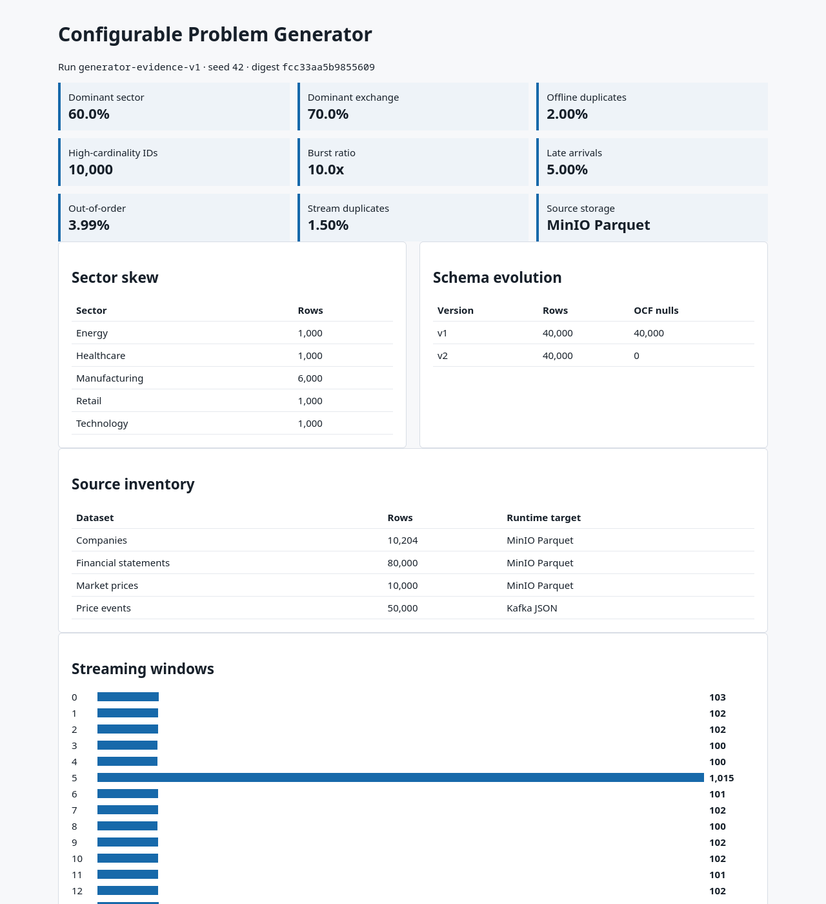

# Data Generator: configurable, deterministic simulation of real-world data problems

This doc proves "Implement Data Generator": `src/generator/` produces
deterministic batch and streaming data with measured skew, cardinality,
schema evolution, duplicates, and burst/late/duplicate streaming problems,
all driven by a typed YAML config, with results stored for later Bronze
ingestion. It does not claim the generated data resembles any specific real
company's actual financials — it is synthetic, seed-reproducible fixture
data by design.

**Active deployment facts:** `configs/generator-config.yaml`,
`configs/schema-contracts.yaml`, evidence run `generator-evidence-v1`,
seed `42`.

## Part I — Config-driven simulation

### 1. Typed config controls every data characteristic

```bash
python scripts/run_generator_and_profile.py \
  --config configs/generator-config.yaml --profile evidence
```

The YAML contract controls seed/`run_id`, companies/quarters, high-cardinality
IDs, dominant sector/exchange rates, offline duplicate rate, schema-change
quarter, event volume/window/burst multiplier, late/out-of-order/duplicate
rates, and offset bounds. Unknown, missing, invalid-rate, invalid-volume, and
impossible-burst settings fail before generation — not silently ignored.

### 2. Offline and streaming problem simulation

```text
Offline: skew is deterministic by company index (not statistical luck);
  high_cardinality_id has exact configured cardinality; financial schema
  v1 has null operating_cash_flow/retained_earnings/statement_type, v2
  populates them; duplicate rows share the business key with a later
  created_ts (measures Silver latest-row dedup).

Streaming: topic financial.price_events, finite replay ordered by
  ingest_timestamp; one configured burst window, configured lateness,
  configured out-of-order events, duplicates sharing a deterministic
  event_id. is_late/is_injected_duplicate are generator truth labels,
  not inferred results.
```

## Part II — Measured evidence run

| Characteristic | Measured result |
|---|---:|
| Base companies | 10,000 |
| Financial statements | 80,000 |
| Market prices | 10,000 |
| Stream events | 50,000 |
| Dominant sector | 60.00% |
| Dominant exchange | 70.00% |
| Exact high-cardinality IDs | 10,000 |
| Schema v1 / v2 rows | 40,000 / 40,000 |
| Offline duplicates | 1.9992% |
| Burst peak / baseline | 10.05x |
| Late events | 5.002% |
| Out-of-order events | 3.994% |
| Stream duplicates | 1.500% |

Artifacts:
[`effective-config.json`](../../evidence/generator/effective-config.json),
[`profile.json`](../../evidence/generator/profile.json),
[`source-manifest.json`](../../evidence/generator/source-manifest.json),
[`runtime-validation.json`](../../evidence/generator/runtime-validation.json).

#### Image proof



*Image note:* the generator's own profile output (canonical evidence
capture) summarizes the measured characteristics in the table above. It
proves the numbers come from a real profiling run against generated data. It
does not prove the data was ever ingested downstream — that is
`data_pipeline_orchestration.md`'s DP1 proof.

## Part III — Storage and replay

Local output uses replayable JSONL; runtime MinIO output uses Parquet under
`source/generator/run_id=<run_id>/offline/` — this is the stored-for-later
ingestion step the rubric asks for (simulate data as if it were in another
department, then pull it into Bronze). The same typed config and seed
reproduce identical logical JSON serialization hashes; storage encodings may
differ across library versions, so correctness uses row counts and logical
hashes rather than raw Parquet byte hashes.

## Limitations

Storage-encoding non-determinism across Parquet library versions is a known,
disclosed limitation of the replay-hash approach — mitigated by comparing
logical content hashes instead of raw bytes, not by claiming byte-for-byte
reproducibility that doesn't hold across environments.

## References

- None external — the generator is original to this codebase.
</content>
