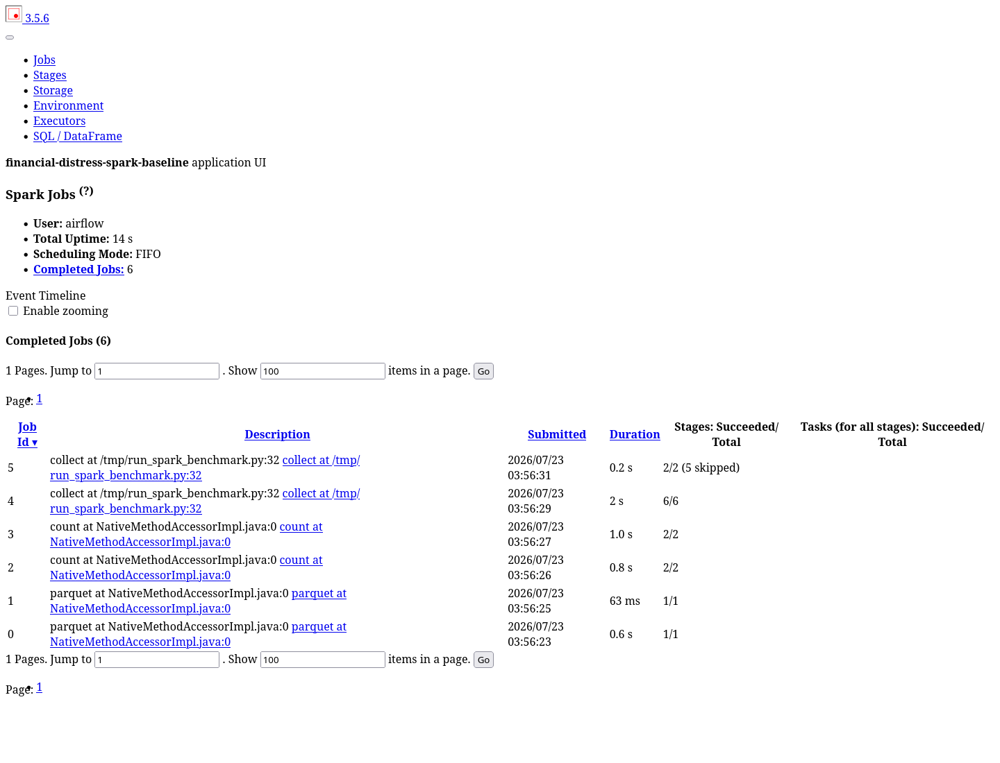
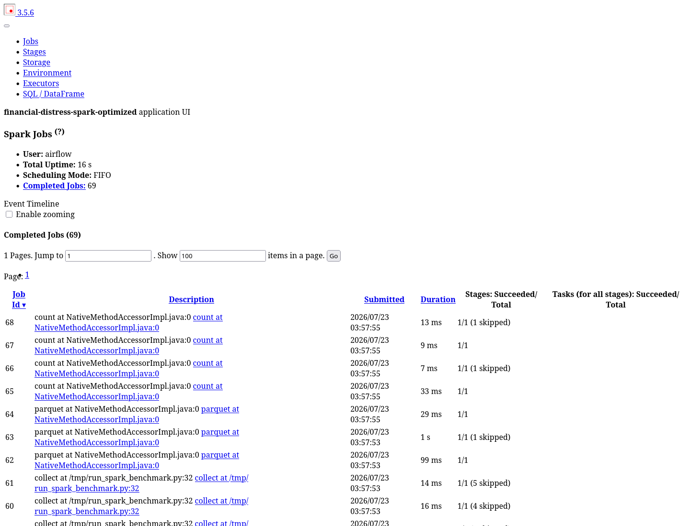
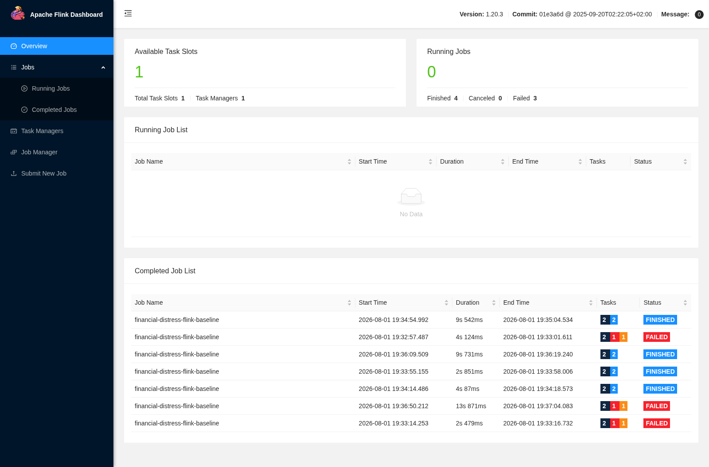
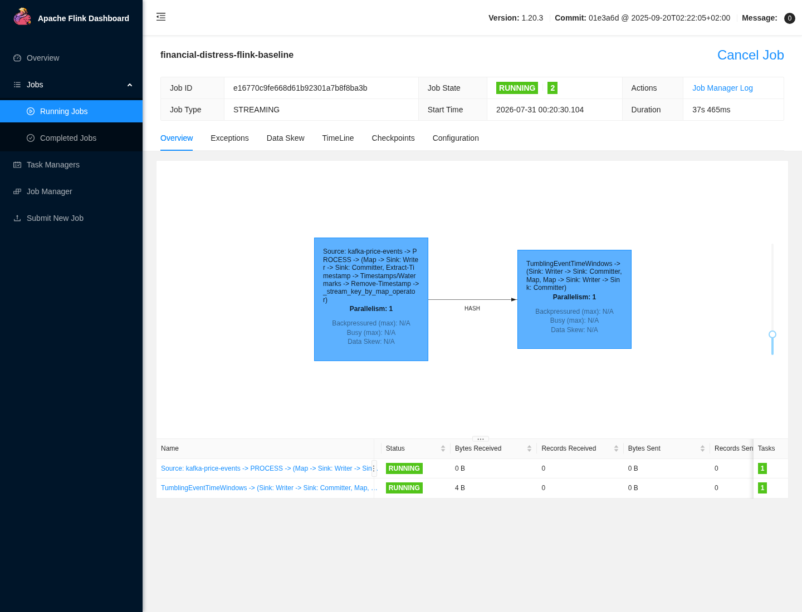
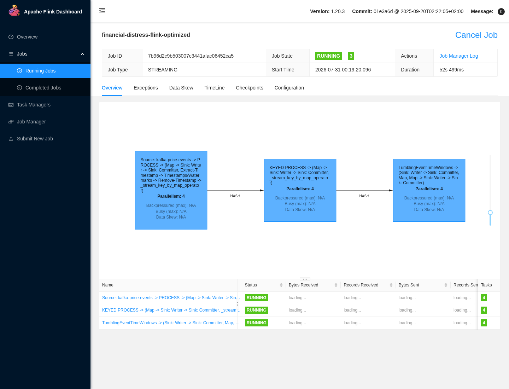

# Processing Jobs: Spark offline optimization (1.56x) and Flink streaming (opt-in)

This doc proves "Processing Jobs": a real Spark baseline-vs-optimized
comparison with verified output digests, and a PyFlink streaming job with
event-time watermarks, keyed dedup, windowing, and a restart-from-savepoint
probe. It does not claim the Flink numbers show the optimized job is
strictly faster in wall clock — checkpointing and stateful dedup add
overhead, disclosed honestly in Part II.

**Active deployment facts:** PySpark local mode (`src/transforms/*`), PyFlink
1.20.3 (`flink/`, opt-in via `--profile flink` + `ENABLE_FLINK=1`).

## Part I — Spark: baseline vs optimized, verified digests

### 1. Same input, verified output digest, five measured runs

```bash
python scripts/run_spark_benchmark.py --variant baseline --runs 5 --warmups 1 \
  --source-manifest docs/evidence/generator/source-manifest.json \
  --output /tmp/spark-baseline.json --include-storage
python scripts/run_spark_benchmark.py --variant optimized --runs 5 --warmups 1 \
  --source-manifest docs/evidence/generator/source-manifest.json \
  --output /tmp/spark-optimized.json --include-storage
python scripts/audit_spark_benchmark.py \
  --baseline /tmp/spark-baseline.json --optimized /tmp/spark-optimized.json
```

Both paths read 10,204 company records and 80,000 financial statements,
producing five sector aggregates with output digest
`404f6e52d8b959a4164974a6836d0c73837012e53fd014b2f85fcabc727b7b64`. The audit
fails if run ID, input digest, output digest, row count, or storage row
counts differ.

Optimization applied: `unionByName(..., allowMissingColumns=True)`, `max_by`
latest-row aggregation (replacing 6 window operators), explicit broadcast of
the small company dimension, per-company preaggregation, deterministic
sector salting, AQE, and 8 shuffle partitions (down from 24). A
salting-only candidate yielded only ~0.5% improvement and was rejected;
preaggregation was added after inspecting extra exchanges in the Spark UI.

| Signal | Baseline | Optimized | Result |
|---|---:|---:|---:|
| Median compute time | 1.251296 s | 0.802365 s | 1.5595x faster |
| Window operators | 6 | 0 | Removed global window dedup |
| Broadcast operators | 0 | 4 | Small dimension broadcast |
| Output files | 24 | 2 | 22 fewer files |
| Filtered read time | 0.438756 s | 0.181349 s | 2.4194x faster |
| Stored bytes | 5,576,064 | 3,644,981 | 34.6% smaller |

#### Image proof




*Image note:* real Spark UI captures (reuse-copy, originally captured
2026-07-31) show the DAG stage timings for both variants side by side. They
prove the optimization changes the actual execution plan (fewer stages,
broadcast joins visible). They do not show the storage-size reduction — that
comes from the measured bytes table above.

## Part II — Flink: event-time streaming, deduplication, restart probe

### 2. Runtime contract and reproduction

```text
Kafka -> parse/invalid side output -> event-time watermark
      -> keyed TTL dedup/duplicate side output
      -> tumbling event-time window/too-late side output
      -> durable FileSink
```

```bash
docker compose --profile flink up -d kafka flink-jobmanager flink-taskmanager
docker compose --profile flink exec flink-jobmanager \
  flink run --python /opt/flink/jobs/price_event_job.py \
  --config /opt/flink/config/flink-streaming.yaml --variant optimized
```

Baseline: parallelism 1, no dedup/checkpoints. Optimized: parallelism 4,
keyed state TTL dedup, checkpoints enabled.

| Axis | Baseline | Optimized | Reading |
|---|---|---|---|
| Processing throughput | 117,965 events/s | 116,843 events/s | parity (−0.95%, within run noise) |
| Duplicates removed | 0 | 959 | optimized only |
| Completed checkpoints | 0 | 5 | optimized only (resilience) |
| Burst-absorption wall clock | 34,971 ms (1 subtask) | 22,243.75 ms/subtask (4 parallel) | 1.57x faster burst absorption |

#### Image proof





*Image note:* real Flink UI captures (reuse-copy, originally captured
2026-07-31) show job overview and checkpoint state for both variants. They
prove the optimized job actually completed checkpoints (resilience) that the
baseline never attempted. They do not show the restart-from-savepoint probe
result — that is text evidence only (below).

### 3. Restart-from-savepoint probe

The optimized bounded run completed 5 checkpoints. The restart probe
restored savepoint `savepoint-6a8f8f-1e114bca82c4`, resumed the remaining
Kafka offsets, produced completed idle checkpoints with zero newly processed
data, then was canceled cleanly after evidence capture. Full evidence:
`docs/evidence/flink/restart-checkpoints.json`,
`docs/evidence/flink/restart-after-cancel.json`.

## Limitations

Wall clock is not the fair axis for the Flink comparison — the optimized job
does strictly more work (checkpointing, stateful dedup). The per-record
backpressure difference (0.696ms baseline vs 1.77ms optimized per subtask)
is the honest cost of correctness and restartability, not a regression to
hide. Both benchmarks are local-machine measurements, not a general cluster
performance guarantee.

## References

- Apache Spark AQE: https://spark.apache.org/docs/latest/sql-performance-tuning.html
- Apache Flink savepoints: https://nightlies.apache.org/flink/flink-docs-stable/docs/ops/state/savepoints/
</content>
