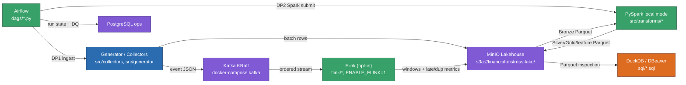

# README Business Domain: the row itself, plus the deployable-unit diagram

This doc proves the README requirement: a business-domain introduction and a
high-level system deployment diagram where every major component is a real
deployable unit. It does not repeat the full README — it explains what that
section covers and why the diagram is drawn the way it is.

## Part I — Business domain

The platform is a **local-first financial-distress data lakehouse** for
Vietnamese listed companies: it collects quarterly financial statements,
daily market prices, and reference data, then produces curated
Bronze/Silver/Gold tables, distress labels (Altman Z''-Score inspired), and
audit-ready evidence. Three primary users:

- **Data engineer** — owns Airflow DAGs, Kafka topics, PySpark transforms,
  MinIO layout, PostgreSQL metadata.
- **ML engineer** — consumes Gold features and `obt_company_quarter_risk`
  for the platform training/scoring/monitoring.
- **Analyst / reviewer** — opens DBeaver or DuckDB against the local
  lakehouse to validate row counts, SCD2 history, lineage, and contracts.

Full text: `README.md` §Business Domain.

## Part II — Deployable-unit diagram

The the platform lakehouse subsystem diagram (Phase 3 of this plan) draws only
real deployable units — Kafka, Airflow, Spark, MinIO, PostgreSQL, DuckDB —
never a library or SDK as a node:

Every arrow follows data-flow direction (A→B when data moves from A to B) and
carries a label describing what moves along it — the same convention this
plan's style contract fixes for all seven subsystem diagrams. Feast SDK,
DuckDB `httpfs` extension, and similar libraries are deliberately *not*
drawn as nodes — they are not independently deployable.

## Limitations

This doc indexes the diagram and domain summary; the full README carries the
canonical, most-current version of both — read `README.md` directly for the
authoritative text.

## References

- Mermaid flowchart syntax: https://mermaid.js.org/syntax/flowchart.html
