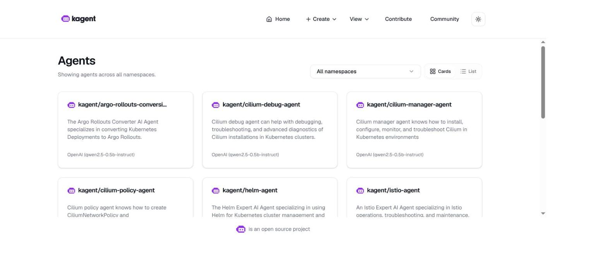
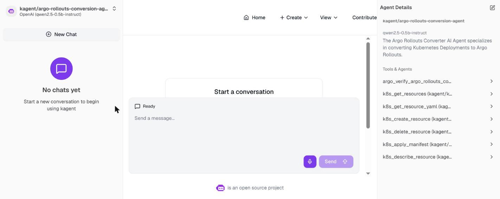
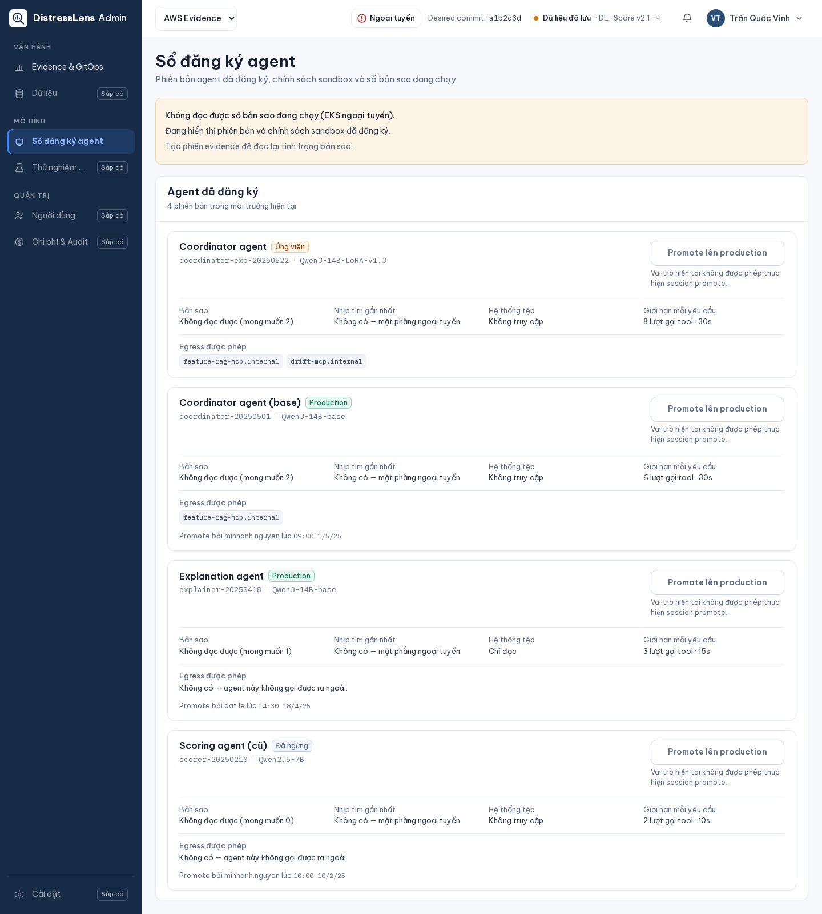

# Agent Registry: a queryable, GitOps-owned agent catalog

This doc proves the single row in the "Deploy registry for agent" rubric
area: a real FastAPI service that projects the GitOps-owned agent registry
as a queryable HTTP API, backed by a ConfigMap, and the kagent-ui agent list
that renders the same underlying agents. It does not prove write access to
the registry — it is intentionally read-only.

**Active deployment facts:** namespace `kagent`, deployment
`agentregistry`, FastAPI registry `1.0.0`, ConfigMap CRD
`registry.fd.dev/v1alpha1`.

## Part I — Deploy

### 1. Read-only HTTP projection of the GitOps-owned registry

```python
# src/agents/registry.py:1-31
"""Read-only HTTP projection of the GitOps-owned agent registry."""

def load_registry(path: str | Path | None = None) -> dict[str, Any]:
    registry_path = Path(path or os.getenv("AGENT_REGISTRY_PATH", "/registry/registry.json"))
    payload = json.loads(registry_path.read_text(encoding="utf-8"))
    if not isinstance(payload.get("agents"), list):
        raise ValueError("registry must contain an agents list")
    return payload


def create_app() -> FastAPI:
    application = FastAPI(title="agent-registry", version="1.0.0")

    @application.get("/readyz")
    async def readyz() -> dict[str, Any]:
        payload = load_registry()
        return {"status": "ready", "agents": len(payload["agents"])}

    @application.get("/v1/agents")
    async def agents() -> dict[str, Any]:
        return load_registry()
```

The service never accepts writes — it is a projection of a ConfigMap that
GitOps owns exclusively, keeping "who's registered" a declarative, auditable
fact rather than a runtime-mutable one.

#### Image proof



*Image note:* the kagent-ui registry UI (live capture, 2026-08-14) lists
every deployed agent with its model and description. It proves the registry
UI surfaces all deployed agents. It does not by itself prove the read-only
FastAPI projection below — that is proven by the CLI round-trip in Part II.

## Part II — Round-trip

```text
$ kubectl exec -n kagent deploy/agentregistry -- python -c "..."
/readyz  -> {"status":"ready","agents":3}
/v1/agents -> feature-agent, drift-agent, coordinator
              (each with version/status/replicas/model/sandbox metadata)
```

Full evidence:
[`LLM-registry-for-agent-theo-t-registry-for-agent-theo-tutori.md`](../../phase2/evidence/llm/LLM-registry-for-agent-theo-t-registry-for-agent-theo-tutori.md).

#### Image proof



*Image note:* live kagent-ui agent detail panel (2026-08-14) for
`kagent/argo-rollouts-conversion-agent` shows its model
(`qwen2.5-0.5b-instruct`) and its bound-tools list. It proves the registry
detail view exposes per-agent model and tool metadata, not just a name in a
list. It does not represent one of this submission's three agents — kagent's
own bundled Kubernetes-operations agents share the same UI, used here only
to demonstrate the detail-panel mechanism.

## Part III — Product web app registry surface

The registry is also visible through the product plane's own agent-registry
UI, independent of the kagent-ui capture above:



*Image note:* Next.js product agent-registry surface (Playwright capture),
degraded-state view for the `platform_operator` role. It proves the product
plane renders a live agent-registry surface, including an honest degraded
state rather than hiding it. It does not show the analyst-role happy-path
view — see `web_api_user_data.md` for that capture.

## Limitations

The registry lists 3 agents matching this submission's scope (feature,
drift, coordinator); `agent_registry.md`'s CLI-verified count does not
include the tool-only kagent agents visible in the wider kagent-ui view
(`kagent_agents_ready.png` shows more — those are kagent's own bundled
Kubernetes-operations agents, unrelated to this submission's coordinator/
feature/drift agent trio).

## References

- FastAPI: https://fastapi.tiangolo.com/
</content>
