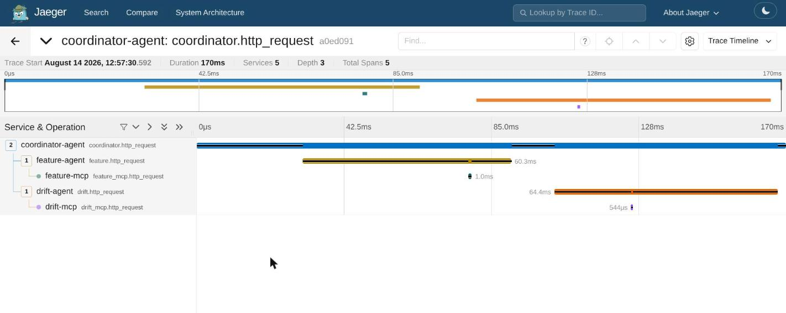
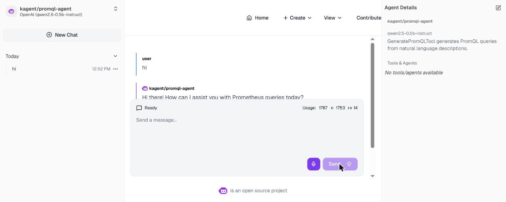

# Coordinator Agent: bounded-hop orchestration of 2 specialists, live-traced

This doc proves the two rows in "Deploy 1 Coordinator Agent": a coordinator
that fans out to the feature and drift specialists in parallel, enforces a
hop bound, aggregates real citations, and is published on the registry with
its specialist list and policy. It does not prove unbounded multi-hop
orchestration — `max_hops=2` is an intentional, tested limit.

**Active deployment facts:** namespace `agents-sandbox`, deployment
`coordinator`, `MAX_AGENT_HOPS=2`, `max_parallel=2`, `timeout_seconds=50.0`,
2-3 replicas, model `qwen2.5-0.5b-instruct` (Q4_K_M) via
`fd-global-model-config`.

## Part I — Orchestration logic

### 1. Parallel fan-out with a hop bound and citation validation

```python
# src/agents/coordinator.py:44-93
class Coordinator:
    feature_agent: Specialist
    drift_agent: Specialist
    max_hops: int = 2
    max_parallel: int = 2
    timeout_seconds: float = 50.0

    async def _coordinate(
        self, raw: CoordinatorRequest | dict[str, Any]
    ) -> CoordinatorResponse | AgentFailure:
        request = raw if isinstance(raw, CoordinatorRequest) else CoordinatorRequest.model_validate(raw)
        if request.hop + 1 > self.max_hops:
            return self.failure_policy("hop_limit_exceeded")
        semaphore = asyncio.Semaphore(self.max_parallel)

        async def invoke(agent: Specialist, payload: dict[str, Any]) -> SpecialistResponse:
            async with semaphore:
                return await agent.run({"question": request.question, **payload})

        results = await asyncio.wait_for(
            asyncio.gather(
                invoke(self.feature_agent, request.feature_request),
                invoke(self.drift_agent, request.drift_request),
            ),
            timeout=self.timeout_seconds,
        )
        citations = [citation for result in results for citation in result.citations]
        if not citations_are_valid(citations):
            return self.failure_policy("invalid_citations")
```

Every hop is wrapped in an OpenTelemetry span
(`telemetry.span("agent.coordinator.coordinate", ...)`) — this is the code
path that produced the live trace below.

### 2. Live call: hop-bounded, dual-citation response

```text
$ kubectl exec sandbox-negative-probe -n agents-sandbox -- curl -fsS -X POST \
    http://coordinator.agents-sandbox.svc.cluster.local/v1/run ...
-> status=ok, feature specialist object, drift specialist object,
   2 citations, hops_used=1
   coordinator endpoint: 2 replicas after HPA settled
```

Full evidence:
[`LLM-1-coordinator-agent-i-u-ph-i-2-agent-tr-n.md`](../../phase2/evidence/llm/LLM-1-coordinator-agent-i-u-ph-i-2-agent-tr-n.md).

#### Image proof



*Image note:* live Jaeger trace (2026-08-14, trace ID `a0ed091`) shows
`coordinator.http_request` (170ms total) spanning `feature.http_request`
(60.3ms) → `feature_mcp.http_request` (1.0ms) and
`drift.http_request` (64.4ms) → `drift_mcp.http_request` (544µs), 5 spans, 3
services traced end to end. It proves the coordinator's fan-out actually
executes both specialist paths through their respective MCP tools in a real
request. It does not prove the specific citation content returned — that is
the CLI evidence quoted above.

## Part II — Registry publication

```text
$ kubectl exec -n kagent deploy/agentregistry -- python -c "..." /v1/agents/coordinator
-> version 1.0.0, active, replicas 2..3, fd-global-model-config,
   specialists=[feature-agent, drift-agent], maxHops=2
```

Full evidence:
[`LLM-1-coordinator-agent-publish-agent-n-y-l-n-registry.md`](../../phase2/evidence/llm/LLM-1-coordinator-agent-publish-agent-n-y-l-n-registry.md).

#### Image proof



*Image note:* live kagent-ui chat round-trip (2026-08-14) with
`kagent/promql-agent` shows a successful response with visible token usage
(1767 total: 1753 in / 14 out). It proves a real agent round-trip through
the same kagent runtime the coordinator uses, with genuine token accounting
rather than a placeholder. It is a different agent than the coordinator
itself — included as corroborating evidence that the kagent chat mechanism
produces real, measured responses.

## Limitations

`max_hops=2` is a hard-coded ceiling, not a configurable per-request budget —
a query requiring a third specialist hop is rejected with
`hop_limit_exceeded` rather than partially answered. This is an intentional
scope boundary for this submission, not an undiscovered limit.

## References

- OpenTelemetry Python: https://opentelemetry.io/docs/languages/python/
</content>
