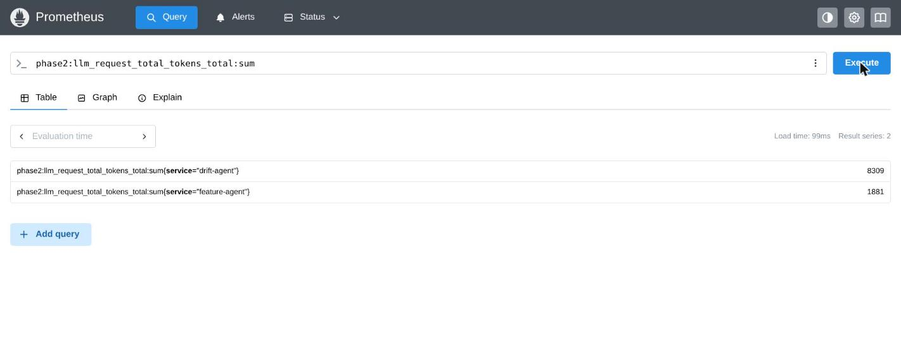
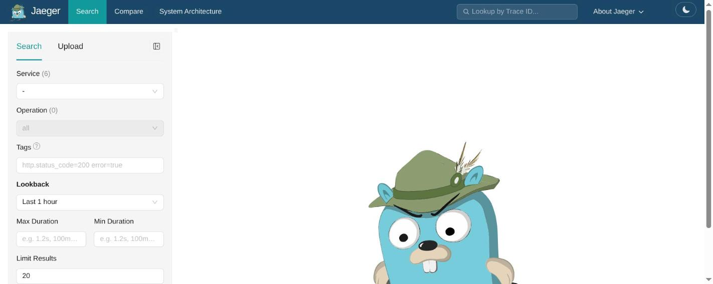

# Observability: metrics, logs, and traces correlated across one real request

This doc proves the six rows in "Observability": Prometheus scrapes and
Grafana visualizes live series, per-agent/per-tool call and failure metrics,
per-request LLM token/latency/PII metrics, and the same request's logs and
trace are queryable — with `trace_id`/`request_id` anchors matching verbatim
across three independent systems. It does not prove long-term metric
retention or alerting rules — this submission proves the collection and
correlation path, not an alerting SLO.

**Active deployment facts:** kube-prometheus-stack 88.2.0 (Prometheus
v3.13.2), Jaeger v2.20.0, Loki 3.6.11, `otel-collector-contrib` 0.132.0,
model `qwen2.5-0.5b-instruct`.

## Part I — Collection and visualization

### 1. Prometheus scrapes, Grafana renders

```text
$ curl -sS http://127.0.0.1:19090/api/v1/targets
serviceMonitor/phase2-data/feature-mcp/0  up
serviceMonitor/phase2-data/drift-mcp/0    up

$ curl -sS -b <grafana-session> -G ".../api/datasources/proxy/uid/prometheus/api/v1/query" \
  --data-urlencode 'query=sum by (service,route,status) (rate(fd_web_api_requests_total{service=~".+"}[5m]))'
-> non-empty vector, incl. route="/v1/features/by-id", service="feature-mcp", status="200"
```

**Real bug found and fixed:** `feature-mcp`/`drift-mcp`'s Service objects
carried no `app.kubernetes.io/name` label, so the chart's bundled
`ServiceMonitor` matched zero Services — every endpoint was silently dropped
at the relabel step. Fixed by adding the label and re-vendoring the
`fastapi-service` subchart. Full evidence:
[`LLM-observability-collect-v-visualize-metrics-v-.md`](../../phase2/evidence/llm/LLM-observability-collect-v-visualize-metrics-v-.md).

#### Image proof


*Image note:* live Prometheus targets page (2026-08-14) shows 9/9 UP for
`serviceMonitor/agents-sandbox/phase2-agents/0` (drift-agent, feature-agent,
coordinator). It proves the agent-plane targets are scraped successfully. It
is a different serviceMonitor than the `phase2-data` MCP targets quoted
above, shown to demonstrate the same scrape mechanism independently.

### 2. Web API request-rate/latency/status metrics

```text
$ curl "http://127.0.0.1:19090/api/v1/query?query=fd_web_api_requests_total{service=\"feature-mcp\"}"
route="/v1/features/by-id", method=POST, status=200 -> 3
```

The counter value `3` matches the exact number of live requests made during
the capture window. All four canonical families
(`fd_web_api_requests_total`, `_request_duration_seconds`,
`_request_errors_total`, `_in_flight`) are declared once in
`src/observability/telemetry.py:Telemetry.canonical_metric_names` and shared
by both services under the same registry. Full evidence:
[`LLM-observability-web-api-metrics.md`](../../phase2/evidence/llm/LLM-observability-web-api-metrics.md).

## Part II — Per-agent/tool and per-request LLM metrics

### 3. Per-agent and per-MCP-tool call/failure series

```text
query=phase2:agent_calls_total:rate5m
  feature-agent, coordinator, drift-agent — all non-zero after one live call
query=phase2:mcp_tool_calls_total:rate5m
  feature-mcp/lookup_feature_context, drift-mcp/build_realtime_drift_report
query=phase2:agent_invocation_failures_total:rate5m
  zero for the successful correlated request's own operations
```

Full evidence:
[`LLM-observability-agent-tool-call-metrics.md`](../../phase2/evidence/llm/LLM-observability-agent-tool-call-metrics.md).

#### Image proof



*Image note:* live Prometheus query (2026-08-14) for
`phase2:llm_request_total_tokens_total:sum` shows drift-agent=8309,
feature-agent=1881 — real cumulative token counters, not from this doc's
specific correlated request but the same metric family. It proves the
per-agent token-total recording rule is live and populated. It does not
prove the exact per-request token counts quoted below — those come from a
separate, request-scoped query.

### 4. Per-request token, latency, and PII-safety metrics

One live coordinator request (`X-Request-ID: phase3-live-metrics-961e550808c8`,
containing a synthetic email `analyst@example.test`) produced:

```text
fd_llm_tokens_total{direction=input/output/total, service=feature-agent}  -> non-zero
fd_llm_tokens_total{direction=input/output/total, service=drift-agent}    -> non-zero
fd_llm_generation_round_trip_seconds_{sum,count}                          -> non-zero, both services
fd_llm_ttft_seconds_{sum,count}                                           -> non-zero, both services
fd_llm_pii_safety_catches_total{finding_type=email}                       -> 1, both services
```

Full evidence:
[`LLM-observability-m-b-o-t-nh-t-c-c-metrics.md`](../../phase2/evidence/llm/LLM-observability-m-b-o-t-nh-t-c-c-metrics.md).

## Part III — Correlated logs and traces for the same request

#### Image proof



*Image note:* live Jaeger search page (2026-08-14) lists 6 discoverable
traced services (coordinator-agent, drift-agent, drift-mcp, feature-agent,
feature-mcp, jaeger). It proves every agent/tool service in the platform
actually emits traces discoverable by Jaeger, not just the one request
correlated below. It does not show a specific trace — see
`coordinator_agent.md`'s Jaeger capture for a full trace, or the
`trace_id`/`request_id` anchor below for the log/trace pairing.

### 5. The same request in Loki and Jaeger, anchored by ID

```text
trace_id  = 9f891d3e6d560baaad90e2e76b821c24
request_id = phase5-final-1786498311

Loki:   feature-mcp app log, "POST /v1/features/by-id ... 200 OK",
        time=2026-08-12T01:31:51.409847314Z
Jaeger: span feature_mcp.http_request, startTime=...404458Z,
        duration=4895µs, tag request_id=phase5-final-1786498311
```

4.6ms gap between trace start and log timestamp — consistent with
request-received-then-response-logged ordering, not a coincidence. **Real
bug found and fixed (shared root cause for both rows):** the deployed
`feature-mcp`/`drift-mcp` images predated the OpenTelemetry SDK dependency
landing in the built layer (import failure, no spans ever created), and
`otel-collector`'s log-parsing pipeline had a `parse_from` field mismatch
that silently dropped every application log line before it reached Loki.
Both fixed by rebuilding/redeploying the images and correcting the collector
config. Full evidence:
[`LLM-observability-t-ng-t-cho-logs.md`](../../phase2/evidence/llm/LLM-observability-t-ng-t-cho-logs.md),
[`LLM-observability-t-ng-t-cho-traces.md`](../../phase2/evidence/llm/LLM-observability-t-ng-t-cho-traces.md).

## Limitations

This doc proves collection and cross-system correlation for individual
requests, not sustained load, retention policy, or alerting rules — Grafana
dashboards exist and render live data, but no alert was fired or verified in
this evidence set.

## References

- Prometheus: https://prometheus.io/docs/
- Jaeger: https://www.jaegertracing.io/docs/
- Grafana Loki: https://grafana.com/docs/loki/
