# RAG Pipeline: fetch, chunk, govern, embed, write — proven idempotent and governed

This doc proves the two rows in the "RAG" rubric area: `RagIngestionPipeline`
runs a real fetch→chunk→dedupe→govern→embed→write flow against a live
PGVector store and is idempotent on rerun, and the governance layer actually
quarantines a policy-violating chunk end to end. It does not prove ingestion
from a live production document source — the corpus is a tracked fixture.

**Active deployment facts:** `phase2-postgres` (PGVector `pgvector/pgvector:pg16`),
schema `ml_metadata`, embedding model `deterministic-hash-v1`,
source `financial-distress-data@5a5a40a`.

## Part I — Pipeline and governance

### 1. Fetch → chunk → dedupe → govern → embed → write

`RagIngestionPipeline` (wrapped by `dags/phase2/phase2_rag_ingest.py`'s
`run_ingestion_task`) is the single entrypoint for both a rerun-safety proof
and a governance-enforcement proof.

```mermaid
flowchart LR
    classDef edge fill:#2b6cb0,stroke:#1a365d,color:#fff
    classDef service fill:#38a169,stroke:#22543d,color:#fff
    classDef store fill:#805ad5,stroke:#44337a,color:#fff
    classDef model fill:#d69e2e,stroke:#744210,color:#fff
    classDef result fill:#dd6b20,stroke:#7b341e,color:#fff

    SOURCE["Approved source document"]:::edge
    NORM["normalize/hash/chunk<br/>src/llm/rag_pipeline.py"]:::service
    EMBED["fd-embeddings InferenceService<br/>KServe"]:::model
    INDEX["PGVector index<br/>+ MinIO artifact store"]:::store
    FEAST["Feast feature_repo/"]:::store
    RETRIEVE["governed retrieval tool<br/>feature-MCP"]:::service
    CITE["citation with source + version + lineage"]:::result

    SOURCE -->|"raw text"| NORM
    NORM -->|"chunks"| EMBED
    EMBED -->|"versioned vectors"| INDEX
    NORM -->|"governance metadata"| FEAST
    INDEX -->|"top-k match"| RETRIEVE
    FEAST -->|"lineage record"| RETRIEVE
    RETRIEVE -->|"cited passage"| CITE
```



### 2. Idempotency: rerun writes zero new rows

```text
run 1: {"documents_fetched": 1, "chunks_new": 2, "chunks_quarantined": 0,
        "ingestion_version": "2026-08-08-c53e23b28d00"}
run 2: {"documents_fetched": 1, "chunks_new": 0, "chunks_quarantined": 0,
        "ingestion_version": ""}
SELECT count(*) FROM ml_metadata.rag_chunk;  -> 2 (unchanged after run 2)
```

Full evidence:
[`LLM-rag-rag-data-pipeline.md`](../../phase2/evidence/llm/LLM-rag-rag-data-pipeline.md).

### 3. Governance: a licensing violation is quarantined, not silently dropped

```text
$ .venv/bin/python -m pytest tests/phase2/pipelines/test_data_governance.py -q
32 passed in 3.18s

# live probe: one chunk with license="unlicensed_scrape" (outside
# configs/rag-sources.yaml's allowed_licenses)
chunks remaining after governance: 0

$ psql ... "SELECT chunk_id, violation_reason FROM ml_metadata.rag_quarantine;"
 7960d31...  license 'unlicensed_scrape' not in allowlist
             ['company_disclosure_public_domain', 'vnstock_public_api_terms']
$ psql ... "SELECT count(*) FROM ml_metadata.rag_chunk;"   -> 2 (unaffected)
```

The quarantined chunk never touches `ml_metadata.rag_chunk` — it is filtered
before the write step and recorded with a non-empty `violation_reason`. Full
evidence:
[`LLM-rag-m-b-o-data-governance-cho-pipe.md`](../../phase2/evidence/llm/LLM-rag-m-b-o-data-governance-cho-pipe.md).

## Limitations

The ingestion corpus is a tracked fixture
(`tests/phase2/fixtures/rag_corpus/vnstock_news_vnm.txt`), not a live scrape
of a real disclosure source — no registered real source in
`configs/rag-sources.yaml` actually violates the licensing policy, so the
quarantine probe used a synthetic chunk to exercise the real enforcement path
against real Postgres. DataHub lineage is audited through the no-network
`audit_phase2_lineage` path — this sandbox has no live DataHub server; the
emit path itself is separately exercised against a fake client in
`tests/phase2/pipelines/test_lineage_emitter.py`.

## References

- pgvector: https://github.com/pgvector/pgvector
</content>
