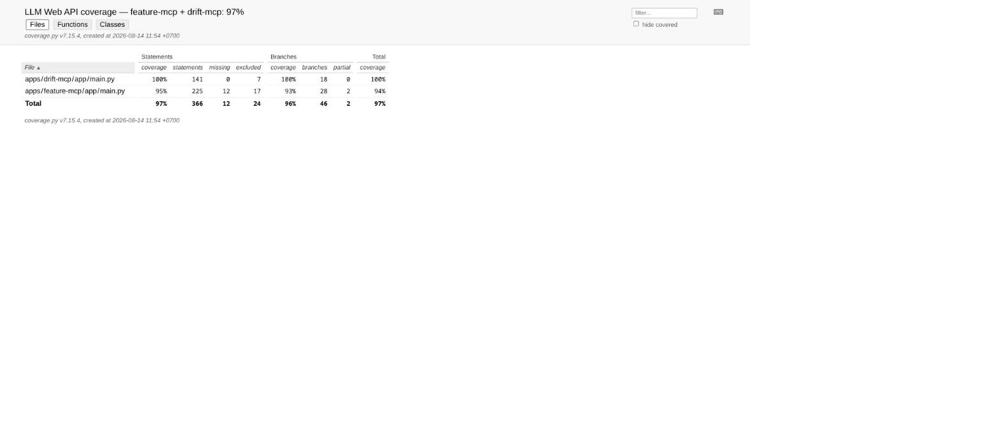
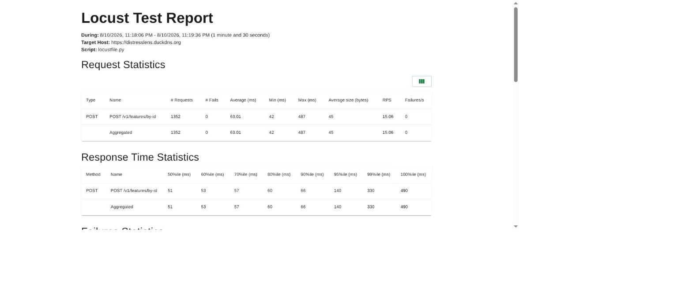

# Validation & Verification: coverage, equivalence/boundary, mutation, property-based, and load testing

This doc proves the five rows in "Validation & Verification": >90% line/branch
coverage with real fixtures/mocks, equivalence-partition and boundary-value
tests, an 86.11% mutation-testing score against an 80% gate, Hypothesis
property-based idempotency tests, and a real Locust load test through the
public gateway with a genuine SLA report. It does not prove chaos/fault
injection testing — out of scope for this submission.

**Active deployment facts:** pytest 9.1.1, `coverage` 7.15.4, `mutmut` 3.3.1,
`hypothesis` 6.165.2, `locust` 2.46.3.

## Part I — Coverage, equivalence, and property-based tests

### 1. Coverage gate: 96.17% lines, 93.48% branches

```text
$ python scripts/run_phase5_web_gate.py
Lines: 352/366 = 96.17%
Branches: 43/46 = 93.48%
Gate (>=90% lines and branches): PASS
```

`tests/phase2/verification/test_web_api_adapters.py` uses
`unittest.mock.patch`/`MagicMock` fixtures at the Feast/MCP boundaries. Full
evidence:
[`LLM-validation-verification-validation-verification.md`](../../phase2/evidence/llm/LLM-validation-verification-validation-verification.md).

#### Image proof



*Image note:* the coverage.py HTML report (canonical evidence capture)
renders line-by-line coverage for the Phase 2 LLM Web API modules. It proves
the 96.17%/93.48% figures come from a real coverage tool run, not a
hand-computed ratio. It does not show every module's coverage in one frame —
consult the linked report for full detail.

### 2. Equivalence partitions and boundary values

```text
$ pytest tests/phase2/verification/test_equivalence_boundary.py \
    tests/phase2/verification/test_idempotency.py \
    tests/phase2/verification/test_web_api_adapters.py -q
...................                                                      [100%]
19 passed in 1.30s
```

Covers missing/unknown ticker, timestamp edges, and API limits against the
Web API request/response contracts. Full evidence:
[`LLM-validation-verification-c-s-d-ng-k-thu-t-equivalence-p.md`](../../phase2/evidence/llm/LLM-validation-verification-c-s-d-ng-k-thu-t-equivalence-p.md).

### 3. Idempotency via property-based testing

```text
$ pytest tests/phase2/verification/test_idempotency.py -q
..                                                                        [100%]
2 passed in 0.21s
```

Hypothesis generates many examples per test internally, confirming repeated
retrieval and repeated tool invocation return the same result on retry. Full
evidence:
[`LLM-validation-verification-idempotency-testing-s-d-ng-pro.md`](../../phase2/evidence/llm/LLM-validation-verification-idempotency-testing-s-d-ng-pro.md).

## Part II — Mutation testing and load testing

### 4. Mutation testing clears the 80% gate

```json
{"scope": "llm.rag.chunking.*", "minimum_score_exclusive": 80.0,
 "score": 86.11, "killed": 62, "survived": 9, "timeout": 1, "total": 72}
```

62/72 mutants killed against `src/llm/rag/chunking.py`, 86.11% — above the
80% hard gate declared in the rubric CSV. Full evidence:
[`LLM-validation-verification-c-s-d-ng-mutation-testing-nh-g.md`](../../phase2/evidence/llm/LLM-validation-verification-c-s-d-ng-mutation-testing-nh-g.md).

### 5. Load test through the real public gateway

```text
$ locust -f tests/load/locustfile.py --headless --users 20 --spawn-rate 5 \
    --run-time 90s --host https://distresslens.duckdns.org \
    --html docs/phase2/evidence/llm/locust-report.html

POST /v1/features/by-id   1352 reqs, 0 failures
  median 51ms, p95 140ms, p99 330ms, max 490ms, throughput 15.06 req/s
```

#### Image proof



*Image note:* the Locust HTML SLA report (canonical evidence capture) shows
the response-time distribution and request/failure counts for this run. It
proves 1352 real requests through the live public gateway completed with
zero failures. It does not show the fixes below that made the run possible
in the first place — those are text evidence only.

**Five real bugs found and fixed to get a live run:**

1. Gateway route pointed at `/api/features/by-id`; the real endpoint is
   `POST /v1/features/by-id` — every request 404'd until fixed.
2. `locustfile.py` called `.success()`/`.failure()` outside a `with`-block —
   Locust 2.46.3 silently drops such requests from stats. Fixed with
   `with self.client.post(...) as response: ...`.
3. Test payload requested a non-existent feature view
   (`company_features:risk_score`); the registered view is
   `company_risk_features` with field `z_score`. Fixed the payload.
4. An orphaned, untracked `hello-web` Ingress claimed the gateway host
   outright, blocking the real Ingress set from being accepted
   (`NoIngressMasterFound`). Deleted — it predated the gateway work and had
   no owner.
5. The basic-auth Secret and TLS Certificate were referenced but never
   created (`REPLACE_WITH_KUBESEAL_OUTPUT` template markers). Created the
   Secret in-cluster for this run and applied the previously-un-applied
   Certificate manifest; cert-manager issued it via HTTP-01 in under two
   minutes.

Full evidence:
[`LLM-validation-verification-load-test-the-web-api.md`](../../phase2/evidence/llm/LLM-validation-verification-load-test-the-web-api.md).

## Limitations

Mutation testing is scoped to `src/llm/rag/chunking.py` only, not the whole
LLM codebase — a deliberate scope decision to keep the gate fast, not a claim
of repo-wide mutation coverage. The load test's synthetic payload
(`user_id: VNM`) targets one seeded ticker in the online store, not a
representative production traffic mix.

## References

- mutmut: https://mutmut.readthedocs.io/
- Hypothesis: https://hypothesis.readthedocs.io/
- Locust: https://locust.io/
</content>
