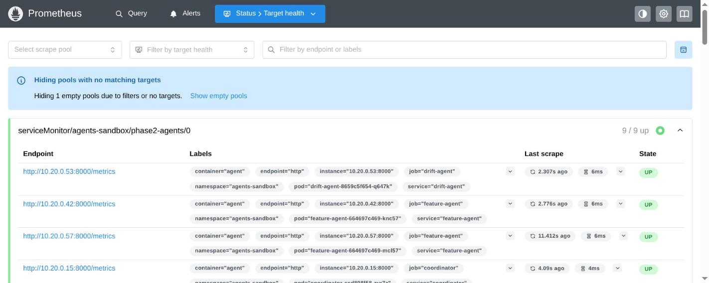

# Web API for real-time drift detection: async API, MCP tool, HPA-scaled sandboxed agent

This doc proves the six rows in the "Web API cho Real-time Drift Detection"
rubric area — the mirror of `web_api_user_data.md` for the drift domain: a
real async FastAPI drift API, deployed as an MCP tool via Helm, called by a
sandboxed drift agent under HPA autoscaling that reaches 3 replicas, and
published on the registry. It does not prove drift detection accuracy on
real production data — the drift scenario is synthetic (`market_stress`).

**Active deployment facts:** namespace `phase2-data` (drift-mcp, drift-api),
namespace `agents-sandbox` (drift-agent, HPA min 2 max 3). FastAPI 0.141.1,
Pydantic 2.13.4, Helm 3, drift-mcp chart 0.1.0.

## Part I — API and deployment

### 1. Async, idempotent drift API

```text
$ .venv-phase2/bin/python -m pytest tests/phase2/apps/test_drift_api_and_mcp.py -q
-> focused tests passed, including async offload of the pure domain
   calculation and a repeated identical response (idempotency)
```

Full evidence:
[`LLM-web-api-cho-real-time-dri-s-d-ng-async.md`](../../phase2/evidence/llm/LLM-web-api-cho-real-time-dri-s-d-ng-async.md),
[`LLM-web-api-cho-real-time-dri-c-s-d-ng-fastapi-data-validati.md`](../../phase2/evidence/llm/LLM-web-api-cho-real-time-dri-c-s-d-ng-fastapi-data-validati.md).

### 2. MCP tool deployed via Helm

```text
$ helm upgrade --install drift-mcp charts/drift-mcp -n phase2-data \
    -f apps/dev/drift-mcp/values.yaml --atomic --timeout 5m
-> release revision 3; atomic rollback on a bad image verified for the
   shared MCP chart family (same chart used by feature-mcp)
```

Full evidence:
[`LLM-web-api-cho-real-time-dri-in-the-form-of-mcp-tool-to-k8s.md`](../../phase2/evidence/llm/LLM-web-api-cho-real-time-dri-in-the-form-of-mcp-tool-to-k8s.md).

### 3. Registry publication

```text
$ kubectl exec -n kagent deploy/agentregistry -- python -c "..." /v1/agents/drift-agent
-> version 1.0.0, active, replicas 2..3, fd-global-model-config,
   tool drift-mcp.build_realtime_drift_report
```

Full evidence:
[`LLM-web-api-cho-real-time-dri-publish-agent-tr-n-l-n-registr.md`](../../phase2/evidence/llm/LLM-web-api-cho-real-time-dri-publish-agent-tr-n-l-n-registr.md).

## Part II — Agent call, autoscaling, and sandbox boundary

### 4. Drift agent call and HPA settle

```text
$ kubectl exec sandbox-negative-probe -n agents-sandbox -- curl -fsS \
    http://drift-agent.agents-sandbox.svc.cluster.local/readyz
-> {"status": "ready"}
direct drift call + coordinator fan-out -> cited drift://scenario/market_stress
endpoints after HPA settled -> 3 drift-agent replicas
```

#### Image proof



*Image note:* Prometheus (live capture, 2026-08-14) shows the drift-agent
target `UP` alongside feature-agent and coordinator, confirming the drift
agent pods are alive and scraped. It proves the pods are running and
reachable by the metrics pipeline. It does not by itself prove the HPA
settled at 3 replicas — that is the CLI evidence quoted above.

Full evidence:
[`LLM-web-api-cho-real-time-dri-1-agent-s-d-ng-mcp-tool-tr-n-v.md`](../../phase2/evidence/llm/LLM-web-api-cho-real-time-dri-1-agent-s-d-ng-mcp-tool-tr-n-v.md).

### 5. Sandbox boundary: same negative-proof suite as the feature agent

```text
$ kubectl get networkpolicy -n agents-sandbox
-> default-deny namespace policy + per-agent egress allow-list
```

Five negative probes (token file, metadata endpoint, arbitrary DNS, direct
model bypass, filesystem write) were denied, while drift MCP/gateway
readiness and the positive drift path were allowed — the same control set
proven for feature-agent in `web_api_user_data.md`, applied identically here.
Full evidence:
[`LLM-web-api-cho-real-time-dri-agent-ch-y-trong-sandbox-m-b-o.md`](../../phase2/evidence/llm/LLM-web-api-cho-real-time-dri-agent-ch-y-trong-sandbox-m-b-o.md).

## Limitations

The drift scenario (`market_stress`) is synthetic, generated by
`src/drift/generator.py` for demonstration — this doc proves the real-time
detection *path* end to end, not statistical drift-detection accuracy on
production financial data. See `improve_data_generator.md` for the drift
simulation mechanism itself.

## References

- FastAPI: https://fastapi.tiangolo.com/
- Kubernetes HPA: https://kubernetes.io/docs/tasks/run-application/horizontal-pod-autoscale/
