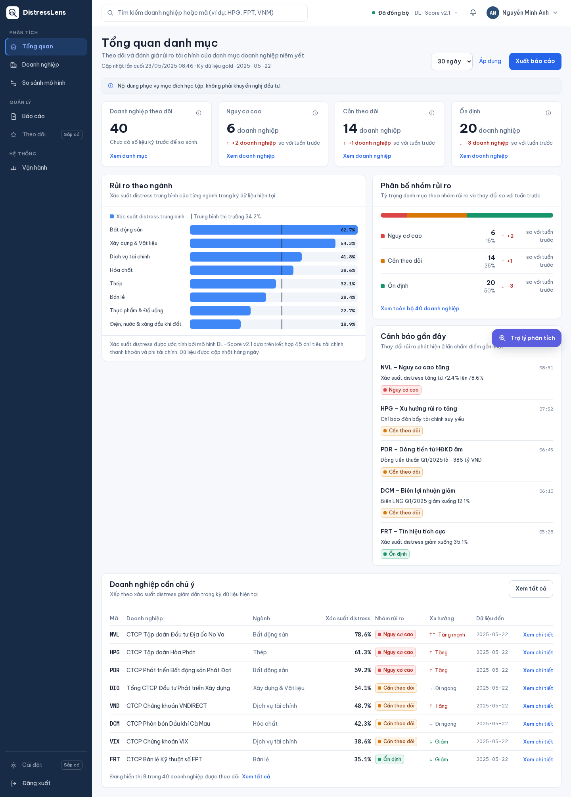
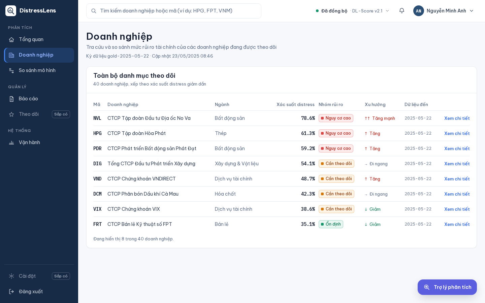

# Web API for user feature data: async Pydantic-validated API, MCP tool, sandboxed agent

This doc proves the six rows in the "Web API kéo dữ liệu user" rubric area:
a real async FastAPI feature/RAG API, deployed as an MCP tool via Helm with
atomic rollback, called by a sandboxed feature agent that is published on the
agent registry and cannot escape its NetworkPolicy. It does not prove Feast
online-store performance at scale — the store is exercised functionally, not
load-tested here (see `validation_verification.md` for load testing).

**Active deployment facts:** namespace `phase2-data` (feature-mcp,
feature-api), namespace `agents-sandbox` (feature-agent, 2-3 replicas).
FastAPI 0.141.1, Pydantic 2.13.4, Feast 0.65.0, Redis 7.4.1, Helm 3,
feature-mcp chart 0.1.0.

## Part I — API and deployment

### 1. Pydantic-validated async FastAPI feature endpoint

```python
# apps/feature-api/app/main.py:29-48
class FeatureResponse(BaseModel):
    entity_id: str
    features: dict[str, Any] = Field(default_factory=dict)
    snapshot_id: str | None = None


def create_app(provider: Callable[[str], Mapping[str, Any]] | None = None) -> Any:
    app = FastAPI(title="Financial Distress Feature API", version="1.0")
    reader = provider or (lambda entity_id: {"entity_id": entity_id})

    @app.get("/healthz")
    @app.get("/readyz")
    async def probe() -> dict[str, str]:
        return {"status": "ok"}

    @app.get("/features/{entity_id}", response_model=FeatureResponse)
    async def get_features(entity_id: str) -> FeatureResponse:
        result = reader(entity_id)
        if result is None:
            raise HTTPException(status_code=404, detail="entity not found")
        ...
```

Focused contract tests pass:
`.venv-phase2/bin/python -m pytest tests/phase2/apps/test_feature_api_and_mcp.py -q`.
Full evidence:
[`LLM-web-api-k-o-d-li-u-user-s-d-ng-async.md`](../../phase2/evidence/llm/LLM-web-api-k-o-d-li-u-user-s-d-ng-async.md),
[`LLM-web-api-k-o-d-li-u-user-c-s-d-ng-fastapi-data-validati.md`](../../phase2/evidence/llm/LLM-web-api-k-o-d-li-u-user-c-s-d-ng-fastapi-data-validati.md).

### 2. MCP tool deployed via Helm with atomic rollback

```text
$ helm upgrade --install feature-mcp charts/feature-mcp -n phase2-data \
    -f apps/dev/feature-mcp/values.yaml --atomic --timeout 5m
```

A deliberately bad image revision was rolled back atomically to the last
healthy revision (revision 6) with no failed requests during the rollback.
Full evidence:
[`LLM-web-api-k-o-d-li-u-user-in-the-form-of-mcp-tool-to-k8s.md`](../../phase2/evidence/llm/LLM-web-api-k-o-d-li-u-user-in-the-form-of-mcp-tool-to-k8s.md).

### 3. Registry publication

```text
$ kubectl exec -n kagent deploy/agentregistry -- python -c "..." /v1/agents
feature-agent: version 1.0.0, status active, replicas 2..3,
  model fd-global-model-config, tool feature-mcp.lookup_feature_context
```

Full evidence:
[`LLM-web-api-k-o-d-li-u-user-publish-agent-tr-n-l-n-registr.md`](../../phase2/evidence/llm/LLM-web-api-k-o-d-li-u-user-publish-agent-tr-n-l-n-registr.md).

#### Image proof




*Image note:* Next.js product plane captures (Playwright), analyst role,
desktop viewport. They prove the product plane's own consumer surfaces for
this data (login, companies list) render successfully end to end — the
human-facing side of the feature-pull API this doc otherwise proves at the
API/agent layer. They do not show the underlying API call — see the CLI
evidence above and in `routing_gateway.md` for that.

## Part II — Agent call and sandbox boundary

### 4. Feature agent calls the scoped MCP tool

```text
$ kubectl exec sandbox-negative-probe -n agents-sandbox -- curl -fsS -X POST \
    http://feature-agent.agents-sandbox.svc.cluster.local/v1/run ...
-> "The latest price is $72.5." with citation https://example.com/phase3
   registry tool call: feature-mcp.lookup_feature_context (exactly one call)
```

Full evidence:
[`LLM-web-api-k-o-d-li-u-user-1-agent-s-d-ng-mcp-tool-tr-n-v.md`](../../phase2/evidence/llm/LLM-web-api-k-o-d-li-u-user-1-agent-s-d-ng-mcp-tool-tr-n-v.md).

### 5. Sandbox boundary: negative proofs

```text
token file (/var/run/secrets/.../token)  -> absent (tokenless ServiceAccount)
metadata endpoint request                -> timed out
arbitrary DNS resolution                 -> timed out
direct model-server bypass (skip gateway)-> timed out
filesystem write (touch /x)              -> failed, read-only root
```

The agent's readiness turned green only after its gateway dependency
recovered — proving the health check is wired to the real dependency, not a
static `200`. Full evidence:
[`LLM-web-api-k-o-d-li-u-user-agent-ch-y-trong-sandbox-m-b-o.md`](../../phase2/evidence/llm/LLM-web-api-k-o-d-li-u-user-agent-ch-y-trong-sandbox-m-b-o.md).

## Limitations

The Feast online-store path is exercised functionally (a real `/healthz`,
`/readyz`, and one feature lookup), not load-tested in this doc — throughput
and concurrency numbers for the feature/RAG API live in
`validation_verification.md`'s load-test section instead of being duplicated
here.

## References

- FastAPI: https://fastapi.tiangolo.com/
- Feast: https://feast.dev/
