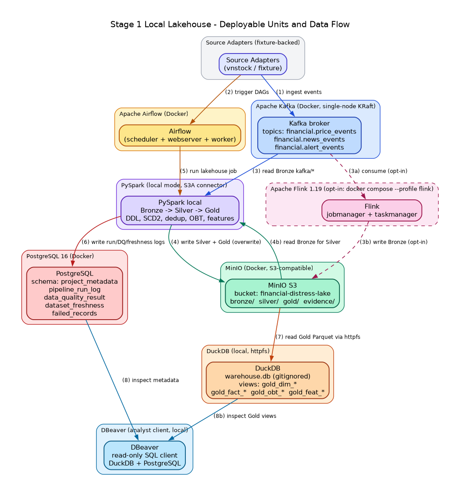

# System Architecture

## Phase 1 (verified, unchanged)

The diagram uses only deployable runtime units as major nodes. Arrows are
numbered in execution order and name the payload crossing each boundary.

## Runtime Boundaries

- Airflow owns orchestration, validation gates, retries, and publication order.
- Spark owns bounded Bronze-to-Silver/Gold and offline feature computation.
- Flink owns event-time streaming windows, late routing, and TTL deduplication.
- MinIO is the durable lakehouse boundary; PostgreSQL stores operational metadata.
- DataHub stores catalog, ownership, pipeline lineage, assertions, and contracts.
- DuckDB/DBeaver is a reviewer inspection surface, not a production service.

The executable behavior and evidence are detailed in the generator, Spark,
Flink, orchestration, governance, and schema documents linked from the README.

## Phase 2 (accepted, two-plane)

Phase 2 adds two planes and an 8-flow design on top of the Phase 1 lakehouse:

- **Product plane (persistent, low cost):** Next.js on Vercel Hobby + Supabase
  Auth/Postgres Free. Always available; renders persisted reports and an
  honest evidence-plane state machine.
- **Evidence plane (disposable, bounded budget):** ephemeral EKS in
  `ap-southeast-1` (6h default / 8h hard TTL, ≤ 3 sessions/month,
  ≤ USD 25/session, ≤ USD 10/month), provisioned and destroyed through a
  separate GitOps repository (Terraform + Helm/Kustomize + Argo CD).

The four traffic layers are the active F5 NGINX Ingress Controller OSS
(`nginx/kubernetes-ingress`, public TLS edge), Istio (east-west
mTLS/authorization), agentgateway (MCP/A2A/model-backend routing), and Envoy
Gateway + Envoy AI Gateway (KServe `LLMInferenceService`). The agent chain is
kagent `Agent` -> kagent `ModelConfig` -> agentgateway AI backend -> Envoy AI
Gateway -> KServe/llm-d. The eight numbered data
flows (analyst, training, inference, agent+RAG, operator, CI/GitOps,
observability, teardown) are documented in `docs/phase2/architecture.md`.
Cost envelope, ADRs 001..009, and the 200-point evidence contract live under
`docs/phase2/` and are enforced by `scripts/audit_phase2_evidence.py`.

Phase 2 never mutates Phase 1 pipeline semantics; Phase 1 continues to run
with identical outputs.
