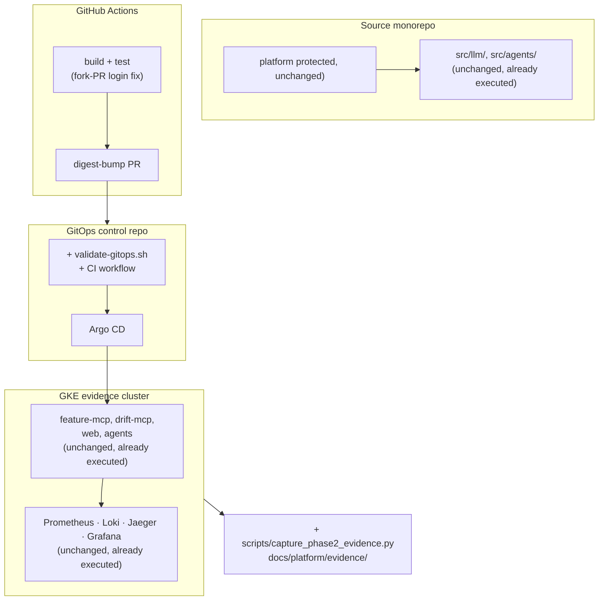

# Production hardening overlay

## Overview

**Descoped 2026-08-14 (user decision).** This plan originally covered both an
ML-track production build-out (Kyverno, service mesh, lakehouse, Flink CDC,
MLflow/Kubeflow, Argo Rollouts — phases 3, 5–12) and LLM-track/GitOps hygiene
(phases 1–2). The user submits the **LLM track only**; the ML track is not
being turned in. Phases 3, 5–12 are cancelled — see each phase file's
cancellation banner. Their real, already-written artifacts (`apps/drift-api`,
`apps/feature-api`, `src/cdc/`, `src/lakehouse/`, `src/ml/`, ADRs 011–014,
GitOps `platform/ml/`, `platform/rollouts/`, `platform/security/{kyverno,
linkerd,external-secrets}*`, etc.) are **not deleted** — they are committed
as-is in a clearly labelled archive commit for anyone resuming the ML track
later, but nothing further is built on them and they are excluded from active
CI, the deployable catalog, and the strict evidence gate.

Verified before cutting (`docs/platform/rubric-matrix.csv`, 60 LLM / 57 ML rows):
zero LLM rows mention Kyverno, cosign, Linkerd, ESO, Lakekeeper, Iceberg, Argo
Rollouts, KEDA, MLflow, or Kubeflow. All 60 LLM rows are already
`evidence_type=executed`; the strict `--track LLM` gate's only failures are
mechanical — a dirty working tree in both repos and stale evidence SHAs — not
missing behaviour. Full breakdown:
[`audit-260814-0734-hardening-followup-verification.md`](../reports/audit-260814-0734-hardening-followup-verification.md).

What remains in scope is exactly what phases 1–2 were already building:

1. **Close the protection gap and unify the repo layout** (phase 1) — six
   `src/` packages hold unprotected platform .ehaviour; phase naming leaks into
   `infra/`, compose services, and CI workflow names.
2. **A GitOps offline validation gate** (phase 2) — the control repo gets CI,
   a render/policy/digest-pin script, and agent rules.
3. **Make the strict `--track LLM` gate actually pass** — added to this
   descope: commit both repositories' working trees, re-stamp evidence
   `source_sha`/`gitops_sha` against the new HEADs, and confirm zero
   protected-path drift. This was the plan's own acceptance criterion 1 and
   was not previously true in practice (122 findings on a real run — see the
   audit report above).

Accepted brainstorm contract: outcome, constraints, non-goals and acceptance
criteria were settled before this plan and are recorded in §Contract, updated
2026-08-14 to reflect the ML descope. Do not re-litigate the ML cut without a
new user decision.

Background reports this plan is built on:

- [`xia-260813-1731-gitops-and-mlops-reference-study.md`](../reports/xia-260813-1731-gitops-and-mlops-reference-study.md)
  — study of `emanhthangngot/yas-cd` (GitOps) and `itsmekhoathekid/RecSys-MLops`
  (ML track), the source of the tool choices and of the 50-points-of-missing-artifacts
  finding.
- [`scout-260813-2117-repo-layout-audit.md`](../reports/scout-260813-2117-repo-layout-audit.md)
  — repo layout audit: the protection-list gap, the 12-package phase-ownership
  trace, and the measured scope of phase naming. Consumed by phase 1.

## Contract

**Outcome.** The unsubmitted LLM track's strict evidence gate
(`--require-executed --run-validations --track LLM`) actually passes 100/100 —
a real green run on a committed, clean tree with correctly stamped SHAs, not
"would pass once the tree is cleaned." The repo layout has no leftover
phase-2 naming in the paths that matter (`infra/`, compose services, CI
workflow names), and the GitOps control repo has its own offline validation
gate. The ML track is not submitted from this repo and receives no further
build-out.

**Constraints** (verified in-repo, not assumed):

| Constraint | Evidence |
|---|---|
| `PHASE1_PROTECTED` must not be modified — it certifies 100 unsubmitted LLM points | `scripts/audit_phase2_evidence.py:58-71`, plus `dags/` at line 412 |
| `PHASE1_HYGIENE_OVERRIDE=1` exists but is **forbidden** in this plan | `scripts/audit_phase2_evidence.py:427` |
| `docs/mini_coursework.md` is itself protected — relax the local-first rule in `AGENTS.md` only | protected list, line 68 |
| Spec permits this work: Kubernetes/cloud are out of scope *"unless explicitly requested"* | `docs/mini_coursework.md:16` |
| Zero LLM rubric rows reference Kyverno / cosign / Linkerd / ESO / Lakekeeper / Iceberg / Argo Rollouts / KEDA / MLflow / Kubeflow | measured 2026-08-14 against `docs/platform/rubric-matrix.csv`, both tracks |
| ML track is out of scope for submission — the whole track, not just its HA/DR edges | user decision, 2026-08-14 |

Existing protected-path carve-outs that remain valid: `src/streaming/flink/jobs/`
and `sql/init_ml.sql`.

**Non-goals** (deliberately rejected, with reason):

| Rejected | Reason |
|---|---|
| ML-track production build-out (phases 3, 5-12: supply-chain sign/SBOM, Kyverno, ESO+Linkerd, Iceberg+Lakekeeper, Flink CDC, Phase 1-on-cluster, MLflow/training/drift, Argo Rollouts+KEDA, ML evidence freeze) | Zero LLM rubric rows need any of it (measured, not assumed); the ML track is not being submitted. Already-written artifacts are archived, not deleted — see Overview |
| Dagster as orchestrator | Asset-checks are genuinely nicer than Airflow's out-of-band DQ, but migrating touches protected `dags/` and the existing DQ path already writes `ops.data_quality_result`. Churn, not improvement. |
| Trino + Superset | DuckDB `httpfs` and `apps/web` already cover query and presentation at single-node scale. |
| HA / multi-AZ / DR | Out of accepted scope regardless of track. |

**Acceptance criteria** (`WHO -> ACTION -> RESULT`):

1. `scripts/audit_phase2_evidence.py --require-executed --run-validations --track LLM --phase1-base <SHA> --gitops-root <path> --ml 100 --llm 100` -> run against a committed, clean tree in both repos -> PASS 100/100, zero protected-path drift, zero SHA-drift findings.
2. `scripts/run_phase2_quality_gates.py --gitops-root <path>` -> single command -> both repos' offline validation (Helm lint/template, kubeconform, terraform fmt/validate, digest-pin check, secret scan, pytest selection) passes.
3. GitOps CI (`validate-gitops.yml`) -> opened PR with a tag-based image reference or a staged secret-shaped string -> fails naming the exact file and reason.
4. `scripts/capture_phase2_evidence.py` -> invoked as one command -> emits the full screenshot and manifest set for a named LLM rubric section, with zero manual capture steps and no silent pass on a missing command or screenshot.
5. `grep -rn 'phase2' infra docker-compose.yml` (Tier 1 paths) -> after phase 1 -> zero hits in `infra/`.

## Goals

| # | Goal | Priority |
|---|------|----------|
| 1 | Make the unsubmitted LLM 100/100 gate actually pass — clean trees, correct SHAs, not just "would pass" | P0 |
| 2 | Make evidence capture a scripted, checklist-driven system rather than manual screenshots | P1 |
| 3 | Present as one unified LLM-track repo — no phase naming in code, containers or config | P1 |
| 4 | Give the GitOps control repo its own offline validation gate (render, digest-pin, secret-scan, CI) | P1 |

## Phases

No cloud quota needed for anything still in scope.

| # | Phase | Effort | Depends on | Status |
|---|-------|--------|-----------|--------|
| 1 | [Repo unification, guardrails and baseline](./phase-01-start.md) | 3.5d | — | In progress — guardrails/artifact audit complete; infra flatten done this pass; remaining Tier 1 renames and dependency consolidation pending |
| 2 | [GitOps repo validation gate](./phase-02-gitops-validation-gate.md) | 1.5d | 1 | In progress — validator, source wrapper and `validate-gitops.yml` CI workflow committed and passing locally; live PR-blocking proof (tag-based image, staged secret) still pending |
| 3 | ~~Supply chain: sign, attest, SBOM~~ | — | — | **Cancelled 2026-08-14 — ML-scoped, 0 LLM rubric hits.** See phase file |
| 4 | ~~Quota raise and capacity gate~~ | — | — | **Cancelled 2026-08-14 — was only needed for phases 5-12.** See phase file |
| 5 | ~~Kyverno admission and runtime policy~~ | — | — | **Cancelled 2026-08-14 — ML-scoped, 0 LLM rubric hits.** See phase file |
| 6 | ~~Secrets: ESO + Secret Manager, and Linkerd~~ | — | — | **Cancelled 2026-08-14 — ML-scoped.** See phase file |
| 7 | ~~Lakehouse: Iceberg + Lakekeeper catalog~~ | — | — | **Cancelled 2026-08-14 — ML-scoped.** See phase file |
| 8 | ~~Flink CDC parallel ingestion path~~ | — | — | **Cancelled 2026-08-14 — ML-scoped.** See phase file |
| 9 | ~~platform data plane onto the cluster~~ | — | — | **Cancelled 2026-08-14 — ML-scoped.** See phase file |
| 10 | ~~ML core: MLflow, training, distributed, drift~~ | — | — | **Cancelled 2026-08-14 — ML-scoped.** See phase file |
| 11 | ~~Argo Rollouts, autoscale and observability~~ | — | — | **Cancelled 2026-08-14 — ML-scoped.** See phase file |
| 12 | ~~Evidence capture system and submission freeze~~ | — | — | **Cancelled 2026-08-14 — was the ML track's freeze; LLM freeze lives in `260811-1627-close-llm-rubric-to-100` phase 6.** See phase file |

Total: **~5 working days** (phase 1 + phase 2). Phases 3-12 are cancelled —
see the Overview for what happens to their already-written artifacts.

**platform .uns first by explicit user decision (2026-08-13):** layout unification
before optimisation. That reasoning is now moot for the cancelled phases but
still holds for phase 1 itself.

## Architecture

Target state after phase 2, LLM track only. New components are marked `+`.

**Why this shape.** Everything ML-scoped from the original diagram (CDC, ML
training/registry/drift, Kyverno, ESO/Linkerd, Iceberg/Lakekeeper, MLflow,
Argo Rollouts) is removed — none of it backs an LLM rubric row. What remains
is the GitOps offline validation gate (`yas-cd`-derived) and the scripted
evidence capture system, both of which serve the LLM submission directly.

## Risks

| Risk | Likelihood | Impact | Mitigation |
|---|---|---|---|
| A change silently touches a `PHASE1_PROTECTED` path and breaks the unsubmitted LLM gate | Medium | **Critical** | Every phase ends by running the strict `--track LLM` gate; phase 1 adds a pre-commit protected-path check so the failure surfaces before commit |
| **platform protected code | **Confirmed, already true** | **Critical** | platform .tep 2 extends `PHASE1_PROTECTED` with all six platform .ackages and adds file-level exceptions for the two shared ones. Tightening only — cannot cost points |
| De-phasing renames break a path the rubric matrix declares | Medium | High | Measured before acting: `evidence_path`, `test` and `validation_command` point into `docs/platform/` and `tests/platform/` on all 60 LLM rows; `infra/phase2` on **zero**. platform .enames only Tier 1 (no gate meaning) |
| Committing the archived ML scaffolding accidentally wires it back into active CI or the deployable catalog | Low | Medium | Archive commit touches only files already excluded from `configs/phase2-deployables.yaml` and `.github/workflows/`; verified by re-running `run_phase2_quality_gates.py` after the commit |
| Evidence captured before this descope goes stale | Medium | Medium | Re-run `--check-artifacts` and the strict LLM gate after every commit in this pass, not only at the end |

## Rollback strategy

Every phase lands as **one PR on its own branch**, independently revertable.

- **Source repo:** phases are additive — new files under `scripts/`, `infra/`, `configs/`. Revert = revert the PR; no platform data migration unwinds. The ML-scaffolding archive commit is a single labelled commit for exactly this reason — `git revert` removes it cleanly if it turns out to interfere with anything.
- **GitOps repo:** Argo CD is declarative — reverting the commit reconciles the cluster back.
- **Evidence:** `docs/platform/evidence/` is append-only per phase; a reverted phase's evidence files are removed in the same revert PR so the auditor never sees an orphan.

Hard invariant for all rollbacks: the strict `--track LLM` gate must pass both
before and after any revert.

## Success Criteria

- [x] Strict two-repository auditor passes `--track LLM` at 100/100 on a committed, clean tree with correctly stamped `source_sha`/`gitops_sha` — a real run, not a projected one (`scripts/audit_phase2_evidence.py --require-executed --run-validations --track LLM --phase1-base ddbcbe7bd41ae4883954b8a247efdc67c7329078 --gitops-root ../financial-distress-gitops --ml 100 --llm 100` -> exit 0, "platform .ubric matrix is complete and consistent"; both trees confirmed clean via `git status --porcelain=v1 --untracked-files=all`)
- [ ] `scripts/capture_phase2_evidence.py` regenerates the full LLM evidence set in one command — script exists and its config was trimmed to LLM-only sections this pass, but a full regeneration run has not been executed/verified in this session
- [ ] GitOps repo CI is green and blocks a tag-based (non-digest-pinned) image reference and a secret-bearing change — `validate-gitops.yml` and the digest/secret checks in `validate-gitops.sh` exist and pass on current `main`, but no PR was opened to prove the negative case blocks a merge
- [x] Zero `artifact_path` entries missing from disk for LLM rows (`--check-artifacts` PASS, zero missing; confirmed again by the 100/100 strict run above)
- [ ] `infra/` has no `phase2` or `phase1-cluster` naming left in the paths still actively used by CI — partially true: the three service directories were flattened (`infra/rag-pipeline/`, `infra/stream-feature-{online,offline}/`), but `docker-compose.yml` still declares `phase2-redis`/`phase2-postgres`/`phase2-pgdata` (Tier 1 rename step 10, not yet done) and `infra/phase1-cluster/` still exists as the archived, un-flattened ML directory — `grep -rn 'phase2' infra docker-compose.yml` still returns hits
- [x] ML-scoped artifacts (apps, DAGs, ADRs, GitOps manifests) are committed for reference, excluded from the deployable catalog and active CI, and do not appear in any strict-gate failure (`configs/phase2-deployables.yaml` has no `feature-api`/`drift-api` entries; the 9 dangling ML rubric rows are `design_only` warnings, never errors, per code-reviewer report and the passing strict LLM run)

## Open questions

1. `plans/260806-2234-architecture-hygiene-before-phase-3` is still `pending` but
   its phase 3 appears already delivered — `PHASE1_BASE_SHA` is the commit
   `fix(generators): resolve generator package collision`. Confirm whether that
   plan should be archived rather than run.
2. Is any renamed workflow a **required status check** in branch protection?
   `ci.yml` is excluded from renaming for exactly this reason; if the remaining
   Tier 1/Tier 2 phase-1 renames are picked up later, that assumption needs one
   look at the repo settings first.
3. Retire `.venv-phase2` now that the ML libraries it served (`feast`, etc.) are
   archived rather than actively developed? Phase 1's original plan was to keep
   it until proven redundant across four command groups — still valid, just
   lower urgency with ML out of scope.

**Resolved 2026-08-13** (detail in phase 1 "Decisions taken"): the two
requirements files merge into one rather than being renamed.

**Resolved 2026-08-14** (this descope): ML track is out of scope for
submission; phases 3, 5-12 cancelled; already-written ML artifacts archived,
not deleted; the broader Tier 1/Tier 2 workflow and compose-service renames in
phase 1 remain future work, not executed in this pass.

<!-- slug: production-hardening-overlay -->
