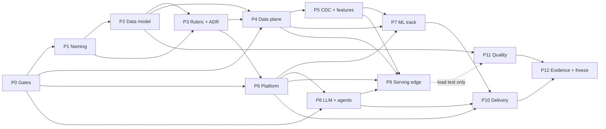

# Unified Rebuild: Target MLOps Architecture + Full Rubric Coverage

## Revision 2026-09-02 — two audits applied

Two audits were run against this plan and both are folded in.

**Audit 1 — rubric + architecture coverage**
([`reports/advise-260902-1336-rubric-300-architecture-audit.md`](./reports/advise-260902-1336-rubric-300-architecture-audit.md)):

- Architecture (O-1) verified sound: 62 component classes read from the target image, **zero without
  an owning phase**; the 83-row inventory matches the image.
- Rubric arithmetic verified: 44 + 57 + 60 = **161 rows / 300 points**, exactly as claimed.
- **R-12 found:** 162 AC lines across 13 phase files carried 74 rubric citations and **not one `mini`
  citation**. With ML 15-17, 43 and LLM 2-3, 31-33, 47, 55 also uncited, **118 of 300 points had no
  acceptance criterion anywhere** — executing the plan as written would have produced 182/300.
- Three concrete errors: the cut ladder priced Flink at 0 points when mini 20-24 make it 13; P12
  ordered `--track mini` after P4 when 25 of its points need P5; the `owning_phase` table had no
  mini rows.
- **User decision:** when O-1 and O-2 conflict, **points win**; image fidelity yields. P1's full
  rename is retained by explicit user decision despite earning ≤4 points.

**Audit 2 — schema design**
([`reports/research-260902-1402-schema-design-audit.md`](./reports/research-260902-1402-schema-design-audit.md)):

16 findings (F1-F16) against Kimball, SQL:2011, Iceberg 2025 and Feast conventions. Four reverse a
2026-09-01 decision — most importantly **F1**: the plan conflated `company_key` (worthless) with
`company_version_key` (a valid SCD2 version surrogate) and deleted both. Facts must join the
dimension surrogate, not the natural key. Full reversal table in `phase-02` §Revision 2026-09-02.

Net schedule effect: gross effort +8-9 days, but P11 re-baselined to depend on P2 alone recovers
7-10 days of parallelism → critical path **86-122 days vs 87-125 before**, with strictly more scope
covered. The 1.8-2.6× overcommit is unchanged and remains R-1.

---

## Revision 2026-09-01 — scope re-baselined by user decision

This plan replaces the 2026-08-31 arbiter version. Three user decisions drive the rewrite:

1. **Both objectives are binding, not either/or.** The architecture in
   `images/architecture/fdd-architecture-full-4k.png` must be live, **and** all three rubrics must
   be satisfied with executed evidence. Neither is a proxy for the other.
2. **One project. No platform . platform .plit.** The vocabulary, directory layout, namespaces,
   database schemas, and CI workflow names that encode the split are removed.
3. **No forbidden areas.** Every previous lock is lifted. The data model, the data contracts, the
   naming, and the paths are all in scope.

### Locks revoked (BREAKS-LOCK)

| Lock | Source | Status | Ground |
|---|---|---|---|
| **N-5** "No changes to platform .ronze/Silver/Gold Parquet semantics (Iceberg runs parallel)" | previous `plan.md:87` | **REVOKED** | Directly contradicts G-2 "one table format (Iceberg); zero shims". A parallel Parquet path is a shim. Both cannot hold. |
| **G-3** "platform data contracts immutable" | previous `plan.md:72` | **AMENDED** | Now: *contracts are immutable **after P2 exit***. The current contracts contain defects that block rubric rows and defeat the project's own leakage guard (see §Data Model Findings). |
| **AGENTS.md** "`ops` (Phase 1) vs `ml` (Phase 2) — don't cross-write" | `AGENTS.md:11` | **REVOKED** | The split is the phase boundary being erased. Replaced by one database, two renamed schemas, with real foreign keys. |
| **AGENTS.md** "Dedupe by business key + latest `created_ts`" | `AGENTS.md:10` | **AMENDED** | Now: dedupe on the business key **including the vintage axis**; `is_latest_vintage` is a derived flag. The old rule destroys restatement history. |
| **N-2** "Kyverno and Linkerd stay archived" | previous `plan.md:84` | **RETAINED** | Istio is in the target image and the image must be live. Linkerd stays archived. |

Every revocation is recorded as an ADR in P3.

---

## Objectives

| # | Objective | Verified by |
|---|---|---|
| **O-1** | Every component and annotated edge in `fdd-architecture-full-4k.png` is live | `scripts/verify_target_architecture.py` exits 0 (83 components) |
| **O-2** | All 161 rubric rows across three tracks are `executed` with a real artifact | `scripts/verify_rubric_coverage.py` exits 0; zero `design_only` |
| **O-3** | One project: no `phase1`/`phase2`/`stage1` vocabulary in any path, identifier, namespace, or schema name | `scripts/verify_naming_cutover.py` exits 0 |
| **O-4** | The data model answers "what did we know, and when did we know it" | Leakage guard **fails** on a seeded restatement, then passes after the vintage filter |
| **O-5** | Every evidence assertion is falsifiable | For each artifact, a named pipeline change makes it fail |
| **O-6** | Reversible at a named boundary | git revert + Argo resync; one documented exception (P8 KServe CRD upgrade) |

### Rubric scope — 161 rows / 300 points

| Track | Source | Rows | Points | Current state |
|---|---|---|---|---|
| mini | `docs/Coursework Tracking (Public) - rubic (mini-coursework).csv` | 44 | 100 | not in the matrix |
| ML | `docs/Coursework Tracking (Public) - rubic final-coursework (final - ml).csv` | 57 | 100 | **100% `design_only`** |
| LLM | `docs/Coursework Tracking (Public) - rubic final-coursework (final - llm).csv` | 60 | 100 | 100% `executed` — must be re-earned after the evidence purge |

Verified 2026-09-01: the mini CSV has 84 physical lines / 47 logical records / 5 columns → 44 scored
rows. `docs/platform/rubric-matrix.csv` has 117 data rows / 19 columns, `track` = 60 LLM + 57 ML,
`evidence_type` = 60 `executed` + 57 `design_only`.

---

## Why the previous plan could not reach O-2

The image and the rubric are **intersecting sets, not nested sets**. Verified by reading both final
rubric CSVs on 2026-09-01:

**In the image, never named by either final rubric:** Iceberg, Lakekeeper, Trino, Superset, dbt,
DataHub, Debezium, Flink, Jenkins, Ray, Triton, llm-d, LWS, GIE, KServe 0.18, Kiali, Spark.
*(Iceberg, Spark and DataHub are named by the mini rubric; the others are named by no rubric.)*

**Named by the rubric, not depictable in any architecture diagram** — roughly **63 of the 200 final
points**: test coverage >90%, equivalence partitioning / boundary value analysis, mutation testing,
property-based idempotency testing, load test with HTML report, Jupyter notebooks, notebook→pipeline
step parity, Feast TTL *with rationale*, incremental data versioning, generator drift simulation and
configuration, label table, clean code / clean repo, low-level design of 5 key classes, 2 novel
ideas per track, model-server benchmark.

**Named by the rubric, absent from every phase file of the previous plan** — grep of the 10 phase
files on 2026-09-01 returned no match for: `Ansible`, `property-based`, `mutation testing`,
`equivalence partitioning`, `boundary value`, `rate limit`, `basic auth`, `KNative Eventing`, `TTL`,
`Jupyter`/`notebook`, `--atomic`/`rollingupdate`.

The previous success criterion (`verify_target_architecture.py` exits zero) tested the **image**.
This plan tests the image **and** the rubric, as two independent gates.

---

## Data Model Findings that force P2

All verified in-repo on 2026-09-01. Full audit:
[`reports/brainstorm-260901-0826-schema-and-plan-audit.md`](./reports/brainstorm-260901-0826-schema-and-plan-audit.md).

| # | Finding | Evidence |
|---|---|---|
| D-1 | `company_key` / `company_version_key` are **write-only**. Every join and check uses `ticker`. The only consumer of `company_key` is a referential-integrity check against itself. **Amended 2026-09-02 (schema audit F1): this is a *usage* defect, not a *design* defect.** `company_version_key = sha256(f"{ticker}\|{valid_from}")[:16]` is a valid SCD2 version surrogate and is **retained**; only `company_key = sha256(ticker)[:16]` is deleted. The fix is to make joins use the version key, per Kimball. | `keys.py:14-17`; `dim_company.py:50`; `pit.py:111-119`; `stage1_dq_job.py:75,78-83`; `obt_company_quarter_risk.py:18,21` |
| D-2 | `sha256(upper(ticker))[:16]` is 16 bytes replacing a 3-byte natural key, and inherits every volatility property of ticker. | `src/transforms/keys.py:14-17` |
| D-3 | Silver dedup keeps latest `created_ts` per `(ticker, report_period)` — **every restatement is destroyed**. | `silver/core.py:31-38`; `silver/spark.py:96-99`; `stage1_evidence_job.py:387` |
| D-4 | The PIT leakage guard compares timestamp **columns**, never values, so it passes on restated data by construction. It cannot detect the project's largest leakage source. | `leakage_guard.py:84-90` |
| D-5 | `_parse_timestamp` returns `datetime.min` on null/unparseable input — the guard **fails open**, and both source timestamps are contract-nullable. | `pit.py:100-104`; `silver/core.py:50`; `schema_registry.py:118-130` |
| D-6 | `date_key` falls back to `f"{fiscal_year}-01-01"`, backdating a Q4 statement by up to 14 months. | `fact_financial_statement.py:19-23` |
| D-7 | `valid_from_ts` on `dim_company` is the **ingestion** timestamp, not a business effective date. The column name asserts something untrue. | `dim_company.py:45` |
| D-8 | SCD2 tracks only `(industry, sector, exchange, delisted_flag)`; `company_name` is an undeclared type-1 attribute inside a type-2 row. | `dim_company.py:29` |
| D-9 | `report_period` + `fiscal_year` + `fiscal_quarter` encode one fact three times with no enforced consistency. | `schema_registry.py:108-117` |
| D-10 | Money is `DOUBLE`. Market-wide aggregates over ~1600 companies in VND exceed 2^53, so `assets = liabilities + equity` has no principled DQ tolerance. **Amended 2026-09-02b (U-1, measured): target is `DECIMAL(18,0)`.** vnstock statements arrive in whole đồng at 1,000đ granularity (`explorer/kbs/financial.py:572,369,259`), so scale 0 loses nothing. Measured: 9.36 B/value at precision 18 vs 16.66 at 38 (pyarrow 25.0.0); Spark 4.2.0 promotes `SUM(DECIMAL(18,0))` → `DECIMAL(28,0)` while `DECIMAL(38,2)` **cannot promote**. The earlier `DECIMAL(38,2)` and `DECIMAL(20,2)` targets are both superseded | `schema_evidence.sql:14-15,22,44,72`; `docs/07_data_contracts.md:120-124`; vnstock 4.0.7 wheel |
| D-11 | `check_id TEXT PRIMARY KEY` = `uuid4()`. The PK constrains nothing and DQ writes are not idempotent. | `init_project_metadata.sql:18`; `metadata_writer.py:357` |
| D-12 | `ops` has **zero** foreign keys; three `run_id` columns reference `pipeline_run_log` by naming convention only. | `sql/init_ops.sql` |
| D-13 | Naive `TIMESTAMP` in `ops` vs `TIMESTAMPTZ` in `ml` → a 7-hour silent error class on a UTC+7 domain. | both `sql/init_*.sql` |
| D-14 | `schema_version_registry.is_current` has no partial unique index; two rows can both be current. | `init_project_metadata.sql:40-48` |
| D-15 | Canonical layout is **one file per dataset**, no partitioning, against a 10-50M row target. | `src/io/paths.py:13-14` |
| D-16 | The graded ERD declares six FKs on `company_version_key` that the pipeline never writes; its generator inserts two hardcoded rows, leaves all fact tables **empty**, and asserts `foreign_key_count >= 4` from `information_schema`. It cannot fail because of pipeline behavior. | `sql/schema_evidence.sql:63,70,77`; `scripts/build_schema_evidence.py:19-24,73-80` |
| D-17 | The submitted bundle contradicts itself: `mini_coursework.md:565,579` denies `company_version_key` on facts; `docs/schema-design.md:11-14` and `evidence/final/*/queries/schema.json:10` assert it. All three frozen bundles carry the contradiction. | as cited |
| D-18 | `vnstock_adapter.py` — the "Live vnstock adapter" — is 13 lines that re-export the fixture. `vnstock` is in no dependency file; there are zero network calls in `src/collectors/`. `collector_config.yaml` says `source_mode: online`. The pipeline runs on 5 synthetic tickers. | `vnstock_adapter.py:11-13`; `configs/collector_config.yaml:1-3`; `fixture_config.py:25-27` |
| **D-19** | **Price unit is wrong by 1000×.** `docs/07_data_contracts.md:92-95` declares `open`/`high`/`low`/`close` as `DOUBLE … VND`, but vnstock divides OHLC and match price by 1000 for stock and ETF assets, so it delivers **nghìn đồng**. A VNM close of 62,000đ arrives as `62.0`. Every price-derived feature — market cap, return, volatility — is off by three orders of magnitude while passing every existing check | `vnstock/explorer/kbs/quote.py:345,506`; `docs/07_data_contracts.md:92-95` |
| **D-20** | **mini rubric row 43 has a second clause the plan missed**: `(- Bronze & Silver layer: raw_, stg_ prefix or similar)`. Bronze and Silver tables carry no prefix at all. 2 points at risk | raw mini CSV, scored row 43 |
| **D-21** | **The free vnstock tier caps financial statements at 4 periods, hard.** Measured live 2026-09-02b on VNM: `period='quarter'` → 2026-Q2, 2026-Q1, 2025-Q4, 2025-Q3; `period='year'` → 2025, 2024, 2023, 2022; both print *"Phiên bản cộng đồng: … giới hạn tối đa 4 kỳ"*. It is **not** a pagination window, the notice appears **without registering** (so Community does not lift it), and KBS statements return `shape (0,0)` entirely — only VCI serves them. Against `collector_config.yaml`'s `start_year: 2018 … quarterly` = 32 quarters, **28 of 32 per company are unobtainable**. Company list (1 751 symbols) and daily OHLCV (2 264 rows, 2017-08 → 2026-08) are **not** capped | live `vnstock` 4.0.7 calls, guest access |
| **D-22** | **`fallback_sources` is dead configuration.** `collector_config.yaml` names `cafe_f`, `vietstock`, `tcbs`, `ssi`. `source_mapping.yaml` has only three sources with two `enabled: false`; `ingestion_manifest.yaml` has two, both `enabled: false` with `endpoint: fixture` and a comment that the HTTP handlers are *"reserved future keys"*. `vietstock` and `ssi` appear in **no** mapping file. `cafe_f` is spelled `cafef` in one of the three. vnstock 4.0.7 has only `kbs` and `vci` explorers — no `tcbs` since 3.x. Same defect class as D-18 | `configs/collector_config.yaml`; `configs/source_mapping.yaml`; `configs/ingestion_manifest.yaml`; vnstock 4.0.7 package |

---

## Naming Cutover Map (P1)

Surface measured 2026-09-01: **~90 paths** carry `phase1`/`phase2`/`stage1` in their name;
**296 files** contain `phase2`, **106** contain `stage1`, **95** contain `Phase 1`, **155** contain
`Phase 2`.

| Old | New | Note |
|---|---|---|
| `docs/platform/` | `docs/platform/` | ADRs + rubric matrix |
| `docs/phase1_architecture.md` | `docs/architecture/lakehouse.md` | |
| `docs/02_schema_design.md`, `docs/schema-design.md` | merged → `docs/architecture/data-model.md` | resolves D-17 |
| `tests/platform/` | `tests/platform/` | |
| `tests/test_stage1_*.py` | `tests/test_lakehouse_*.py` | |
| `dags/phase2/*.py` | `dags/` flattened, semantic names | |
| `dags/stage1_*.py`, `dags/_stage1_dag_utils.py`, `dags/utils/stage1_dag_utils.py` | `dags/lakehouse_*.py`, `dags/utils/dag_utils.py` | |
| `src/jobs/stage1_*.py` | `src/jobs/lakehouse_*.py` | |
| `src/governance/phase2_lineage.py` | `src/governance/lineage.py` | |
| `scripts/*stage1*` | `scripts/*lakehouse*` | |
| `scripts/*phase2*`, `scripts/phase2_ci/` | `scripts/*platform*`, `scripts/ci/` | |
| `configs/phase2-*.yaml` | `configs/platform-*.yaml` | |
| `requirements-phase2.txt` | `pyproject.toml` `[project.optional-dependencies] platform` | |
| `.venv-phase2` | `.venv-platform` | two-venv rule retained (psycopg/pyspark conflict) |
| `outputs/phase2/` | `outputs/evidence/` | |
| `infra/phase1-cluster/` | `infra/lakehouse-cluster/` | |
| `apps/web/scripts/phase2/` | `apps/web/scripts/platform/` | |
| `.github/workflows/phase2-*.yaml` | drop prefix | directory is deleted at P10 |
| ns `phase2-data` | ns `dataflow` | |
| ns `phase2-llm` | dissolved into `kserve` | |
| ns `monitoring` | ns `observability` | |
| Postgres schema `ops` | schema `ops` | |
| Postgres schema `ml` | schema `ml` | |
| Terraform/GKE label `phase=phase2` | `component=unified-platform` | |
| `docs/evidence/stage1_*.json` | regenerated under the unified tree | deleted, not renamed |

### Dataset and column renames forced by the schema audit (P2, ADR-021)

Separate from the phase-vocabulary cutover above. These are driven by mini rubric row 43 and by the
schema audit, and they are owned by **P2**, not P1 — P2 already rewrites `sql/` and
`src/io/paths.py`. Every token is greppable in the rubric matrix before renaming.

| Old | New | Driver |
|---|---|---|
| `gold.distress_labels` | `gold.fact_distress_label` | mini row 43 clause 1 — no prefix, plural among singular peers |
| `gold.distress_holdout_v1` | `gold.distress_holdout` | version lives in the Iceberg tag `holdout-v1` only |
| `ml.label_table` | `ml.distress_label` | "table" inside a table name |
| `bronze.{companies,financial_statements,market_prices_daily}` | `bronze.raw_*` | mini row 43 clause 2 (D-20) |
| `silver.{companies,financial_statements,market_prices_daily}` | `silver.stg_*` | mini row 43 clause 2 (D-20) |
| `ops.*_at` (8 columns) | `ops.*_ts` | one timestamp suffix project-wide |

**Do not rename:** `supabase/migrations/*_phase2_*.sql` and their `rollback/` counterparts. Applied
migration filenames are keys in `supabase_migrations.schema_migrations`; renaming them re-applies or
orphans migrations. Record the exception in ADR-019.

---

## Phases

| # | File | Title | Effort | vCPU (resident) | Depends on |
|---|---|---|---|---|---|
| P0 | [phase-00-gates.md](./phase-00-gates.md) | Capacity, cost and version gates | 2-3 d | 0 | — |
| P1 | [phase-01-naming-cutover.md](./phase-01-naming-cutover.md) | Unified naming cutover | 4-6 d | 0 | P0 |
| P2 | [phase-02-data-model.md](./phase-02-data-model.md) | Data model v2 and metadata unification | 9-13 d | 0 | P1 |
| P3 | [phase-03-contracts-rubric.md](./phase-03-contracts-rubric.md) | Unified rubric matrix, ADRs, verification tooling | 7-10 d | 0 | P1, P2 |
| P4 | [phase-04-data-plane.md](./phase-04-data-plane.md) | Data plane: lakehouse, Iceberg, Spark, Airflow, DataHub, real source | 12-16 d | 2-3 | P0, P2, P3 |
| P5 | [phase-05-cdc-streaming.md](./phase-05-cdc-streaming.md) | CDC, streaming, feature stores | 10-14 d | 5-7 windowed | P4 |
| P6 | [phase-06-platform.md](./phase-06-platform.md) | GKE, Istio, Vault, Terraform + Ansible | 10-14 d | 7-9 | P0, P3 |
| P7 | [phase-07-ml-track.md](./phase-07-ml-track.md) | ML track: notebooks, KFP, Ray, MLflow, Triton, drift/retrain | 14-20 d | +3-4 windowed | P4, P5, P6 |
| P8 | [phase-08-llm-agent-track.md](./phase-08-llm-agent-track.md) | LLM + agent track: KServe 0.18, llm-d, agent registry, warm mode | 8-12 d | 6-12 windowed | P0, P6 |
| P9 | [phase-09-serving-edge.md](./phase-09-serving-edge.md) | API serving, KEDA, web, analytics, NGINX edge policy | 10-14 d | 2-4 windowed | P4, P5, P6, P8 |
| P10 | [phase-10-delivery.md](./phase-10-delivery.md) | Jenkins, Argo Rollouts, secrets cutover, GitOps | 10-14 d | 1-2 windowed | P6, P7, P8, P9 |
| P11 | [phase-11-quality-engineering.md](./phase-11-quality-engineering.md) | Coverage, EP/BVA, mutation, property-based, load, Docker | 7-10 d | 0 | **P2** (load test only: P9) |
| P12 | [phase-12-observability-evidence.md](./phase-12-observability-evidence.md) | Observability, 300-point evidence capture, freeze | 8-12 d | 3-4 | P10, P11 |

### Dependency edges

Exact edge list, taken from each phase file's `dependencies:` frontmatter — not a drawing.

| Phase | Depends on |
|---|---|
| P0 | — |
| P1 | P0 |
| P2 | P1 |
| P3 | P1, P2 |
| P4 | P0, P2, P3 |
| P5 | P4 |
| P6 | P0, P3 |
| P7 | P4, P5, P6 |
| P8 | P0, P6 |
| P9 | P4, P5, P6, P8 |
| P10 | P6, P7, P8, P9 |
| P11 | **P2** — re-baselined 2026-09-02; only the load test (4 pts) soft-depends on P9 |
| P12 | P10, P11 |

Every edge increases the phase index → acyclic. Verified programmatically against the frontmatter
on 2026-09-01: 13 phases, zero back-edges, zero broken dependency paths. Re-verified 2026-09-02
after P11's dependency was re-baselined from `[P7, P8, P9]` to `[P2]` — still acyclic, and the
`P9 → P11` edge survives as a soft edge for the load test only.



**Genuinely parallel pairs** (no shared file ownership): `P5 ∥ P6`, `P7 ∥ P8`, and — new
2026-09-02 — `P11 ∥ (P4, P5, P6)`. P11 owns only `tests/`, `mutants/`, `docs/testing/` and the
Dockerfiles, which no other phase touches, and 22 of its 26 points need nothing beyond P2.
**P1 runs alone** — it touches every path in the repository.

### File ownership (no two parallel phases touch the same file)

- **P1** owns every rename; runs alone, nothing else may be in flight.
- **P2** owns `src/transforms/`, `src/metadata/`, `src/quality/`, `sql/`, `src/io/paths.py`
- **P3** owns `docs/platform/adr/`, `docs/rubric-matrix-unified.csv`, `scripts/verify_*.py`
- **P4** owns `src/lakehouse/`, `src/collectors/`, `src/generator/`, `src/jobs/`, `platform/lakehouse/`, `platform/orchestration/`, `platform/governance/`
- **P5** owns `src/cdc/`, `src/streaming/`, `src/ml/feast/`, `feature_repo/`, `platform/streaming/`, `platform/features/`
- **P6** owns `platform/istio/`, `platform/security/`, `infra/ansible/`, Terraform, all Argo `destination.namespace`
- **P7** owns `src/ml/pipelines/`, `src/ml/mlflow*`, `src/ml/promotion_gate.py`, `notebooks/`, `platform/kubeflow/`, `platform/tracking/`, `platform/serving/triton-isvc.yaml`
- **P8** owns `platform/inference/`, `platform/serving/llm-*`, `platform/agents/`, `platform/agentgateway/`, `src/agents/`
- **P9** owns `src/analytics/`, `apps/`, `platform/analytic/`, `platform/api-serving/`, `platform/keda/`, `platform/web/`, `charts/`
- **P10** owns `Jenkinsfile*`, `platform/ci/`, `platform/rollouts/`, `.github/workflows/`
- **P11** owns `tests/`, `mutants/`, `tests/load/`, `docs/testing/`, `Dockerfile*`, `docker-compose*.yml`
- **P12** owns `platform/observability/`, `docs/`

---

## Schedule Reality — read before authorizing P4

```
Phase effort, min : 2+4+9+7+12+10+10+14+8+10+10+7+8   = 111 working days
Phase effort, max : 3+6+13+10+16+14+14+20+12+14+14+10+12 = 158 working days

Parallel savings (P5∥P6, P7∥P8, P11∥P4-P6)             = -25 to -36 days
Critical path                                          = 86 to 122 working days

Available 2026-09-02 → 2026-11-06                      = 48 weekdays
Stated capacity at 30 h/week                           = ~283 hours
Critical path at 6 h/day                               = 516 to 732 hours

                                        OVERCOMMITTED BY 1.8× TO 2.6×
```

Revised 2026-09-02. Gross effort rose by 8-9 days (mini-track ACs in P4/P5/P11, the evidence baseline
tag and AC-citation gate in P3, the schema-audit rework in P2), but P11 running parallel to P4-P6
recovers 7-10, so the **critical path is 86-122 days versus 87-125 before** — marginally shorter with
strictly more scope covered. The overcommit ratio is unchanged, and it is still the dominant risk.

This plan **delivers the full requested scope**. It does not silently shrink it. But the arithmetic
above is a fact, and the plan states three things about it:

1. **The credit window is not the same as the scope.** If the window closes first, what has been
   captured is what counts. Therefore phases are ordered so that **rubric points land as early as
   dependencies allow**, and P12's capture script is incremental and wave-ordered — every completed
   phase can be captured immediately, not only at the end.
2. **Points before image fidelity.** User decision 2026-09-02: when the two objectives conflict,
   O-2 (300 points) wins and O-1 (83 live components) yields. Ordering follows: 173 of the 300 points
   need no cluster, so waves 1-4 run independently of G0.
3. **If a cut becomes necessary, cut in this order** — lowest rubric points per day first. Recompute
   the ordering against the regenerated matrix at P3 exit before using it (§Risk R-9).

### Cut ladder — recomputed 2026-09-02 against all three rubrics

The 2026-09-01 ladder priced every item at **0 rubric points** because it was computed against the
two *final* rubrics only. The mini rubric was not yet in the matrix. With all 161 rows in scope, two
prices change, and one of them is load-bearing.

| Order | Cut | Days saved | Rubric points at risk | Named by rubric? |
|---|---|---|---|---|
| 1 | Kiali (P6 partial) | 1 | **0** | Not named |
| 2 | Triton (P7 partial) | 2-3 | **0** | Not named |
| 3 | Trino + Superset + dbt (P9 partial) | 6-8 | **0** | Named by no rubric. mini 26 asks for warehouse indexing, owned by P2, not by Trino |
| 4 | Jenkins → keep GitHub Actions (P10 partial) | 6-8 | **0** | No — rubric says "CI/CD" only |
| 5 | Ray → Spark/XGBoost distributed (P7 partial) | 5-7 | **0** if another distributed backend | ML 24 says "distributed training", not Ray |
| 6 | KServe 0.18 + llm-d + LWS + GIE (P8 partial) | 5-8 | **2** | LLM 2-3 need *an* LLM inference platform with a custom model; a simpler server still earns them, so only the 0.18-specific evidence is at risk |
| — | **Below this line every cut loses points** | | | |
| 7 | Kubeflow | 3-4 | **1** | ML 50 names the Kubeflow API |
| 8 | Istio | 6-8 | **1** | ML 54 names "service mesh" |
| 9 | Vault | 2-3 | **2** | ML 53 / LLM 57, "(or similar tools)" |
| ✗ | **Debezium + Flink CDC — RE-PRICED, do not cut** | 5-7 | **13** | mini 20-24 name a **Flink job** explicitly: baseline 2 + burst 3 + late arrival 3 + other 3 + window processing 2. The 2026-09-01 ladder listed this as item 3 at **0 points**. That was wrong |
| ✗ | **Loki / Jaeger — never cut** | — | **14** | ML 38,39,47,48; LLM 41,42,51,52 |
| ✗ | **Spark + Airflow + DataHub — never cut** | — | **~60** | mini 14-19 (Spark), 27-38 (pipelines + governance), plus ML/LLM CI-CD-for-pipelines rows |

Cutting items 1-5 saves **21-27 days at zero rubric cost** and reduces the always-on floor, but
forfeits O-1 (image fidelity). Item 6 costs 2 points for 5-8 days.
**Do not execute any cut without an explicit user decision.**

R-9 still applies: recompute this table against the regenerated matrix at P3 exit (`phase-03` step 7).

### Score tripwires — added 2026-09-02

Phase-completion tripwires give no signal about points. These do. Day 0 is the first working day of
P1.

| Day | Captured points required | If missed |
|---|---|---|
| 15 | ≥ 100 / 300 | Review wave 1+2 blockers; do not start P6 until wave 2 is capturing |
| 30 | ≥ 200 / 300 | **Execute cut ladder items 1-5 immediately.** No further deliberation |
| 40 | ≥ 260 / 300 | Execute item 6; freeze scope; P12 runs `--only-failed` from here on |

Measured by `scripts/run_unified_evidence_capture.py --summary`, which reports captured points per
wave. Waves 1-4 total ~152 points and need **no cluster**, so a G0 delay cannot by itself cause a
day-15 or day-30 miss (see `phase-12` §Capture ordering).

---

## Cost Model

| Always-on group | vCPU | Resident from |
|---|---|---|
| Istio + Kiali | 5-6 | P6 |
| Gateway API stack for llm-d (GIE + LWS) | 1-2 | P8 |
| Observability (Prometheus, Grafana, Loki, Jaeger, OTel, PushGateway) | 3-4 | P12 |
| Stores (MinIO, Postgres, Redis) | 2-3 | P4 |
| **Always-on floor** | **13-18** | — |
| Spark / Airflow windows | +6-12 | processing |
| Kubeflow + Ray windows | +3-4 | training |
| Triton + KServe windows | +2-4 | serving |
| Jenkins windows | +1-2 | CI |
| Trino + Superset windows | +2-4 | analytics |

Verified GCP baseline 2026-08-31: `CPUS_ALL_REGIONS=12`, regional `CPUS=32`, `E2_CPUS=8`,
`PREEMPTIBLE_CPUS=0`, `INSTANCES=8`. Usage reads zero only because both node pools are at size 0 and
the evidence VM is terminated. Post-approval topology: primary 2 × `e2-standard-8` = 16 on-demand,
secondary up to 7 × Spot `e2-standard-4` = 28, evidence VM 2 → 46/48 vCPU, 10 instances.

---

## Key Risks

| # | Risk | Prob. | Impact | Mitigation |
|---|---|---|---|---|
| R-1 | **Scope exceeds the credit window by 1.8-2.6×** | **High** | Partial capture at freeze | Wave-ordered incremental capture from P2 onward (`phase-12` §Capture ordering); recomputed cut ladder above; **score tripwires at day 15 / 30 / 40** replace the vague slack check |
| R-2 | G0 quota bundle not granted | Medium | O-1 unreachable | Day-1 request; branch C is a hard stop and escalates to the user |
| R-3 | Naming cutover (P1) breaks imports across 296 files | Medium | P2+ blocked | P1 runs alone; full suite is the exit gate; single atomic commit per rename class |
| R-4 | Data-model v2 changes the *set* of Gold tables, forcing mass re-authoring of matrix rows | Medium | P3 rework | **Tripwire: if more than 20 matrix rows need re-authoring, stop and re-plan deliberately.** Two dataset renames are known and pre-greppable: `distress_labels` → `fact_distress_label`, `distress_holdout_v1` → `distress_holdout` |
| R-5 | Evidence purge fails to re-earn the 100 banked LLM points | Medium | −100 points | All 60 LLM rows retain `validation_command` + `behavioral_assertion`; re-run is contract-only. Capture LLM rows first in P12 |
| R-6 | 57 ML rows are `design_only` — none has ever executed | **High** | −100 points | P7 + P11 own them explicitly; P3 emits a per-row owning-phase map and fails if any row is unowned |
| R-7 | KServe 0.18 CRD upgrade is conditionally irreversible | Low | Manual recovery | Pre-upgrade object export is a P8 **entry** artifact (documented rollback exception) |
| R-8 | Real vnstock ingestion hits rate limits or schema drift | Medium | P4 slip | Fixture adapter stays as the CI path; live adapter is opt-in with checkpointing and `failed_records` routing |
| R-9 | Cut ladder ordering is stale | Medium | Wrong cut | Recompute points-at-risk per day-saved against the regenerated matrix at P3 exit |
| R-10 | Supabase migration rename breaks applied-migration tracking | Low | Product plane broken | Migrations are explicitly excluded from P1; ADR-019 records why |
| R-11 | Three external load balancers keep billing | High | Cost + sole-ingress invariant | P0 converts Kourier and agentgateway to `ClusterIP` through GitOps |
| **R-12** | **118 of 300 points had no acceptance criterion in any phase file** — all 44 mini rows plus ML 15-17, 43 and LLM 2-3, 31-33, 47, 55. Measured 2026-09-02: 162 AC lines, 74 rubric citations, **zero mini citations** | **was certain, now closed** | Executing every AC would have yielded **182/300** | `phase-03` §`owning_phase` parts 2 + 3 assign all 55; matching ACs added to `phase-02` (AC-P2-14…22), `phase-04` (AC-P4-12…24), `phase-05` (AC-P5-9…16), `phase-06` (AC-P6-9), `phase-08` (AC-P8-15…17), `phase-11` (AC-P11-9…10). `verify_rubric_coverage.py` now fails on any uncited row (AC-P3-2b) |
| **R-13** | Deleting `docs/evidence/` + `docs/submission/` at P3 destroys the only reference numbers for the ~100 mini points being re-captured | **was High, now closed** | mini becomes a rebuild, not a re-capture | `phase-03` **step 0** tags `evidence-baseline-pre-rebuild` and **gates step 8's deletion** on that tag existing (AC-P3-11) |
| **R-14** | Money scale is committed before the real vnstock reporting unit is known, and **Iceberg prohibits scale change** (only precision widening) | **was Medium, now CLOSED** | was irreversible | **Closed 2026-09-02b by reading the source, not by guessing:** `explorer/kbs/financial.py:572` requests `"unit": 1000  # Đơn vị ngàn đồng`, `:369` passes `unit_multiplier=1000.0`, `:259` applies it → statements arrive in whole đồng at 1,000đ granularity. Target is **`DECIMAL(18,0)`** (D-10). Residual risk moves to R-15 |
| **R-15** | The money unit is a property of **which adapter answered**, not of "vnstock" | **CLOSED 2026-09-02b** | was silent 1000× errors | Verified both live explorers deliver **whole đồng**: KBS by source (`kbs/financial.py:572,369,259`), VCI by live call (VNM `current_assets` 2026-Q2 = `4.089226e+13` ≈ 40 892 tỷ đồng). `vci/const.py:105` `_UNIT_MAP` is dead code — one grep hit, its own definition. The four `fallback_sources` have **no adapter at all** (D-22), so there was nothing left to verify. `source_unit` + fail-closed retained as a regression guard (AC-P2-25, AC-P4-25) |
| **R-16** | vnstock rate tiers vs `min_request_delay_seconds: 1` | **Reframed 2026-09-02b** | throughput only, not coverage | Measured sweep is **~601 requests** (~300 statement + ~300 price-history + 1 listing), not 900+ — you cannot request more statements than the 4-period cap allows. Guest 20 req/min ≈ 30 min; Community 60 ≈ 10 min. **Community registration does not lift the period cap** (D-21), so it is a speed choice, not a data choice (AC-P4-29) |
| **R-17 (D-19)** | Price unit is documented as VND but vnstock delivers nghìn đồng — a silent 1000× error in every price-derived feature | **was certain, now mitigated** | market cap, return, volatility all wrong while every check passes | The adapter multiplies prices back to đồng (AC-P4-26); the contract is corrected with the `quote.py:345` citation (AC-P2-23, AC-P4-27); a known ticker's stored close is compared against the exchange's published price in đồng |
| **R-18 (D-21)** | **The free tier makes 28 of 32 required statement quarters unobtainable.** `phase-04` previously asserted "2018-2025, quarterly" from vnstock | **High, structural** | The "real vnstock adapter" claim in O-1/ADR-020 cannot cover historical statements at any free tier | `phase-04` §Free-tier data ceiling records the measurement; AC-P4-5 is rewritten to claim only what the tier delivers (list + full OHLCV + last 4 quarters); **AC-P4-5b** requires older periods to be logged to `ops.failed_records` with reason `tier_period_cap` and fall through to the generator — never silently synthesized as real. This gives ADR-020's synthesis argument a second, harder basis than volume alone. **Escalation if real 2018-2025 statements are required: a paid Sponsor plan is the only path — user decision, not a plan decision** |
| **R-19 (D-22)** | Four named fallback sources have no handler; two appear in no mapping file; one is spelled two ways | Low | dead config reads as capability the project does not have | AC-P4-25b removes `vietstock` and `ssi`, removes `cafe_f`/`tcbs` unless their handlers exist, and reconciles the `cafe_f`/`cafef` spelling across all three config files |

---

## Success Criteria

- [ ] `scripts/verify_target_architecture.py` exits 0 — all 83 target-image components live **(O-1)**
- [ ] `scripts/verify_rubric_coverage.py` exits 0 — 161 rows, zero `design_only`, every row has an artifact, **and every row cited by an AC in its owning phase file (R-12)** **(O-2)**
- [ ] `scripts/verify_naming_cutover.py` exits 0 — zero `phase1`/`phase2`/`stage1` tokens outside `supabase/migrations/` and `plans/` **(O-3)**
- [ ] `scripts/lint_naming_convention.py` exits 0 — gold prefixes, singular gold names, `_ts`/`_date` suffixes, no version token in any table name, the two reserved Feast names untouched
- [ ] `scripts/run_unified_evidence_capture.py` produces artifacts for all 161 rows / 300 points; waves 1-4 (~152 points) complete with no cluster resource
- [ ] Leakage guard **fails** on the seeded restatement fixture and **passes** with the vintage filter **(O-4)**
- [ ] `scripts/build_schema_evidence.py` runs against real Gold output covering **all 12** Gold datasets; every declared FK resolves with zero orphans; every table has `row_count > 0`; every nullable FK column is below its NULL-rate ceiling **(O-5)**
- [ ] Re-running training pinned to a knowledge-time cutoff yields byte-identical features on two different days
- [ ] `make validate` passes in `financial-distress-gitops`
- [ ] `scripts/run_quality_gates.py` passes in the source repo
- [ ] Exactly one external `LoadBalancer` Service cluster-wide: the NGINX ingress controller
- [ ] Zero `InferenceService` / `LLMInferenceService` under Argo Rollouts control
- [ ] Every Secret in a managed namespace is ESO-sourced from Vault; zero sealed-secrets remain
- [ ] Full-text grep for `company_version_key` across the submitted bundle returns one consistent story: it is the `dim_company` PK and the fact join key, and `company_key` no longer exists
- [ ] `git tag -l evidence-baseline-pre-rebuild` resolves before any evidence tree is deleted

---

## Retained Decisions

| # | Decision | Source |
|---|---|---|
| 1 | One clean-cutover evidence tree; regenerated from zero | predecessor decision #1a |
| 2 | Scope: all three rubrics, 161 rows / 300 points | predecessor decision #1b |
| 3 | Namespace names drop the `phase2-` prefix | predecessor decision #2 |
| 4 | Argo CD is the only allowed managed-namespace mutator | GitOps `AGENTS.md` |
| 5 | Two repositories: source + `financial-distress-gitops` | ADR-002 |
| 6 | ML track: Kubeflow + Ray + MLflow + KServe/Triton | predecessor decision #5 |
| 7 | Generator scaled to 10-50M rows — **now with multi-vintage restatements** | predecessor decision #6, extended by P2 |
| 8 | `gold.distress_holdout` frozen at tag `holdout-v1` — **now pinned to a knowledge-time cutoff; the `_v1` suffix is dropped from the table name (F9), version lives only in the Iceberg tag** | predecessor decision #7, extended by P2 |
| 9 | Three-namespace agent boundary (`agentgateway-system` / `kagent` / `agents-sandbox`) preserved | GitOps namespace-alignment plan |
| 10 | Digest-only promotion; `@sha256` image references | GitOps `AGENTS.md` |

---

## Trail

| Round | Report | Verdict |
|---|---|---|
| R0 | `reports/debate-evidence-packet.md` | shared foundation |
| R1 | `reports/debate-proposal.md` | 25 core claims, 83 components, 57 AC |
| R2 | `reports/debate-audit.md` | 16 PASS / 1 BREAK / 8 UNPROVEN; counter-proposal |
| R3 | `reports/debate-rebuttal.md` | counter-proposal rejected; R-1–R-6 issued |
| R4 | previous `plan.md` | original proposal confirmed |
| **R5** | [`reports/brainstorm-260901-0826-schema-and-plan-audit.md`](./reports/brainstorm-260901-0826-schema-and-plan-audit.md) | **Data-model audit + rubric-vs-image gap; locks revoked; this rewrite** |
| **R6** | [`reports/advise-260902-1336-rubric-300-architecture-audit.md`](./reports/advise-260902-1336-rubric-300-architecture-audit.md) | **Rubric + architecture audit: O-1 sound, 118/300 points had no AC (R-12); cut ladder and P12 ordering errors; points-over-image decision** |
| **R7** | [`reports/research-260902-1402-schema-design-audit.md`](./reports/research-260902-1402-schema-design-audit.md) | **Schema audit: 16 findings; F1 reverses the surrogate-key deletion; F2 reverses the SCD2 rename; F3 unifies the knowledge-axis name; F7 adds real PKs** |

C19 and C20, left UNPROVEN by the R2 audit, are now **PROVEN**: mini CSV = 47 logical records → 44
scored rows; `rubric-matrix.csv` = 117 rows / 19 columns / 60 LLM + 57 ML.

<!-- slug: rebuild-target-mlops-architecture -->
