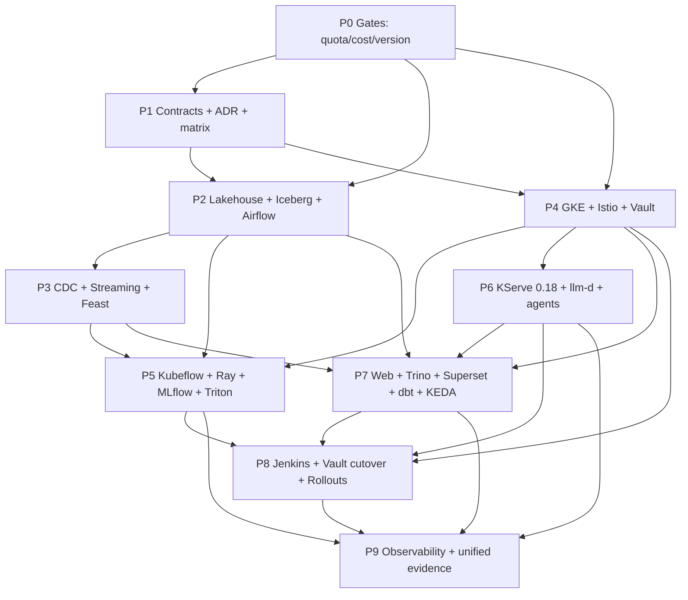

# Architecture Proposal — Transform FDD to the Target Architecture

**Seat:** ArchitectureProposerRetry · **Round:** 1 (proposer retry) · **Date:** 2026-08-31

Evidence basis: the shared packet (`reports/debate-evidence-packet.md`), the target image
`images/architecture/fdd-architecture-full-4k.png` read at region-crop resolution, and cited
source files. Where this proposal contradicts the packet it says so and cites the file.

---

## 0. What the evidence changed about the problem statement

The packet frames this transformation as a mostly green-field build of 24+ absent components
against an unresolved set of seven architectural conflicts. Direct inspection does not support
that framing, in three specific ways, and the difference reshapes the phase plan:

**0.1 — The auditor's expected GitOps paths already all exist.** Every one of the 26 GitOps
paths pinned by `scripts/_phase2_rubric_items.py` resolves: 18 in the live GitOps tree, **8 in
`archive/ml-track/`**, and zero missing. The 8 archived ones are exactly the ML/platform rows
the packet calls absent — KEDA ScaledObjects (`charts/feature-api/templates/scaledobject.yaml`,
`charts/drift-api/templates/scaledobject.yaml`), `platform/ml/ab-testing.yaml`,
`platform/observability/eck-otel-values.yaml`, `platform/security/authorization-policies.yaml`
(Istio AuthorizationPolicy), `platform/security/vault-external-secrets.yaml`. The archive also
holds Lakekeeper (Iceberg REST catalog), Kafka, Airflow, Flink, MinIO and Postgres K8s
manifests, and Argo Rollouts AnalysisTemplates. So a substantial slice of this work is
**restore-to-pinned-path**, not design.

**0.2 — The source repo already implements the contracts, not the runtimes.** `src/lakehouse/`
is an Iceberg/Lakekeeper catalog contract with snapshot and time-travel semantics; `src/cdc/`
is a Debezium/Flink-CDC contract; `src/governance/datahub_emitter.py` is a DataHub contract;
`src/ml/mlflow_registry.py`, `src/ml/pipelines/distributed_training.py`,
`src/ml/leakage_guard.py`, `src/ml/ab_router.py` and `src/ml/feast/` are the ML contracts. None
imports a real client — `pyproject.toml` declares no `ray`, `mlflow`, `kfp`, `feast`,
`pyiceberg` or `trino` dependency. These are deliberate dependency-light contracts with
existing unit harnesses (`tests/phase2/pipelines/test_lakehouse_catalog.py`,
`tests/phase2/verification/test_contract_implementations.py`, and 11 sibling suites). The work
is **binding contracts to runtimes**, which means each binding arrives with its acceptance
harness already written.

**0.3 — Most of the "unresolved conflicts" are already ADRs.** ADR-012 selects Lakekeeper as
the Iceberg catalog; ADR-013 specifies the CDC path; ADR-014 scopes distributed training;
ADR-006 defines the MLflow promotion contract; and — contradicting the packet — **ADR-004 is a
KServe 0.18 pin**, accepted 2026-08-02 and explicitly revived by ADR-010's afternoon amendment
together with the llm-d router. The deployed 0.14.1
(`financial-distress-gitops/platform/inference/VERSIONS.md:13`) is therefore *implementation
drift against an accepted ADR*, not an ADR to overturn. Only four ADRs actually need editing.

**0.4 — And one thing is far worse than the packet says.** The packet treats 48 vCPU as the
planning baseline with cost as a "tight but manageable" risk. Terraform records a correction
dated 2026-08-07: the binding quota is **`CPUS_ALL_REGIONS` = 12**, not the regional `CPUS` =
32, and committed sizing already consumes 10 of those 12. The predecessor plan's own always-on
floor is 12-16 vCPU. Against the verified cap, *no resident subset of the target architecture
fits*. This is not a risk to monitor; it is a hard precondition, and it is why this proposal
puts a stop-and-escalate gate in front of everything that provisions.

---

## 1. Goals

1. **G-1 Full target fidelity.** Every component drawn in
   `images/architecture/fdd-architecture-full-4k.png` exists, runs, and is reachable along the
   drawn edges. Nothing in the image is dropped; nothing outside the image is added.
2. **G-2 Clean cutover, one driver per concern.** At completion there is exactly one CI driver
   (Jenkins), one secrets source of truth (Vault via External Secrets Operator), one table
   format for the rebuilt lakehouse (Iceberg), one service-mesh authorization plane (Istio),
   and zero shims, aliases or dual paths. Superseded workflows, manifests and ADR text are
   deleted, not deprecated.
3. **G-3 Locks preserved.** Phase 1 data contracts (`AGENTS.md:7-11`), Argo-CD-only mutation of
   managed namespaces, digest-only GitOps promotion, two repositories, and the three-namespace
   least-privilege agent boundary all survive unchanged.
4. **G-4 Capacity honesty.** Component residency is scheduled, not assumed. Every phase states
   its resident vCPU cost and its window, and no phase is authorized before the quota it needs
   is verified as granted.
5. **G-5 Evidence regenerated from zero into one tree.** One unified matrix covering
   mini + ML + LLM, keyed by rubric section, replacing the phase-split trees.
6. **G-6 Reversible at a named boundary.** Every phase has a rollback that is a git revert plus
   an Argo resync, or an explicitly named non-reversible step with a pre-taken snapshot.

## 2. Non-goals

1. **N-1** No GPU work. `GPUS_ALL_REGIONS` is 0 and free-trial accounts cannot raise it
   (`plans/260818-0832-rebuild-unified-ml-and-llm-platform/plan.md:53-54`). Disaggregated
   prefill/decode is not a deliverable (`plan.md:55-57`).
2. **N-2** No components outside the target image. Specifically **Kyverno** (five policies in
   `archive/ml-track/platform/security/policies/`) and **Linkerd**
   (`archive/ml-track/platform/security/linkerd-values.yaml`) stay archived: neither appears in
   the image and no rubric row pins them.
3. **N-3** No namespace merging of `agentgateway-system`, `kagent`, `agents-sandbox`.
4. **N-4** No replacement of GitHub as the source host. The image draws Developer → GitHub →
   Webhook Trigger → Jenkins. Only GitHub **Actions** is removed.
5. **N-5** No changes to Phase 1 Bronze/Silver/Gold semantics. Iceberg is a parallel write
   path; the Phase 1 Parquet pipeline and its regression suite stay green throughout.
6. **N-6** No fixing of the tracked-Terraform-state exposure. It is recorded as a standing
   concern (§9, C25) but sits outside the target image and outside this transformation.
7. **N-7** No implementation in this document. Planning only.

---

## 3. Architecture

### 3.1 Target namespace topology and the isolation mapping

The image labels 14 namespaces. Two of its labels are *visual domain groupings* that must not
become Kubernetes namespace collapses. The mapping below is the load-bearing part of this
section.

| Image label | Kubernetes namespace(s) | Note |
|---|---|---|
| `ns: ingress` | `ingress-nginx`, `cert-manager` | Vendor defaults retained; sole external entry point (ADR-009) |
| `ns: web` | `web` | Next.js moves in-cluster |
| `ns: api-serving` | `api-serving` | prediction/feature/drift api + mcp; KEDA controller in `keda` |
| `ns: agents` + nested `Sandbox` box | **`kagent`** + **`agents-sandbox`** + **`agentgateway-system`** | **Isolation preserved.** See §3.2 |
| `ns: analytic` | `analytic` | Trino, Superset, dbt runner |
| `ns: dataflow` | `dataflow` | Renamed from `phase2-data`; adds lakehouse, streaming, Airflow, DataHub |
| `ns: kubeflow` | `kubeflow` | KFP standalone + KubeRay |
| `ns: tracking` | `tracking` | MLflow + its Postgres + MinIO bucket |
| `ns: kserve` | `kserve`, `knative-serving`, `kourier-system` | Vendor split retained |
| `ns: rollouts` | `rollouts` | Argo Rollouts, Deployments only |
| `ns: istio-system` | `istio-system` | istiod, Kiali, GatewayClass |
| `ns: security` | `security` | Vault + ESO; `argocd` retains sealed-secrets until P8 exit |
| `ns: observability` | `observability` | Renamed from `monitoring`; adds PushGateway |
| `ns: ci` | `ci` | Jenkins controller + ephemeral agents |
| — (control plane) | `argocd` | Sole mutator |

Two namespaces are **dissolved**, not renamed: `phase2-data` becomes `dataflow` (the `phase2`
prefix contradicts the un-phased evidence tree, decision #2, `plan.md:37`), and `phase2-llm`
disappears — the image places LLM serving in `ns: kserve` and LLM routing in the agent
namespaces, so a separate LLM namespace is not a target component.

Renames are affordable *because* of the evidence purge: decision #1 (`plan.md:35`) deletes every
evidence artifact, so no pinned evidence hash survives a rename to be re-stamped. The only cost
is stateful-store recreation, which P2/P3 schedule with a pre-taken MinIO snapshot.

### 3.2 The agent isolation boundary (locked; not collapsed)

The packet's Conflict 7 (packet lines 319-323) worries that the image's grouped "agent stack"
implies manifest consolidation. Region-crop reading resolves it in favour of the lock: **the
image itself nests a hatched `Sandbox` box inside `ns: agents`**, containing exactly the
Coordinator Agent (`replicas=3 + autoscale`), Feature Agent and Drift Agent — i.e. the drawing
already distinguishes the runtime sandbox tier from the control plane around it.

Therefore:

- `kagent` keeps the CRDs and controllers (the two purple kagent marks in the image).
- `agents-sandbox` keeps the agent runtime pods — restricted PSS, tokenless ServiceAccount,
  read-only root, default-deny NetworkPolicy. This is the `Sandbox` box.
- `agentgateway-system` is retained as the **only** permitted egress target of that
  default-deny policy, exactly as recorded in
  `../financial-distress-gitops/plans/260818-0028-namespace-convention-alignment/plan.md:77-115`.

The image draws `basic auth + rate limit` and `infer(gRPC)` edges reaching `ns: kserve`. Those
edges are realized **through** `agentgateway-system`; the sandbox NetworkPolicy is not widened
to allow direct sandbox→`kserve` egress. Istio `AuthorizationPolicy` in `kserve` (mTLS STRICT,
per the image) then enforces the same boundary at L7, so the mesh *adds* a second independent
control rather than replacing the NetworkPolicy. **No `BREAKS-LOCK` is required or declared.**

### 3.3 Data plane

```
Vietnam API HOSE/HNX  ─streaming event─┐
Data Generator (simulate batch)  ──────┤
                                       ▼
                          MinIO  +  Iceberg (Lakekeeper REST catalog)
                          Bronze tables ─► Silver/Gold tables
                                              └─ gold.distress_holdout_v1 @ tag holdout-v1
                                       ▲                    │
Source system (Postgres, wal_level=logical)                 │
   └─► Debezium ─► Kafka ─► Flink (realtime feature eng.)   │
                              └─ stream / fresh online features
                                       │                    │
Spark (batch feature eng.) ─update batch features─► FEAST offline store (Postgres)
                                       │                    │  feast materialize
                                       │                    ▼
                                       │            FEAST online store (Redis)
                                       ▼
                              dbt ─build Gold Data Mart─► Trino ─SQL─► Superset
Airflow: trigger sync+materialize · daily check drift DAG · daily gold-mart DAG · retrain trigger
DataHub: lineage + schema assertions over the above
```

Bronze stays append-only and Silver/Gold stay idempotent affected-partition overwrites
(`AGENTS.md:7-8`); Iceberg's snapshot model implements those semantics rather than altering
them. Dedupe remains business key + latest `created_ts` (`AGENTS.md:9`). DQ routing is unchanged:
critical failures halt downstream, warnings route to `ops.failed_records`
(`AGENTS.md:10`), and `ops` / `ml` stay unmixed (`AGENTS.md:11`).

The Feast **offline** store moves from local object storage to Postgres. That is an amendment to
ADR-005 (§3.7), locked by decision #7 (`plan.md:42`) and confirmed by the image, which draws the
offline store as a Postgres elephant.

### 3.4 Model plane

```
Airflow ─retrain trigger─► Kubeflow Pipeline
   │  launch run_id in MLflow BEFORE push to Ray
   ├─ distributed training ─► Ray Cluster ─metrics per epoch/workers─► MLflow
   └─► MLflow (ns: tracking) ─► Postgres metadata+registry · MinIO checkpoints+artifacts
                                     │
              Jenkins model-promote lane: fetch-run ─► holdout gate ─► smoke-test
                                          ─► scan artifact ─► sign ─► bump-gitops
                                     │  (frozen eval set = gold.distress_holdout_v1 @ tag holdout-v1)
                                     ▼
   ns: kserve   Triton InferenceService: revision N-1 stable 90% / revision N canary 10%
                                          canaryTrafficPercent 10 → 25 → 50
                Gateway/GatewayClass: istio / ClusterIP ─► HTTPRoute group: llm-ab
                                          ─► llm-d isvc-a (w=9) · llm-d isvc-b (w=1)
                mTLS STRICT + AuthorizationPolicy · LWS — multi-node serving
   ns: rollouts Argo Rollouts (Deployments only) — canary + AnalysisTemplate
   Gates: ML = p99 latency, error rate, drift · LLM = TTFT, tokens/s, KV-cache hit
```

**Three distinct progressive-delivery mechanisms, deliberately.** The image is precise here and
the plan must not unify them: Triton uses KServe's native `canaryTrafficPercent` revision split;
llm-d A/B uses Gateway API `HTTPRoute` weights (9:1); Argo Rollouts is explicitly annotated
`Rollouts: Deployments only` and therefore governs `api-serving`, `agents` and `web` — never the
`InferenceService`/`LLMInferenceService` CRDs. AnalysisTemplates query the observability stack
(`query metrics, analysis latency, error rate`) for all three.

**The llm-d Gateway is `ClusterIP`.** This matters commercially: no third external load balancer
is introduced, so ADR-009's sole-external-entry rule and the idle-LB cost fix (USD 54/month per
LB, packet §IX) both survive.

### 3.5 Serving and product plane

`ns: web` runs Next.js UI + Route Handlers behind NGINX. `ns: api-serving` runs `prediction-api`
(keyed by `company_id` from the ingress), `feature-api` (`get online features` from Feast/Redis),
`drift-api`, and the two MCP servers `feature-mcp` / `drift-mcp` which the sandbox agents call.
KEDA scales this namespace. The image draws `feature-mcp ─http─► feature-api` and
`drift-mcp ─► drift-api`, i.e. MCP tools are thin adapters over the APIs, which matches the
existing `apps/feature-mcp/`, `apps/drift-mcp/`, `apps/feature-api/`, `apps/drift-api/` split.

### 3.6 Platform, security and delivery plane

- **Istio** mesh-wide (or selectively injected per Gate G0), `mTLS STRICT` +
  `AuthorizationPolicy`, **Kiali** for the service graph. Istio is also the Gateway API provider
  for llm-d's router, which is why `kserve` cannot be dropped from the injected set under any
  fallback (`plan.md:114-115`).
- **Vault + External Secrets Operator** in `ns: security` become the single secrets source.
  Sealed-secrets remains readable in parallel until P8 verifies every ESO-sourced secret, then is
  deleted in one commit.
- **Jenkins** in `ns: ci`, two lanes sharing `bump-gitops`: `app-ci` = lint → test-build → scan →
  push-by-digest; `model-promote` = fetch-run → holdout gate → smoke-test → scan artifact → sign.
  GitHub webhook triggers both.
- **Argo CD** remains the only mutator of managed namespaces. Jenkins never applies to the
  cluster; `bump-gitops` opens a digest-only commit into `financial-distress-gitops`, and Argo
  reconciles. Terraform (`provision`/`IAC`) and Ansible remain reviewed, out-of-band.
- **Observability**: OTel Collector → Loki; Prometheus → Grafana; Jaeger → Grafana; plus a
  **PushGateway**, required by the image's `through pushgateway check daily drift DAG` edge.

### 3.7 Documentation and ADR cutover

| ADR | Action | Reason |
|---|---|---|
| **ADR-004** (KServe 0.18 pin) | **No text change**; close implementation drift | Already decides 0.18 + llm-d; deployed artifact is 0.14.1 (`VERSIONS.md:13`) |
| **ADR-005** (Feast stores) | **Amend**: offline store local object storage → Postgres | Image + `plan.md:42` |
| **ADR-006** (MLflow promotion) | **Un-defer**, text unchanged | Already valid for the ML retrofit |
| **ADR-012** (Iceberg/Lakekeeper) | **No change** | Already accepted; matches image |
| **ADR-013** (CDC path) | **Amend**: direct Flink-CDC WAL read → Debezium → Kafka → Flink | Image + `plan.md:42` |
| **ADR-014** (Kubeflow Trainer) | **Amend**: Trainer boundary → KFP orchestration + Ray distributed training | Image draws `Kubeflow Pipeline ─distributed training─► Ray Cluster` |
| **ADR-010** (LLM-only scope) | **Superseded** by a new ADR-016 | Restores Istio, Vault, Jenkins, Argo Rollouts, ML track |
| **ADR-009** (NGINX sole entry) | **No change** | Image confirms NGINX is the only external ingress; Istio Gateway is ClusterIP |
| **ADR-002** (two repos) | **No change** | Image retains `financial-distress-gitops` |
| `docs/coursework.md`, `docs/system-architecture.md` | Rewrite to target state at P9 | Currently describe the superseded baseline |
| `docs/mini_coursework.md` | **Authority retained**; no lock conflict found | Phase 1 contracts unchanged by this plan |

`AGENTS.md:24` names `.github/workflows/ci.yml` as the CI that runs the definition-of-done gate;
P8 must update that line when the workflows are deleted.

---

## 4. Migration Strategy

### 4.1 Four work classes, three different treatments

Classifying every target component by *what actually has to happen* is what keeps this plan from
being nine green-field builds.

| Class | Count | Treatment | Examples |
|---|---|---|---|
| **A — Restore to pinned path** | 8 paths | `git mv` out of `archive/ml-track/` to the path the auditor already pins, then wrap in a new Argo Application | Vault+ESO, Istio AuthorizationPolicy, KEDA ScaledObjects, AnalysisTemplates, ML A/B, OTel values |
| **B — Bind contract to runtime** | 8 contracts | Add the real client dependency, implement the adapter behind the existing interface, prove it against the existing unit harness plus a new live smoke | Iceberg/Lakekeeper, Debezium, DataHub, MLflow, Ray, Feast, leakage guard, A/B router |
| **C — Build new** | 12 components | New source modules + new GitOps manifests | Trino, Superset, dbt, KEDA controller, KFP, Triton, llm-d/Gateway API/LWS, Istio, Kiali, Jenkins, Argo Rollouts, Airflow-on-K8s |
| **D — Version/drift close** | 1 | Bump vendored manifests to the already-decided version | KServe 0.14.1 → 0.18 |

Class A and D are cheap and de-risk everything downstream; they front-load.

### 4.2 Parallel-write, never in-place, for data

Iceberg lands as a **parallel** namespace alongside the Phase 1 Parquet tables. The Phase 1
pipeline, its DAGs and `scripts/run_stage1_quality_gates.py` stay green for the whole
transformation. Cutover of readers happens once, at P7, when Trino/Superset/dbt point at Iceberg
and nothing still reads the Parquet Gold path. Only then are the Parquet Gold readers removed —
one commit, no dual-read shim left behind.

### 4.3 Staged CI cutover with a single flip

GitHub Actions remains the delivery driver through P7, because Argo-only mutation means every
phase needs a working digest-promotion path and P8 is where Jenkins is built. At the P8 boundary
the flip is atomic: Jenkins `app-ci` proves it produces an identical digest for the same commit,
then one commit deletes all 11 `phase2-*` workflows and `ci.yml` and updates `AGENTS.md:24`.
There is no period with two CI drivers both authorized to promote.

### 4.4 Secrets cutover with a read-only overlap

ESO-sourced secrets are created **alongside** sealed-secrets and compared byte-for-byte before
any consumer is repointed. Sealed-secrets is deleted only after every consumer reads from the
Vault-backed path. The overlap is read-only and time-boxed to P8; it is not a permanent
dual-source.

### 4.5 Scheduled residency as the execution model

Because the always-on floor exceeds nothing available today (§0.4), residency scheduling is the
core mechanic, not an optimization. Groups and their windows follow the predecessor plan's table
(`plan.md:86-108`): Istio/core-platform/Gateway-stack/observability/stores are always-on;
serving, streaming, Airflow, Kubeflow, DataHub, Trino+Superset and Jenkins each get their own
window; Spark, Ray and Locust burst inside those windows only.

### 4.6 Proposed new files

**Source repo (`Financial-Distress-Data`) — new:**

```
docs/phase2/adr/adr-016-unified-ml-llm-target-architecture.md   # supersedes ADR-010
docs/target-architecture.md                                     # target-state runtime doc
docs/rubric-matrix-unified.csv                                  # 161 rows, mini+ML+LLM
src/lakehouse/rest_catalog.py                                    # real Lakekeeper REST client
src/lakehouse/spark_iceberg.py                                   # Spark-on-K8s Iceberg session
src/transforms/iceberg_bronze_to_silver.py
src/transforms/iceberg_silver_to_gold.py
src/lakehouse/holdout_tag.py                                     # gold.distress_holdout_v1 tagging
src/cdc/debezium_connector.py                                    # Kafka Connect connector config
src/streaming/flink/jobs/realtime_feature_job.py
src/ml/feast/postgres_offline_store.py
src/ml/pipelines/kfp_pipeline.py                                 # Kubeflow Pipelines DSL
src/ml/pipelines/ray_trainer.py                                  # real Ray distributed trainer
src/ml/mlflow_client.py                                           # real MLflow tracking client
src/ml/promotion_gate.py                                          # frozen-holdout equality assert
src/serving/triton_model_repo.py                                  # Triton model repository layout
src/analytics/trino_client.py
src/analytics/dbt/                                                # dbt project: gold data mart
dags/10_build_gold_data_mart.py
dags/11_daily_drift_check.py
dags/12_retrain_trigger.py
configs/iceberg_catalog.yaml
configs/debezium_source.yaml
configs/trino_catalogs.yaml
scripts/run_unified_evidence_capture.py
scripts/verify_target_architecture.py                             # component-coverage assertion
tests/phase2/pipelines/test_iceberg_rest_catalog.py
tests/phase2/pipelines/test_debezium_connector_contract.py
tests/phase2/pipelines/test_postgres_offline_store.py
tests/phase2/pipelines/test_kfp_pipeline_contract.py
tests/phase2/pipelines/test_ray_trainer_contract.py
tests/phase2/pipelines/test_promotion_gate.py
tests/phase2/pipelines/test_dbt_gold_mart_contract.py
tests/phase2/verification/test_target_component_coverage.py
Jenkinsfile                                                       # app-ci lane
Jenkinsfile.promote                                               # model-promote lane
```

**GitOps repo (`financial-distress-gitops`) — new Argo Applications:**

```
argocd/applications/platform-istio.yaml
argocd/applications/platform-vault.yaml
argocd/applications/platform-lakehouse.yaml
argocd/applications/platform-streaming.yaml
argocd/applications/platform-orchestration.yaml     # Airflow on K8s
argocd/applications/platform-features.yaml
argocd/applications/platform-governance.yaml        # DataHub
argocd/applications/platform-analytic.yaml
argocd/applications/platform-kubeflow.yaml
argocd/applications/platform-tracking.yaml          # MLflow
argocd/applications/platform-serving-ml.yaml        # Triton
argocd/applications/platform-serving-llm.yaml       # llm-d, Gateway, HTTPRoute, LWS, GIE
argocd/applications/platform-api-serving.yaml
argocd/applications/platform-keda.yaml
argocd/applications/platform-web.yaml
argocd/applications/platform-rollouts.yaml
argocd/applications/platform-ci.yaml                # Jenkins
```

**GitOps repo — new manifests:**

```
platform/istio/{istiod-values.yaml,kiali-values.yaml,gatewayclass.yaml,peer-authentication.yaml}
platform/lakehouse/{minio-values.yaml,lakekeeper.yaml,spark-operator-values.yaml,source-postgres.yaml,networkpolicy.yaml}
platform/streaming/{kafka.yaml,kafka-connect-debezium.yaml,flink-operator-values.yaml,flink-feature-job.yaml}
platform/orchestration/{airflow-values.yaml,networkpolicy.yaml}
platform/features/{feast-server.yaml,redis.yaml,offline-postgres.yaml}
platform/governance/{datahub-values.yaml,elasticsearch.yaml}
platform/analytic/{trino-values.yaml,trino-catalogs.yaml,superset-values.yaml,dbt-cronjob.yaml}
platform/kubeflow/{kfp-standalone.yaml,kuberay-operator-values.yaml,raycluster.yaml}
platform/tracking/{mlflow.yaml,mlflow-postgres.yaml}
platform/serving/{triton-isvc.yaml,llm-isvc-a.yaml,llm-isvc-b.yaml,httproute-llm-ab.yaml,gateway.yaml,lws.yaml,authorizationpolicy.yaml}
platform/api-serving/{prediction-api.yaml,feature-api.yaml,drift-api.yaml,feature-mcp.yaml,drift-mcp.yaml,networkpolicy.yaml}
platform/keda/keda-values.yaml
platform/web/nextjs.yaml
platform/ci/{jenkins-values.yaml,jenkins-agent-podtemplates.yaml,networkpolicy.yaml}
platform/observability/pushgateway.yaml
terraform/gcp/nodepool-spot.tf
```

**Restored from archive to their rubric-pinned paths (Class A) — `git mv`, not new:**

```
archive/ml-track/platform/security/vault-external-secrets.yaml  -> platform/security/vault-external-secrets.yaml
archive/ml-track/platform/security/authorization-policies.yaml  -> platform/security/authorization-policies.yaml
archive/ml-track/platform/security/{secret-store,external-secrets-values}.yaml -> platform/security/
archive/ml-track/platform/ml/ab-testing.yaml                    -> platform/ml/ab-testing.yaml
archive/ml-track/platform/rollouts/{analysis-templates,rollout-dashboard,keda-scaledobjects}.yaml -> platform/rollouts/
archive/ml-track/platform/observability/eck-otel-values.yaml    -> platform/observability/eck-otel-values.yaml
archive/ml-track/charts/feature-api/                            -> charts/feature-api/
archive/ml-track/charts/drift-api/                              -> charts/drift-api/
archive/ml-track/platform/data/lakehouse/{lakekeeper,lakekeeper-postgres,networkpolicy}.yaml -> platform/lakehouse/
archive/ml-track/platform/data-phase1/{kafka,flink}.yaml        -> platform/streaming/
archive/ml-track/platform/data-phase1/airflow.yaml              -> platform/orchestration/
archive/ml-track/platform/data-phase1/{minio,postgres}.yaml     -> platform/lakehouse/
```

**Existing files modified (not created):**

Source: `pyproject.toml` (real clients), `AGENTS.md:24` (CI driver), `docs/coursework.md`,
`docs/system-architecture.md`, `docs/phase2/adr/adr-{005,013,014}-*.md` (amendments),
`docs/phase2/adr/adr-006-mlflow-promotion.md` (un-defer),
`docs/phase2/adr/adr-010-*.md` (superseded banner), `docs/phase2/rubric-matrix.csv` (→ unified),
`scripts/_phase2_rubric_items.py`, `src/lakehouse/{catalog,tables,snapshots}.py`,
`src/cdc/{config,flink_cdc_job}.py`, `src/ml/{mlflow_registry,label_pipeline}.py`,
`src/ml/pipelines/{training_pipeline,distributed_training}.py`, `src/ml/feast/*`,
`feature_repo/structured/feature_store.cluster.yaml`, `docker-compose.yml`.

**Existing files deleted (clean cutover):** `.github/workflows/ci.yml` and the 11
`.github/workflows/phase2-*.yml` (at P8), `docs/evidence/` and `docs/phase2/evidence/` trees (at
P1, per decision #1), `argocd/applications/platform-llm.yaml` and
`platform/llm/` (namespace dissolved), `platform/inference/vendored/03-net-kourier.yaml` **only
if** Gate G6 selects net-istio.

GitOps repo: `platform/inference/{VERSIONS.md,vendored/*}` (0.18 bump),
`argocd/applications/platform-{data,observability,agents,agentgateway,inference,security}.yaml`
(namespace retargets, Istio injection labels).

---

## 5. Phases

Each phase is gated, resident-cost-stated, and independently revertible. **P0 is a gate, not
work**; no phase after it is authorized until its branch is recorded.

### P0 — Capacity, cost and version gates (blocking, no cluster mutation)

| Gate | Question | Branches |
|---|---|---|
| **G0 Quota** | What is granted `CPUS_ALL_REGIONS`? | **A** ≥48 → mesh-wide Istio, plan as written. **B** 24-47 → selective Istio injection in `api-serving`, `agents`, `kserve` (`plan.md:111-115`); `kserve` never droppable. **C** =12, increase refused → **STOP. Escalate.** Always-on floor 12-16 vCPU (`plan.md:103`) exceeds the cap; no resident subset of the target exists. Do not start P2. |
| **G1 Cost** | Measured remaining credit and burn, re-taken today | ≥USD 180 → proceed. USD 120-180 → force branch B, halve capture windows. <USD 120 → escalate scope reduction to the user before P2. |
| **G2 Spot** | Does a spot node pool exist? | No (verified: zero `spot`/`preemptible` in `gke.tf`) → `terraform/gcp/nodepool-spot.tf` is a P0 deliverable, because the 230-260 cluster-hour budget depends on it. |
| **G3 KServe 0.18** | Does the 0.18 install expose `LLMInferenceService` + Gateway API + GIE + LeaderWorkerSet? | Yes → llm-d path. No → ADR-004 branch B (`plan.md:69-79`). |
| **G4 Native sidecars** | K8s ≥1.33 and do Istio-injected Jobs reach `Completed`? | Yes → mesh-wide safe. No → exclude Job-producing namespaces from injection, keep `kserve` injected (`plan.md:114-124`). |
| **G5 vLLM CPU** | Is vLLM CPU usable for production inference? | A → KV-cache-routing evidence. B → llama.cpp + semantic cache evidence (`plan.md:69-79`). |

**Exit:** every gate has a recorded branch and a dated measurement. Effort: 2-3 days plus 1-3
days quota-approval lag (submit day 1, `plan.md:38`).

### P1 — Contracts, ADR cutover, unified evidence tree (source-only)

Normalize the mini rubric CSV (`docs/Coursework Tracking (Public) - rubic (mini-coursework).csv`,
raw export with unnamed columns and multi-line quoted cells) into the 19-column schema of
`docs/phase2/rubric-matrix.csv`; merge with the existing 60 LLM + 57 ML rows into
`docs/rubric-matrix-unified.csv` (161 rows). Write ADR-016 superseding ADR-010; amend ADR-005,
ADR-013, ADR-014; un-defer ADR-006; leave ADR-002/004/009/012 untouched. Delete both evidence
trees. Add `scripts/verify_target_architecture.py` and
`tests/phase2/verification/test_target_component_coverage.py` — the component-coverage assertion
that every later phase is measured against.

No cluster mutation. Resident cost: 0. Effort: 4-6 days.

### P2 — Data plane and lakehouse

Restore MinIO/Postgres/Lakekeeper manifests from archive; deploy `platform-lakehouse` (MinIO,
Lakekeeper + its Postgres, Spark Operator, source Postgres with `wal_level=logical`) and
`platform-orchestration` (Airflow on K8s). Bind `src/lakehouse/` to the real REST catalog
(`rest_catalog.py`), add the Spark-on-K8s Iceberg session, port Bronze→Silver→Gold to Iceberg as
a **parallel** namespace, scale the generator to 10-50M rows (`plan.md:43`), and create
`gold.distress_holdout_v1` with its `holdout-v1` Iceberg tag. Deploy `platform-governance`
(DataHub) and bind `src/governance/datahub_emitter.py`.

Depends on: P0 (branch recorded), P1 (matrix + coverage test).
Resident: stores always-on (2-3 vCPU); Spark/Airflow windowed (`plan.md:92,95`).
Effort: 10-14 days.

### P3 — CDC, streaming and feature stores

Deploy `platform-streaming` (Kafka, Kafka Connect + Debezium, Flink Operator) and
`platform-features` (Feast server, Redis online, Postgres offline). Bind `src/cdc/` to the real
Debezium connector; implement the Flink realtime feature job; implement the Postgres Feast
offline store and repoint `feature_repo/structured/feature_store.cluster.yaml`. Prove the
point-in-time contract with the existing leakage guard against the new offline store.

Depends on: P2 (Iceberg Bronze sink, source Postgres).
Resident: streaming windowed (5-7 vCPU, `plan.md:94`).
Effort: 8-12 days.

### P4 — GKE platform, mesh and secrets

Apply the namespace topology of §3.1. Deploy `platform-istio` (istiod, Kiali, GatewayClass) —
**PERMISSIVE first**, soak, then `mTLS STRICT`. Restore `platform/security/authorization-policies.yaml`
and `platform/security/vault-external-secrets.yaml` from archive; deploy `platform-vault`
(Vault + ESO). Verify G4 Job termination on real Kubeflow/Spark/Ray/Airflow Jobs, not synthetic
ones. Re-verify the sandbox NetworkPolicy negative tests still fail closed **after** injection.

Depends on: P0 (G0/G4 branches), P1.
Resident: Istio 5-6 vCPU + core platform 2-3 (`plan.md:88-89`) — always-on.
Effort: 8-12 days.

### P5 — ML track: Kubeflow, Ray, MLflow, Triton

Deploy `platform-kubeflow` (KFP standalone + KubeRay + RayCluster), `platform-tracking` (MLflow +
Postgres + MinIO bucket), `platform-serving-ml` (Triton `InferenceService` with
`canaryTrafficPercent` 10→25→50). Bind `src/ml/mlflow_registry.py` to a real MLflow client and
`src/ml/pipelines/distributed_training.py` to a real Ray trainer; author the KFP pipeline that
launches the MLflow `run_id` **before** pushing to Ray (per the image's edge label); implement
`src/ml/promotion_gate.py` as a hard equality assert on the frozen holdout tag
(`plan.md:49`). Add the daily drift-check and retrain-trigger DAGs, and the PushGateway path.

Depends on: P2 (Iceberg + holdout tag), P3 (offline features), P4 (mesh, secrets).
Resident: KFP 3-4, MLflow small, Triton in serving window; Ray bursts (`plan.md:96,101`).
Effort: 14-20 days. **Largest single phase.**

### P6 — LLM track: KServe 0.18, llm-d, agents

Bump `platform/inference/vendored/` to KServe 0.18 with an exported pre-upgrade
`InferenceService` set. Deploy `platform-serving-llm`: Gateway (`GatewayClass: istio`,
**ClusterIP**), `HTTPRoute` group `llm-ab` with weights 9:1, two `LLMInferenceService` instances
(isvc-a, isvc-b), GIE endpoint-picker, LeaderWorkerSet. Apply `AuthorizationPolicy` + mTLS STRICT
in `kserve`. Retarget agents and agentgateway into the mesh with injection labels; confirm the
sandbox default-deny still scopes egress to `agentgateway-system` only. Dissolve `phase2-llm`.

**Gate G6 (new, phase-local):** Knative net layer — retain `net-kourier` (ClusterIP, no new LB)
or migrate to `net-istio`. Default: **retain net-kourier**, because migrating risks introducing a
gateway service of type LoadBalancer and re-breaking the two-LB cost fix. Migrate only if
Kourier and the Istio GatewayClass conflict in practice.

Depends on: P0 (G3, G5), P4 (Istio is the Gateway API provider).
Resident: serving window 6-12 vCPU (`plan.md:93`).
Effort: 8-12 days.

### P7 — Web, Trino, Superset, dbt, KEDA

Deploy `platform-analytic` (Trino + catalogs over Iceberg/MinIO, Superset, dbt CronJob building
the Gold Data Mart on the Airflow daily DAG), `platform-api-serving` (prediction/feature/drift
api + the two MCP servers), `platform-keda`, restored `charts/feature-api` and `charts/drift-api`
with their pinned ScaledObjects, and `platform-web` (Next.js in-cluster with Postgres RLS,
replacing external Supabase). **Then** remove the Parquet Gold readers — the one-time reader
cutover of §4.2.

Depends on: P2 (Iceberg Gold), P3 (online features), P4 (mesh/secrets), P6 (agents→MCP path).
Resident: Trino+Superset windowed 2-4 vCPU (`plan.md:98`).
Effort: 10-14 days.

### P8 — Jenkins, Vault cutover, GitOps and Rollouts

Deploy `platform-ci` (Jenkins controller + ephemeral agent pod templates) and
`platform-rollouts` (Argo Rollouts + restored AnalysisTemplates + `platform/ml/ab-testing.yaml`).
Author `Jenkinsfile` (app-ci) and `Jenkinsfile.promote` (model-promote), both terminating in
`bump-gitops` — a digest-only commit, never a `kubectl apply`. Convert `api-serving`, `agents`
and `web` Deployments to Rollouts with canary + AnalysisTemplate on the ML gate (p99 latency,
error rate, drift) and the LLM gate (TTFT, tokens/s, KV-cache hit). Prove digest equivalence
against GitHub Actions, then the atomic flip of §4.3 and the secrets flip of §4.4.

Depends on: P5 (model-promote lane needs MLflow + holdout gate), P6 (serving to canary), P7
(Deployments to convert), P4 (Vault).
Resident: Jenkins windowed 1-2 vCPU (`plan.md:99`).
Effort: 10-14 days.

### P9 — Observability completion and unified evidence capture

Rename `monitoring` → `observability`; add PushGateway; restore
`platform/observability/eck-otel-values.yaml`; add Kiali, Trino, Superset, MLflow, KFP, Ray,
Flink, Kafka and Jenkins scrape targets and dashboards. Run
`scripts/run_unified_evidence_capture.py` in a single dependency-ordered window (`plan.md:108`),
capturing all 161 rows. Run `scripts/verify_target_architecture.py`. Rewrite
`docs/coursework.md`, `docs/system-architecture.md`, `docs/target-architecture.md`. Freeze with
GitOps SHA convergence. Run `make validate` in the GitOps repo and
`scripts/run_stage1_quality_gates.py` in source.

Depends on: P5, P6, P7, P8.
Resident: observability always-on 3-4 vCPU (`plan.md:91`); capture window is peak burn.
Effort: 8-12 days.

---

## 6. Dependencies



**Acyclicity:** edges only ever go from a lower phase index to a higher one (P0→P1, P0→P2, P0→P4,
P1→P2, P1→P4, P2→P3, P2→P5, P2→P7, P3→P5, P3→P7, P4→P5, P4→P6, P4→P7, P4→P8, P5→P8, P5→P9,
P6→P7, P6→P8, P6→P9, P7→P8, P7→P9, P8→P9). A strictly increasing index along every edge is a
topological order, so the graph is acyclic by construction.

**File ownership — no two phases with a parallel-eligible relationship touch the same file.**
P2 owns `src/lakehouse/`, `src/transforms/`, `platform/lakehouse/`, `platform/orchestration/`.
P3 owns `src/cdc/`, `src/streaming/`, `src/ml/feast/`, `feature_repo/`, `platform/streaming/`,
`platform/features/`. P4 owns `platform/istio/`, `platform/security/`, and all Argo
`destination.namespace` fields. P5 owns `src/ml/pipelines/`, `src/ml/mlflow*`,
`src/ml/promotion_gate.py`, `platform/kubeflow/`, `platform/tracking/`, `platform/serving/triton-isvc.yaml`.
P6 owns `platform/inference/`, `platform/serving/llm-*`, `platform/serving/{gateway,httproute-llm-ab,lws}.yaml`,
`platform/agents/`, `platform/agentgateway/`. P7 owns `src/analytics/`, `platform/analytic/`,
`platform/api-serving/`, `platform/keda/`, `platform/web/`, `charts/`. P8 owns `Jenkinsfile*`,
`platform/ci/`, `platform/rollouts/`, `.github/workflows/`. P9 owns `platform/observability/`
and the docs. P3 and P4 are the only genuinely parallel pair and share no file.

**External dependencies:** GCP quota approval (1-3 days, `plan.md:38`); a granted spot-pool
quota; upstream availability of KServe 0.18, GIE, LeaderWorkerSet, Lakekeeper, KubeRay, KFP
standalone, Trino, Superset, DataHub and Jenkins charts at pinnable digests.

---

## 7. Risks

Likelihood × Impact, with a mitigation for every High.

| # | Risk | L | I | Mitigation |
|---|---|---|---|---|
| R1 | **`CPUS_ALL_REGIONS`=12 is not raised.** Verified cap is below the always-on floor; the whole plan is infeasible. | Med | Critical | Gate G0 branch C is a hard stop before P2. Quota submitted on day 1 of P0. No provisioning work starts on speculation. |
| R2 | **Credit exhausts before P9's capture window.** USD 223 at 2026-08-18; 13+ days have since elapsed unmeasured; expiry 2026-11-06. | High | Critical | G1 re-measures today; weekly cost checkpoint from P2; spot pool is a P0 deliverable; P9 runs a *single* dependency-ordered window so a mid-window failure loses only the tail (`plan.md:108`). |
| R3 | **Istio sidecars prevent Jobs reaching `Completed`**, breaking KFP, Ray, Spark and Airflow `KubernetesPodOperator` — roughly half the ML track (`plan.md:117-124`). | Med | High | G4 verifies native sidecars on *real* Job-producing workloads in P4, before P5 depends on them. Fallback: exclude Job namespaces from injection, keep `kserve` injected. |
| R4 | **KServe 0.18 CRD upgrade is not cleanly reversible.** CRD downgrades drop fields. | Med | High | Export all `InferenceService`/`ServingRuntime` objects before the bump; rollback restores from that export, not from the CRD. Named as a non-reversible step (§8). |
| R5 | **Namespace rename destroys stateful data** (`phase2-data`→`dataflow`). | Med | High | Rename executes only inside a window with a completed MinIO/PV snapshot verified restorable; Redis/PGVector are rebuildable from Iceberg + RAG re-ingest. |
| R6 | **Mesh-wide mTLS STRICT breaks the agent path or ingress.** | Med | High | PERMISSIVE-first with a soak, then STRICT; sandbox NetworkPolicy negative tests re-run post-injection as a P4 exit criterion. |
| R7 | **vLLM CPU unusable** (vendor docs say CPU is not an intended target, packet §X). | High | Med | Pre-written branch B evidence story (`plan.md:69-79`); G5 decides before any evidence claim is made. Never claim branch A routing evidence while running branch B. |
| R8 | **Debezium→Kafka→Flink contradicts ADR-013's direct WAL read.** Silent divergence would leave an accepted ADR describing a path that does not exist. | High | Med | ADR-013 amendment is a P1 deliverable, ahead of P3 implementation. |
| R9 | **dbt is an inferred component.** The image's orange four-blade mark between Trino and Airflow, labelled `Buld Gold Data Mart`, is read as dbt. `[INFERENCE]` on the logo; the *role* (Airflow-triggered daily Gold-mart build feeding Trino) is unambiguous from the labels. | Med | Low | P1 records the reading and asks the user to confirm the tool. If not dbt, the role is satisfied by a Spark/Trino DDL CronJob at the same edge — no phase restructuring. |
| R10 | **Three progressive-delivery mechanisms get accidentally unified** into Argo Rollouts, contradicting the image's `Rollouts: Deployments only`. | Med | Med | Mechanism ownership is fixed in §3.4 and asserted by `test_target_component_coverage.py`. |
| R11 | **Two CI drivers both authorized to promote** during the cutover. | Low | High | §4.3 single atomic flip; digest-equivalence proof precedes deletion; never an overlap window. |
| R12 | **Evidence purge forfeits 100 verified LLM points** with no guarantee of re-earning them inside the credit window. | High | High | Decision #1 is user-locked (`plan.md:35`) and not reopened here. P9's capture is dependency-ordered so partial capture is still partial credit rather than zero. Flagged to the user as the dominant schedule risk. |
| R13 | **Schedule: ~30 hrs/wk × 8-10 weeks with zero slack**, and Istio, Jenkins and Vault can each consume the buffer. | High | High | Class A/D work front-loads cheap wins; P3∥P4 is the only parallelism claimed; P5 is explicitly the largest phase and is not co-scheduled with P8. |
| R14 | **Tracked Terraform state and `tfplan` in Git** remain an audit exposure Vault does not fix. | Confirmed | Med | Recorded as a standing concern; out of scope per N-6. |
| R15 | **`monitoring`→`observability` rename churns dashboards and scrape configs.** | Med | Low | Executed in P9 alongside the dashboard rewrite that would happen anyway; zero evidence cost because evidence is regenerated (C22). |

---

## 8. Rollback

**Universal boundary.** Every managed-namespace change is an Argo CD Application. Rollback is
`git revert` of the GitOps commit plus an Argo resync — never imperative `kubectl`. This is the
GitOps repo's own rule and ADR-002's promotion contract. One Argo Application per component
group exists precisely so a rollback blast radius equals one group.

| Phase | Rollback | Reversible? |
|---|---|---|
| P0 | Nothing applied. Discard the branch record. | Fully |
| P1 | Revert source commits. Evidence-tree deletion is recovered from git history. | Fully |
| P2 | Delete `platform-lakehouse` / `platform-orchestration` Applications. Iceberg tables are a **parallel** namespace; Phase 1 Parquet is untouched and its gate stays green. | Fully, except namespace rename (needs the P2 snapshot) |
| P3 | Delete `platform-streaming` / `platform-features`. Debezium replication slot must be dropped explicitly — an orphaned slot pins Postgres WAL and will fill the disk. Named as a mandatory rollback step. | Fully, with the slot-drop step |
| P4 | Set `istio-injection` labels off, revert `platform-istio`; mTLS returns to no-mesh. Vault: revert `platform-vault`; sealed-secrets is still present and authoritative until P8, so no consumer breaks. | Fully |
| P5 | Delete `platform-kubeflow` / `platform-tracking` / `platform-serving-ml`. MLflow's Postgres and MinIO artifacts persist for re-attach. | Fully |
| P6 | **Non-reversible without preparation.** Revert `platform/inference/vendored/` to the 0.14.1 digests *and* re-apply the pre-upgrade `InferenceService`/`ServingRuntime` export. Without that export, rollback loses object definitions to CRD field drop. Taking the export is a P6 entry criterion. | Conditional |
| P7 | Delete `platform-analytic` / `platform-api-serving` / `platform-keda` / `platform-web`; external Vercel+Supabase stays live until the in-cluster web passes its criteria, so the product plane never has a gap. The Parquet-reader removal is a separate, later, individually revertible commit. | Fully |
| P8 | Revert `platform-ci` / `platform-rollouts`; revert the workflow-deletion commit to restore GitHub Actions from git history; ESO `ExternalSecret` objects revert while sealed-secrets remains readable. Rollouts→Deployment conversion reverts per workload. | Fully |
| P9 | Revert observability and docs commits. Evidence artifacts are regenerable by re-running the capture script. | Fully |

**Non-reversible steps, enumerated (all three require a pre-taken artifact):**
1. P2 namespace rename of the stateful `phase2-data` → MinIO/PV snapshot first.
2. P6 KServe CRD upgrade → object export first.
3. P3 Postgres logical replication slot creation → explicit drop in the rollback runbook.

**Cross-phase rule:** rollback of phase *n* never requires rollback of phase *n-1*. This holds
because each phase adds Applications and only P7's reader cutover and P8's CI flip remove a
previously working path — and both are isolated single commits placed at the end of their phase.

---

## 9. Acceptance Criteria

All criteria in `WHO -> ACTION -> RESULT` per `AGENTS.md:43,51`.

**P0 — Gates**
- AC-P0-1: Platform operator -> queries `CPUS_ALL_REGIONS` and the granted increase -> records an integer and a G0 branch letter (A/B/C) with a date; branch C halts the plan.
- AC-P0-2: Cost owner -> reads the GCP billing console -> records remaining credit in USD and VND with a date, and a G1 branch.
- AC-P0-3: Platform operator -> applies `terraform/gcp/nodepool-spot.tf` in plan-only mode -> `terraform plan` shows a spot node pool with `spot = true` and zero nodes.
- AC-P0-4: Platform operator -> installs KServe 0.18 in a throwaway namespace -> `kubectl get crd llminferenceservices.serving.kserve.io` returns a CRD, or G3 branch B is recorded.
- AC-P0-5: Platform operator -> runs an Istio-injected Job producing a pod -> the Job reaches `Completed` within its deadline, or G4 selective-injection branch is recorded.

**P1 — Contracts and evidence**
- AC-P1-1: Data engineer -> normalizes the mini rubric CSV -> `docs/rubric-matrix-unified.csv` has 161 data rows with all 19 columns populated and zero `design_only` values remaining as the terminal state.
- AC-P1-2: Architect -> writes ADR-016 -> `docs/phase2/adr/adr-010-*.md` carries a `Superseded by ADR-016` banner and ADR-016 lists Istio, Vault, Jenkins, Argo Rollouts and the ML track as restored.
- AC-P1-3: Architect -> amends ADR-005/013/014 -> each names its superseding decision, its date, and the `plan.md` line locking it.
- AC-P1-4: `scripts/verify_target_architecture.py` -> is run against an empty cluster -> exits non-zero and lists every target component as missing (proving the assertion is live, not vacuous).
- AC-P1-5: `pytest tests` -> runs the full suite after the evidence-tree deletion -> passes with zero skips.

**P2 — Lakehouse**
- AC-P2-1: Argo CD -> syncs `platform-lakehouse` -> Lakekeeper, MinIO, Spark Operator and source Postgres report `Synced/Healthy`.
- AC-P2-2: `src/lakehouse/rest_catalog.py` -> lists tables against the live Lakekeeper endpoint -> returns the registered Bronze/Silver/Gold identifiers, and `tests/phase2/pipelines/test_lakehouse_catalog.py` still passes unchanged against the local contract.
- AC-P2-3: Spark-on-K8s `iceberg_silver_to_gold` job -> writes an affected partition twice -> row count and content are identical after the second write (idempotent, `AGENTS.md:8`).
- AC-P2-4: Bronze Iceberg writer -> receives a duplicate business key -> appends only, never updates in place, and dedupe resolves to latest `created_ts` (`AGENTS.md:7,9`).
- AC-P2-5: Data engineer -> tags the holdout table -> `gold.distress_holdout_v1` resolves at tag `holdout-v1` and a time-travel read at that tag returns a byte-identical row set across two calls.
- AC-P2-6: Generator -> runs at target scale -> Bronze holds 10-50M rows / 5-20 GB (`plan.md:43`).
- AC-P2-7: `scripts/run_stage1_quality_gates.py` -> runs after the Iceberg path exists -> passes, proving the Phase 1 Parquet path is unaffected.

**P3 — CDC, streaming, features**
- AC-P3-1: Debezium connector -> is registered against source Postgres -> Kafka Connect reports `RUNNING` and the configured topic receives an initial-snapshot record set matching the source row count.
- AC-P3-2: Flink realtime feature job -> consumes a Kafka CDC record -> writes a fresh online feature to Redis within its configured watermark, observable through `feature-api`.
- AC-P3-3: Feast -> materializes from the Postgres offline store -> Redis holds non-null feature values for every requested entity key.
- AC-P3-4: `src/ml/leakage_guard.py` -> validates a point-in-time join over the Postgres offline store -> raises `LeakageError` for any feature timestamp after the label decision boundary and passes otherwise.
- AC-P3-5: Platform operator -> tears down `platform-streaming` -> the Postgres replication slot is dropped and `pg_replication_slots` returns zero rows for it.

**P4 — Platform, mesh, secrets**
- AC-P4-1: Argo CD -> syncs `platform-istio` -> istiod and Kiali are `Healthy` and Kiali renders a service graph containing `api-serving`, `agents` and `kserve`.
- AC-P4-2: Platform operator -> applies `PeerAuthentication` STRICT after the PERMISSIVE soak -> all inter-namespace calls on the drawn edges succeed and a plaintext call from outside the mesh is refused.
- AC-P4-3: Sandbox negative test -> attempts egress from `agents-sandbox` directly to `kserve` -> is refused; the same call via `agentgateway-system` succeeds. Run **after** injection.
- AC-P4-4: ESO -> reconciles an `ExternalSecret` from Vault -> the resulting Secret is byte-identical to the sealed-secrets value it replaces.
- AC-P4-5: Platform operator -> lists namespaces -> `agentgateway-system`, `kagent` and `agents-sandbox` all exist as distinct namespaces with the sandbox retaining restricted PSS, tokenless SA and read-only root.

**P5 — ML track**
- AC-P5-1: Argo CD -> syncs `platform-kubeflow` and `platform-tracking` -> KFP, KubeRay, RayCluster and MLflow are `Healthy`.
- AC-P5-2: KFP pipeline -> starts a training run -> an MLflow `run_id` exists *before* the Ray job is submitted, and Ray reports per-epoch/per-worker metrics into that same run.
- AC-P5-3: `src/ml/promotion_gate.py` -> is given a candidate scored on a different data snapshot than the champion -> fails with a hard equality error and blocks promotion.
- AC-P5-4: `src/ml/promotion_gate.py` -> is given champion and candidate both scored at tag `holdout-v1` -> promotes only when candidate accuracy ≥ champion.
- AC-P5-5: Triton `InferenceService` -> receives a canary revision -> serves revision N-1 at 90% and revision N at 10%, then steps to 25% and 50% on operator action.
- AC-P5-6: Drift DAG -> detects a threshold breach -> pushes through PushGateway and fires the Kubeflow retrain trigger, observable as a new KFP run.

**P6 — LLM track**
- AC-P6-1: Argo CD -> syncs the 0.18 `platform-inference` -> `platform/inference/VERSIONS.md` records 0.18 and the pre-upgrade object export exists as a P6 entry artifact.
- AC-P6-2: Platform operator -> describes the llm-d Gateway -> `GatewayClass` is `istio` and the Service type is `ClusterIP`, and the cluster's external LoadBalancer count is unchanged from before P6.
- AC-P6-3: `HTTPRoute` group `llm-ab` -> receives 100 requests -> routes approximately 90 to isvc-a and 10 to isvc-b, matching weights 9:1.
- AC-P6-4: Coordinator agent -> answers an analyst prompt -> returns HTTP 200 with feature and drift citations, and Jaeger shows a trace spanning coordinator → MCP → api-serving → kserve.
- AC-P6-5: LLM benchmark -> runs the G5-selected branch -> reports TTFT, tokens/s and KV-cache hit rate (branch A) or quantization/thread-pinning/semantic-cache hit rate (branch B); the write-up cites only the branch actually run.

**P7 — Web and analytics**
- AC-P7-1: Superset -> issues a dashboard query -> Trino returns Gold Data Mart rows sourced from Iceberg via MinIO.
- AC-P7-2: Airflow daily DAG -> triggers the dbt Gold Data Mart build -> the mart tables refresh and DataHub records the lineage edge from Silver/Gold to the mart.
- AC-P7-3: Analytic stakeholder -> opens the Superset dashboard through NGINX -> sees current-quarter distress metrics without any direct object-store credential.
- AC-P7-4: KEDA -> observes load on `drift-api` -> scales the deployment above its minimum and back to it, using the restored `charts/drift-api/templates/scaledobject.yaml`.
- AC-P7-5: `prediction-api` -> receives a `company_id` -> fetches online features from Feast/Redis via `feature-api` and returns a scored prediction.
- AC-P7-6: In-cluster Next.js -> serves an authenticated analyst session -> enforces Postgres RLS with no Supabase dependency, and the external Vercel deployment is retired only after this passes.

**P8 — Delivery**
- AC-P8-1: Jenkins `app-ci` -> builds the same source commit that GitHub Actions built -> produces an identical image digest.
- AC-P8-2: Jenkins `bump-gitops` -> promotes a build -> the GitOps commit changes only `@sha256` digest values and no other manifest content.
- AC-P8-3: Jenkins `model-promote` -> passes the holdout gate -> commits `triton-isvc.yaml` and `llm-isvc-b.yaml` digest bumps and nothing else; on gate failure it commits nothing.
- AC-P8-4: Argo Rollouts -> runs a canary on `api-serving` -> the AnalysisTemplate queries p99 latency, error rate and drift, and aborts the rollout on breach.
- AC-P8-5: Platform operator -> lists `.github/workflows/` after the flip -> the directory contains zero workflow files, and `AGENTS.md` names Jenkins as the definition-of-done CI.
- AC-P8-6: Platform operator -> searches the cluster for sealed-secrets -> finds none, and every Secret in a managed namespace is ESO-sourced from Vault.
- AC-P8-7: Argo Rollouts -> is inspected for CRD scope -> governs only `Deployment`-backed workloads; no `InferenceService` or `LLMInferenceService` is under Rollouts control.

**P9 — Observability and evidence**
- AC-P9-1: Prometheus -> lists scrape targets -> every target-image component with a metrics endpoint is `UP`, including Kiali, Trino, Superset, MLflow, KFP, Ray, Flink, Kafka and Jenkins.
- AC-P9-2: Grafana -> loads the platform dashboard -> renders the ML gate (p99 latency, error rate, drift) and LLM gate (TTFT, tokens/s, KV-cache hit) panels with live data.
- AC-P9-3: `scripts/verify_target_architecture.py` -> runs against the finished cluster -> exits zero with every target component mapped to a live resource.
- AC-P9-4: `scripts/run_unified_evidence_capture.py` -> runs the single ordered window -> produces artifacts for all 161 rows of `docs/rubric-matrix-unified.csv` with zero `design_only`.
- AC-P9-5: GitOps operator -> runs `make validate` -> passes; and `scripts/run_stage1_quality_gates.py` passes in the source repo.
- AC-P9-6: Architect -> reads `docs/coursework.md` and `docs/system-architecture.md` -> finds the target architecture described with no residual claim of GitHub Actions, Supabase, sealed-secrets or a no-mesh runtime.

---

## 10. Component Coverage

Every component and annotated edge in `images/architecture/fdd-architecture-full-4k.png`, mapped
to exactly one owning phase. Class per §4.1: **A** restore, **B** bind, **C** build, **D** drift,
**E** exists unchanged.

| # | Target component | Image location | Class | Phase |
|---|---|---|---|---|
| 1 | Analytic Stakeholder (watch dashboard) | top, external | E | P7 |
| 2 | Web user (access) | left, external | E | P7 |
| 3 | Developer (git push / git merge) | left, external | E | P8 |
| 4 | GitHub (SCM + webhook trigger) | left, external | E | P8 |
| 5 | Terraform (provision, IaC) | left, external | E | P0 |
| 6 | Ansible | left, external | E | P0 |
| 7 | GKE / Kubernetes | left + top-right | E | P0/P4 |
| 8 | Vietnam API HOSE/HNX Stock (streaming event) | left of dataflow | E | P3 |
| 9 | `financial-distress-gitops` repo | bottom | E | P8 |
| 10 | Argo CD (reconcile/sync, argo watch) | bottom | E | P8 |
| 11 | NGINX System Controller | `ns: ingress` | E | P4 |
| 12 | cert-manager | `ns: ingress` | E | P4 |
| 13 | Next.js UI + Route Handlers | `ns: web` | C | P7 |
| 14 | `prediction-api` | `ns: api-serving` | C | P7 |
| 15 | `feature-api` (get online features) | `ns: api-serving` | A | P7 |
| 16 | `feature-mcp` (http → feature-api) | `ns: api-serving` | E | P7 |
| 17 | `drift-api` | `ns: api-serving` | A | P7 |
| 18 | `drift-mcp` | `ns: api-serving` | E | P7 |
| 19 | KEDA (autoscale api-serving) | `ns: api-serving` | C+A | P7 |
| 20 | kagent controllers + CRDs | `ns: agents` | E | P6 |
| 21 | Coordinator Agent (replicas=3 + autoscale) | `Sandbox` | E | P6 |
| 22 | Feature Agent | `Sandbox` | E | P6 |
| 23 | Drift Agent | `Sandbox` | E | P6 |
| 24 | agentgateway (retained egress boundary) | implied by `basic auth + rate limit` edge | E | P6 |
| 25 | Superset | `ns: analytic` | C | P7 |
| 26 | Trino (Run SQL) | `ns: analytic` | C | P7 |
| 27 | dbt — Build Gold Data Mart `[INFERENCE on logo]` | `ns: analytic` | C | P7 |
| 28 | Data Generator (simulate batch ingestion) | `ns: dataflow` | E | P2 |
| 29 | MinIO (object storage) | `ns: dataflow` | A | P2 |
| 30 | Iceberg + Lakekeeper REST catalog | `ns: dataflow` | B+A | P2 |
| 31 | Bronze tables | `ns: dataflow` | B | P2 |
| 32 | Silver/Gold tables | `ns: dataflow` | B | P2 |
| 33 | `gold.distress_holdout_v1 @ tag holdout-v1` | `ns: dataflow` | C | P2 |
| 34 | Spark — batch feature engineering | `ns: dataflow` | B | P2 |
| 35 | Source system (Postgres, logical WAL) | `ns: dataflow` | C | P2 |
| 36 | Debezium | `ns: dataflow` | B | P3 |
| 37 | Kafka | `ns: dataflow` | A | P3 |
| 38 | Flink — realtime feature engineering | `ns: dataflow` | A+B | P3 |
| 39 | Feast | `ns: dataflow` | B | P3 |
| 40 | FEAST offline store (Postgres) | `ns: dataflow` | C | P3 |
| 41 | FEAST online store (Redis) | `ns: dataflow` | E | P3 |
| 42 | Airflow (trigger sync/materialize, drift DAG, daily DAG, retrain trigger) | adjacent to dataflow | A | P2 |
| 43 | DataHub | adjacent to dataflow | B | P2 |
| 44 | Kubeflow Pipeline | `ns: kubeflow` | C | P5 |
| 45 | Ray Cluster (distributed training) | `ns: kubeflow` | B+C | P5 |
| 46 | MLflow | `ns: tracking` | B+C | P5 |
| 47 | Postgres — metadata + registry | `ns: tracking` | C | P5 |
| 48 | MinIO — checkpoint + model artifacts | `ns: tracking` | C | P5 |
| 49 | KServe (operator, 0.18) | `ns: kserve` | D | P6 |
| 50 | NVIDIA Triton InferenceService | `ns: kserve` | C | P5 |
| 51 | `canaryTrafficPercent` 10→25→50 (revision N-1 90% / N 10%) | `ns: kserve` | C | P5 |
| 52 | Gateway / GatewayClass: istio / ClusterIP | `ns: kserve` | C | P6 |
| 53 | HTTPRoute group `llm-ab` | `ns: kserve` | C | P6 |
| 54 | llm-d isvc-a (w=9) | `ns: kserve` | C | P6 |
| 55 | llm-d isvc-b (w=1) | `ns: kserve` | C | P6 |
| 56 | LWS — multi-node serving | `ns: kserve` | C | P6 |
| 57 | mTLS STRICT + AuthorizationPolicy (kserve) | `ns: kserve` | A | P6 |
| 58 | Knative Serving + Kourier net layer | `ns: kserve` group | D | P6 |
| 59 | Argo Rollouts (Deployments only) | `ns: rollouts` | C | P8 |
| 60 | canary + AnalysisTemplate | `ns: rollouts` | A | P8 |
| 61 | Istio (istiod) | `ns: istio-system` | C | P4 |
| 62 | Kiali | `ns: istio-system` | C | P4 |
| 63 | mTLS STRICT + AuthorizationPolicy (mesh-wide) | `ns: istio-system` | A | P4 |
| 64 | HashiCorp Vault | `ns: security` | A | P4 |
| 65 | External Secrets Operator | `ns: security` | A | P4 |
| 66 | OpenTelemetry Collector | `ns: observability` | A | P9 |
| 67 | Loki | `ns: observability` | E | P9 |
| 68 | Prometheus | `ns: observability` | E | P9 |
| 69 | Grafana | `ns: observability` | E | P9 |
| 70 | Jaeger | `ns: observability` | E | P9 |
| 71 | PushGateway (`through pushgateway check daily drift DAG`) | implied edge | C | P5 (deploy) / P9 (dashboards) |
| 72 | Jenkins Controller | `ns: ci` | C | P8 |
| 73 | Jenkins Agents | `ns: ci` | C | P8 |
| 74 | app-ci lane: lint → test-build → scan → push-by-digest | `ns: ci` | C | P8 |
| 75 | model-promote lane: fetch-run → holdout gate → smoke-test → scan artifact → sign | `ns: ci` | C | P8 |
| 76 | `bump-gitops` (shared terminus) | `ns: ci` | C | P8 |
| 77 | frozen eval set (holdout gate input) | `ns: ci` edge | C | P5 |
| 78 | `sync: triton-isvc.yaml, llm-isvc-b.yaml` | Argo edge | C | P8 |
| 79 | `commit: canaryTrafficPercent 10→25→50 + llm HTTPRoute weight` | Argo edge | C | P8 |
| 80 | ML gate: p99 latency, error rate, drift | annotation | C | P8 |
| 81 | LLM gate: TTFT, tokens/s, KV-cache hit | annotation | C | P6/P8 |
| 82 | `query metrics, analysis latency, error rate` → AnalysisTemplate | annotation | C | P8 |
| 83 | Developer stress test → Web | dotted edge | C | P7 |

**Coverage assertion:** 83 rows; every row has exactly one owning phase; every phase P2-P9 owns
at least one row. Nothing in the image is unmapped, and no row exists that is not in the image.

---

## Core Claims

Numbered, falsifiable, cited. Each states a check that would refute it.

**C1.** The binding GCP capacity constraint is `CPUS_ALL_REGIONS` = **12**, not the regional
`CPUS` = 32 — `financial-distress-gitops/terraform/gcp/variables.tf:24-32`. *Refute by:* reading
those lines or `gcloud compute project-info describe` showing a different binding quota.

**C2.** Committed Terraform sizing already consumes 10 of those 12 vCPU: primary pool
`e2-standard-8` × 1 node plus an `e2-medium` evidence VM, with `secondary_pool_node_count`
defaulting to 0 — `variables.tf:28-32,33-59`, `terraform/gcp/terraform.tfvars:7-8`. *Refute by:*
different machine types or node counts in those files.

**C3.** The predecessor plan's always-on floor of 12-16 vCPU (`plan.md:103`) exceeds the entire
verified cap of C1, so **no resident subset of the target architecture fits without a granted
quota increase**. *Refute by:* an always-on component set totalling ≤12 vCPU that still contains
Istio, core platform, the Gateway API stack, observability and the stores.

**C4.** No spot or preemptible node pool exists in Terraform — zero matches for
`spot|preemptible` in `terraform/gcp/gke.tf`. The plan's ~230-260 cluster-hour budget (packet §IX)
therefore rests on an unbuilt pool. *Refute by:* a `spot = true` node pool in the GKE Terraform.

**C5.** **ADR-004 is a KServe 0.18 pin**, accepted 2026-08-02, and ADR-010's afternoon amendment
"restored KServe `InferenceService` + Knative Serving + an llm-d router — this pin is back in
effect for those three" — `docs/phase2/adr/adr-004-kserve-018-pin.md:1-15`. The 0.18 migration
therefore closes implementation drift against an accepted ADR rather than overturning one, and
llm-d is already the decided router. This contradicts the packet at lines 264, 301, 598 and 948.
*Refute by:* ADR-004 text pinning 0.14.1 or rejecting llm-d.

**C6.** Deployed KServe is `v0.14.1` — `financial-distress-gitops/platform/inference/VERSIONS.md:13`.
*Refute by:* a different version in that line.

**C7.** ADR-004 keeps Envoy Gateway and Envoy AI Gateway dropped because routing goes through
agentgateway, not the Envoy chain (`adr-004-kserve-018-pin.md:12-15`); the target image's router
is `Gateway / GatewayClass: istio / ClusterIP`, and `plan.md:114-115` names Istio the Gateway API
provider for llm-d. The three are consistent, so no Envoy component is introduced. *Refute by:*
an Envoy Gateway component in the image or an Istio-incompatible GatewayClass requirement.

**C8.** The llm-d Gateway is **ClusterIP** in the target image, so no third external load
balancer is created; ADR-009's sole-external-entry rule and the USD 54/month-per-idle-LB cost fix
(packet §IX) both survive the transformation. *Refute by:* a LoadBalancer-typed gateway in the
image or an unavoidable external LB in the llm-d install.

**C9.** All 26 GitOps paths pinned by `scripts/_phase2_rubric_items.py` resolve: **18** in the
live GitOps tree, **8** under `archive/ml-track/`, **0** missing. *Refute by:* running the same
path existence check and finding any pinned path absent from both locations.

**C10.** Those 8 archived pinned paths are exactly `charts/feature-api/Chart.yaml`,
`charts/feature-api/templates/scaledobject.yaml`, `charts/drift-api/Chart.yaml`,
`charts/drift-api/templates/scaledobject.yaml`, `platform/ml/ab-testing.yaml`,
`platform/observability/eck-otel-values.yaml`, `platform/security/authorization-policies.yaml`,
`platform/security/vault-external-secrets.yaml`. *Refute by:* a different archived set.

**C11.** The source repo already implements dependency-light contracts for eight target
runtimes: Iceberg/Lakekeeper (`src/lakehouse/catalog.py:1-3`), CDC/Debezium
(`src/cdc/config.py`, `src/cdc/flink_cdc_job.py`), DataHub
(`src/governance/datahub_emitter.py`), MLflow (`src/ml/mlflow_registry.py:15`), distributed
training (`src/ml/pipelines/distributed_training.py:2-5`), point-in-time leakage guard
(`src/ml/leakage_guard.py:46,93`), A/B routing (`src/ml/ab_router.py:17`), and Feast
(`feature_repo/`, `src/ml/feast/`). *Refute by:* absence of these modules or their interfaces.

**C12.** `pyproject.toml` declares no `ray`, `mlflow`, `kfp`, `kubeflow`, `feast`, `pyiceberg`,
`trino`, `superset` or `dbt` dependency — zero matches. Every runtime binding in Class B is
therefore new dependency surface requiring a pinned version decision. *Refute by:* any of those
packages appearing in `pyproject.toml`.

**C13.** Trino, Superset, dbt, KEDA, Triton, Jenkins, Istio and Argo Rollouts have **no real
usage** in `src/`, `dags/`, `configs/` or `scripts/`; word-boundary search returns only a DataHub
schema-compatibility enum (`SUPERSET`), docstrings naming Kubeflow, a "dbt-style" SQL macro
comment (`src/quality/sql_contract_macros.sql:1`), and a rubric keyword list
(`scripts/_phase2_rubric_items.py:276-284`). *Refute by:* a real client import or manifest for
any of them in source.

**C14.** ADR-012 already accepts Lakekeeper as the Iceberg REST catalog and names `src/lakehouse/`
as its dependency-light local contract with `ICEBERG_CATALOG_URI` supplied at runtime —
`docs/phase2/adr/adr-012-iceberg-catalog-choice.md:1-14`; Lakekeeper manifests exist at
`archive/ml-track/platform/data/lakehouse/`. No Iceberg catalog design decision is open.
*Refute by:* ADR-012 selecting a different catalog or being unaccepted.

**C15.** ADR-013 specifies Flink CDC reading Postgres logical replication **directly**, with no
Debezium or Kafka hop — `docs/phase2/adr/adr-013-cdc-ingestion-path.md:1-14`. The target image
and `plan.md:42` specify `Debezium → Kafka → Flink`. ADR-013 must be amended, and doing so is a
P1 deliverable ahead of P3. *Refute by:* ADR-013 text naming Debezium and Kafka.

**C16.** ADR-005, as amended by ADR-010, sets the Feast **offline** store to local object storage
— `docs/phase2/adr/adr-005-feast-stores.md:1-13`. The image labels the offline store Postgres and
`plan.md:42` locks Postgres offline. ADR-005 must be amended. *Refute by:* ADR-005 already naming
Postgres for the offline store.

**C17.** ADR-014 scopes distributed training to a Kubeflow **Trainer** `submit_kubeflow` HTTP
boundary — `docs/phase2/adr/adr-014-kubeflow-trainer-scope.md:1-13`. The target image routes
`Kubeflow Pipeline ─distributed training─► Ray Cluster`, and `plan.md:40` locks Ray. ADR-014 must
be amended to a Ray-backed executor. *Refute by:* ADR-014 already naming Ray.

**C18.** ADR-006 (MLflow promotion) is deferred but textually unchanged and explicitly "stays
valid and unchanged for the post-deadline ML retrofit" —
`docs/phase2/adr/adr-006-mlflow-promotion.md:1-8`. It needs un-deferring, not rewriting.
*Refute by:* ADR-006 requiring substantive edits for the target.

**C19.** `docs/phase2/rubric-matrix.csv` contains 60 LLM and 57 ML rows with 57 `design_only`
occurrences, and contains **no** mini-coursework rows. *Refute by:* different track counts from
`awk -F, 'NR>1{print $2}' | sort | uniq -c`.

**C20.** The mini-coursework rubric source exists at
`docs/Coursework Tracking (Public) - rubic (mini-coursework).csv` in raw exported form (unnamed
leading columns, multi-line quoted cells, 84 physical lines). The packet's "mini rubric matrix
location unsourced" gap therefore reduces to a **normalization** task into the 19-column schema
of `docs/phase2/rubric-matrix.csv`, not a discovery task. *Refute by:* that file being absent or
already normalized.

**C21.** The target image nests a hatched `Sandbox` boundary inside `ns: agents` containing the
Coordinator (`replicas=3 + autoscale`), Feature and Drift agents. The drawing therefore already
distinguishes the sandbox tier, and mapping `ns: agents` onto `kagent` + `agents-sandbox` +
`agentgateway-system` preserves the locked NetworkPolicy egress scoping
(`../financial-distress-gitops/plans/260818-0028-namespace-convention-alignment/plan.md:77-115`)
with **zero** loss of visual fidelity. No `BREAKS-LOCK` is needed. *Refute by:* the image drawing
a single flat agent namespace with no nested sandbox boundary.

**C22.** Locked decision #1 deletes every evidence artifact and regenerates from zero
(`plan.md:35`). Consequently the namespace renames `phase2-data`→`dataflow` and
`monitoring`→`observability` carry **no** evidence re-stamp cost; their only cost is
stateful-store recreation. *Refute by:* a surviving pinned evidence hash that depends on a
namespace name.

**C23.** The target image specifies **three distinct** progressive-delivery mechanisms: Argo
Rollouts annotated `Rollouts: Deployments only`; Triton via KServe `canaryTrafficPercent`
10→25→50 across `revision N-1 stable 90%` / `revision N canary 10%`; and llm-d A/B via
`HTTPRoute group: llm-ab` at weights 9:1. Unifying them under Argo Rollouts would contradict the
image. *Refute by:* the image annotating Rollouts as governing InferenceServices.

**C24.** GitHub remains the source host in the target image (Developer → GitHub →
`Webhook Trigger` → Jenkins), so the CI cutover removes GitHub **Actions** only. `AGENTS.md:24`
currently names `.github/workflows/ci.yml` as the definition-of-done CI and must be updated at the
P8 flip when all 12 workflow files are deleted. *Refute by:* the image omitting GitHub, or
`AGENTS.md:24` not naming the workflow.

**C25.** `terraform/gcp/terraform.tfstate`, `terraform.tfstate.backup` and `tfplan` are tracked in
the GitOps repository — a standing audit exposure that Vault/ESO adoption does not address, and
which this plan explicitly does not fix (N-6). *Refute by:* those files being absent or ignored.

---

## Status

**Status:** `DONE`

**Summary:**
Proposes a ten-stage (P0 gate + P1-P9) clean-cutover transformation of the whole project to
`images/architecture/fdd-architecture-full-4k.png`, read at region-crop resolution and mapped to
**83 components and annotated edges, each owned by exactly one phase**, with an acyclic dependency
graph (strictly increasing phase index along every edge) and non-overlapping file ownership.

The proposal reframes the work from a green-field rebuild into four classes — **8 rubric-pinned
GitOps paths restored from `archive/ml-track/`** (all 26 pinned paths resolve, zero missing),
**8 existing dependency-light source contracts bound to real runtimes** (each arriving with its
unit harness already written), **12 genuinely absent components built**, and **1 version drift
closed** (KServe 0.14.1 → the 0.18 that ADR-004 already decided). It corrects the packet on
ADR-004's direction, identifies four ADRs needing amendment (005, 013, 014) or un-deferral (006)
plus a new ADR-016 superseding ADR-010, and closes the packet's "mini rubric unsourced" gap to a
CSV normalization task.

It preserves every lock: the three-namespace agent isolation boundary survives because the image
itself nests a `Sandbox` box inside `ns: agents`; Argo CD remains the sole mutator with Jenkins
restricted to digest-only `bump-gitops`; Bronze/Silver/Gold semantics are unchanged and Iceberg
lands as a parallel path with the Phase 1 gate green throughout. **Zero `BREAKS-LOCK`
declarations.** Six decision gates (quota, cost, spot, KServe 0.18 CRDs, native sidecars, vLLM
CPU) plus a phase-local Knative-net-layer gate front-load the branch decisions, and rollback is
per-Argo-Application with exactly three non-reversible steps enumerated and each given a
pre-taken artifact.

The dominant finding is capacity: the binding quota is `CPUS_ALL_REGIONS` = 12 with 10 already
committed, while the plan's own always-on floor is 12-16 vCPU. Gate G0 branch C is therefore a
hard stop, not a risk item.

**Concerns/Blockers:**

1. **BLOCKER — quota.** `CPUS_ALL_REGIONS` = 12 (`variables.tf:24-32`) against a 12-16 vCPU
   always-on floor (`plan.md:103`). No resident subset of the target exists without a granted
   increase. P2 onward must not start until G0 records branch A or B.
2. **BLOCKER — cost measurement is 13+ days stale.** The USD 223 figure is dated 2026-08-18
   (packet §IX) against a 2026-11-06 expiry. G1 must re-measure before P2.
3. **BLOCKER — no spot pool exists.** The 230-260 cluster-hour budget depends on one; building it
   is a P0 deliverable, and its own quota grant is a second external dependency.
4. **Concern — evidence purge (decision #1) forfeits 100 verified LLM points** with no guarantee
   of re-earning them inside the credit window. User-locked; not reopened here, but it is the
   dominant schedule risk and the arbiter should confirm the user still accepts it against the
   revised capacity picture.
5. **Concern — dbt is an inferred component.** The orange four-blade mark labelled
   `Buld Gold Data Mart` between Airflow and Trino is read as dbt; the logo identification is
   `[INFERENCE]`, the role is not. Needs one user confirmation; no phase restructuring either way.
6. **Concern — KServe 0.18 CRD upgrade is the only conditionally-reversible step.** Rollback
   requires a pre-upgrade object export; if that export is skipped, P6 becomes one-way.
7. **Concern — three ADR amendments must land before their implementing phases** (ADR-013 before
   P3, ADR-005 before P3, ADR-014 before P5) or the repo will carry accepted ADRs describing paths
   that do not exist.
8. **Unresolved question — Knative net layer.** Gate G6 (retain `net-kourier` vs migrate to
   `net-istio`) defaults to retention to protect the two-LB cost fix, but the interaction between
   Kourier and an Istio GatewayClass in the same cluster is not proven by any repository snapshot.
9. **Unresolved question — namespace label fidelity.** `monitoring`→`observability` and
   `phase2-data`→`dataflow` are proposed for image fidelity and de-phasing; `ingress-nginx` +
   `cert-manager` are *not* renamed to `ingress`, and `knative-serving` + `kourier-system` are not
   folded into `kserve`, because vendor-default namespaces carry install-time assumptions. The
   arbiter may prefer full label fidelity; this proposal judges the vendor-default renames
   net-negative.
10. **Out of scope but standing — tracked Terraform state** (`terraform.tfstate`, `tfplan`) is an
    audit exposure this plan deliberately does not fix (N-6).

**Report path:**
`/home/pearspringmind/Studying/FSDS/Financial-Distress-Data/plans/260831-1644-rebuild-target-mlops-architecture/reports/debate-proposal.md`
